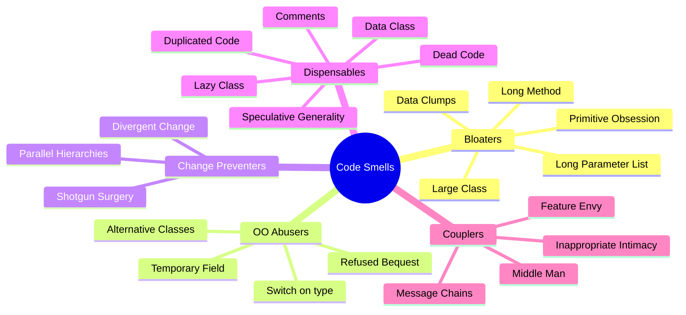
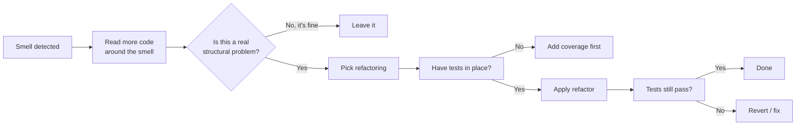

# Code Smells

## Overview

A **code smell** is a surface signal that something deeper might be wrong. Coined by Kent Beck (and popularized by Martin Fowler in *Refactoring*, 1999), a smell isn't necessarily a bug — it's a hint that the code wants to be refactored.

The catalog of named smells gives a team **shared vocabulary** for code review. "This has Feature Envy" is faster and clearer than "this method seems to do work that should be elsewhere." Naming the smell focuses the conversation on the underlying issue.

This page is a working catalog organized by category. Each entry: brief description, how to recognize, what's wrong, the typical refactoring response.

## Problem

Without a vocabulary for design problems, code review devolves into vague feelings: "this seems off," "I don't like this," "could be cleaner." The author can't act on vague feedback; the reviewer can't justify it; everyone leaves the conversation slightly frustrated.

A catalog of smells solves this:

- It **objectifies** the discussion. "Long Method" is a name; we both know what it means.
- It **prioritizes**. Some smells signal architectural issues; others are cosmetic.
- It **prescribes**. Each smell typically maps to a specific refactoring technique (see `Refactoring_Techniques`).
- It **builds taste**. Junior developers learn to recognize smells faster than to articulate the underlying principles.

## Key Concepts

### Smell ≠ bug

A smell is a *symptom*, not a *defect*. Code with smells works correctly today; the smell signals it'll be expensive to maintain or change tomorrow.

The distinction matters because:

- Fixing every smell is over-engineering. Some smells live in code that's never touched again.
- Ignoring all smells is technical debt. Smells compound.

The skill is **knowing which smells to act on and when**.

### Smell categories

Loosely:

- **Bloaters** — code, methods, or classes that have grown too large.
- **Object-orientation abusers** — using OO features in ways they weren't meant for.
- **Change preventers** — code structures that make change disproportionately expensive.
- **Dispensables** — code that adds nothing of value.
- **Couplers** — structures that increase coupling unnecessarily.

These groupings aren't strict — many smells fit multiple categories — but they help navigation.

## Prerequisites

- `Coupling_Cohesion` — most smells are coupling or cohesion problems in disguise.
- `Encapsulation` — many smells reveal leaking encapsulation.
- General programming experience: you need code to smell *bad* relative to alternatives you've seen.

## Smell Catalog

### Bloaters

#### Long Method

A method that does too much, in too many lines.

**Recognize**: more than ~20-50 lines (language-dependent), multiple unrelated chunks, comments breaking it into pseudo-sections.

**Why it's bad**: Hard to read, hard to test (mocking the dependencies of all the things it does), hard to change without ripple effects.

**Refactor**: Extract Method per logical chunk; sometimes Replace Method with Method Object if the extraction is non-trivial.

#### Large Class

A class trying to do too much.

**Recognize**: many fields, many methods, file size disproportionate to peers.

**Why it's bad**: Low cohesion (many reasons to change), hard to understand the whole, contributes to merge conflicts.

**Refactor**: Extract Class along the responsibility lines; Extract Subclass if the split has hierarchical character; Extract Interface if a coherent subset can be promoted to its own contract.

#### Long Parameter List

A method with five-plus parameters.

**Recognize**: the signature wraps to multiple lines; callers struggle to remember the order.

**Why it's bad**: Callers carry burden of order. Adding a parameter cascades through callers. Often signals the parameters belong together (smelling like a missing object).

**Refactor**: Introduce Parameter Object (group related parameters into a value object). Preserve Whole Object (pass the source object instead of pulling fields). Replace Parameter With Method Call (when the method can compute the value itself).

#### Primitive Obsession

Using primitive types where a domain concept deserves its own class.

**Recognize**: strings carrying around emails, currency-as-decimal-everywhere, ZIP codes as ints, dates as `YYYYMMDD` ints.

**Why it's bad**: Validation is duplicated everywhere (every piece of code that handles "an email" re-validates). Type system can't help — `transferAmount(from: int, to: int, amount: int)` lets you swap the parameters at the type level.

**Refactor**: Replace Primitive with Object (a `Email` value object that validates on construction; thereafter, just a typed value). Especially valuable for IDs (`UserId`, `OrderId` instead of all-`int`).

#### Data Clumps

The same group of fields keeps appearing together.

**Recognize**: parameters always come in the same trio (`firstName, lastName, middleInitial`); the same fields show up in three different classes.

**Why it's bad**: They're conceptually one thing (a `Name`). Treating them as separate causes their handling to be repeated.

**Refactor**: Extract Class to bundle them. Now they live as one thing.

### Object-Orientation Abusers

#### Switch Statements (on type)

A switch / if-elif chain on a type tag or string.

**Recognize**: `if (shape.type == "circle")`; `switch (paymentProvider)`.

**Why it's bad**: Adding a new case means editing the switch — and likely several similar switches across the codebase. OCP violation.

**Refactor**: Replace Conditional with Polymorphism. Each case becomes a subtype implementing a common method.

Note: not all switches are smells. A switch on a *closed* enum that genuinely varies in one place is fine.

#### Refused Bequest

A subclass inherits from a parent but doesn't use most of what it inherited.

**Recognize**: subclass overrides every parent method; subclass throws `NotSupportedException` for inherited methods.

**Why it's bad**: Inheritance was the wrong relationship. The subclass doesn't actually want to be a subtype.

**Refactor**: Replace Inheritance with Composition (hold an instance of the parent class instead of extending it).

#### Temporary Field

A field used only by some methods, sometimes left null otherwise.

**Recognize**: a field set in one method and read in another; null-check guards that vary across methods.

**Why it's bad**: The class isn't really a single thing — the temp field is a mode. Hard to reason about.

**Refactor**: Extract Class to encapsulate the conditional behavior; or Introduce Null Object to remove the null-check sprawl.

#### Alternative Classes with Different Interfaces

Two classes that do similar things but have different method names and signatures.

**Recognize**: `Sender.send(msg)` and `Notifier.notify(message)` — same conceptual operation, different APIs.

**Why it's bad**: Callers can't substitute one for the other; each class has its own quirks.

**Refactor**: Rename Method / Move Method to align signatures; eventually Extract Superclass or Extract Interface to unify them.

### Change Preventers

#### Divergent Change

One class changes for many reasons.

**Recognize**: a single class file appears in commits driven by very different requirements (auth, billing, formatting, persistence).

**Why it's bad**: SRP violation. The class has multiple responsibilities; each demands its own changes.

**Refactor**: Extract Class along the lines of responsibility. Each new class changes for one reason.

#### Shotgun Surgery

A single change requires edits in many classes.

**Recognize**: "to add a field, I have to change 12 files."

**Why it's bad**: A concern is scattered across the codebase. Each location is a chance to miss the change and produce inconsistency.

**Refactor**: Move Method / Move Field to consolidate the scattered concern into one place.

#### Parallel Inheritance Hierarchies

Adding a class in one hierarchy forces adding a corresponding class in another.

**Recognize**: every time you add `XYZRequest`, you also have to add `XYZHandler`, `XYZValidator`, `XYZResponse`.

**Why it's bad**: The two hierarchies are coupled by structure. Growth is amplified.

**Refactor**: Move Method / Move Field to merge the parallel structures. Often replaced by composition over multiple inheritance trees.

### Dispensables

#### Comments

Comments are not always smells, but excessive comments often are.

**Recognize**: a method has a paragraph of comments explaining what it does; comments compensate for unclear names.

**Why it's bad**: Comments rot. They drift out of sync with the code, then mislead readers.

**Refactor**: Rename Method / Rename Variable so the names carry the meaning the comment was carrying. Extract Method for the chunks the comments were demarcating. Remove redundant comments.

Some comments are genuinely useful: explaining *why* (a non-obvious decision, a workaround for a known bug, a reference to a paper). Those stay.

#### Duplicated Code

The same code appears in multiple places.

**Recognize**: same loop, same conditional, same calculation, with minor variations.

**Why it's bad**: Bug fixes have to happen in N places. Drift is inevitable.

**Refactor**: Extract Method (if local), Extract Class (if cross-class), Pull Up Method (if cross-subclass), or Form Template Method (for variation in a common skeleton).

Watch for **wrong-DRY** — code that *looks* duplicated but represents independent facts. See `DRY_KISS_YAGNI`.

#### Lazy Class

A class that doesn't do enough to justify its existence.

**Recognize**: a class with one trivial method, used in one place, that's just delegating to something else.

**Why it's bad**: Adds navigation cost without value.

**Refactor**: Inline Class — fold its contents back into its caller.

#### Data Class

A class with only fields and getters/setters, no behavior.

**Recognize**: the class is a "bag of data"; all logic lives in "service" classes that operate on it.

**Why it's bad**: Often signals an anemic domain — behavior should be on the data.

**Refactor**: Move Method onto the data class wherever the methods are operating mostly on its fields.

Note: pure DTOs / records are intentionally data-only and not smells. The smell is when a *domain* class has been hollowed out.

#### Dead Code

Code that's no longer reachable or used.

**Recognize**: a method nobody calls, a class with no instantiations, a feature flag that's been "true" for two years.

**Why it's bad**: Clutter. Future developers waste time reading and trying to understand it. Sometimes hides bugs (the dead method is broken; nobody noticed because nobody runs it).

**Refactor**: Delete it. Trust your version control to keep history. Don't leave it "in case we need it" — that's YAGNI violation.

#### Speculative Generality

Code generalized for a future need that hasn't materialized.

**Recognize**: an interface with one implementer (and no plausible second); a configuration knob nobody sets; a callback hook nobody uses.

**Why it's bad**: YAGNI violation. The generalization adds cost (mental overhead, more code paths, more documentation) without benefit.

**Refactor**: Inline Class / Inline Method to remove the unused flexibility.

### Couplers

#### Feature Envy

A method uses another class's data more than its own.

**Recognize**: a method in class A reads/writes class B's fields heavily; barely touches class A's fields.

**Why it's bad**: The method is in the wrong class. It "envies" the features of B.

**Refactor**: Move Method into B, where its data lives.

#### Inappropriate Intimacy

Two classes know too much about each other's internals.

**Recognize**: class A and class B exchange private state; they reach into each other's private members (via friend declarations, package-private access, reflection).

**Why it's bad**: Coupling is at content-level (the worst). Refactor to either is dangerous.

**Refactor**: Move Method / Move Field to clarify boundaries; Extract Class for the shared concern. Sometimes Replace Inheritance with Delegation if the intimacy was inheritance-based.

#### Message Chains

Long sequences of `.get*()` calls.

**Recognize**: `a.getB().getC().getD().getE()`.

**Why it's bad**: Law of Demeter violation. Caller knows about A's, B's, C's, D's structure.

**Refactor**: Hide Delegate (push the chain inside A). Extract Method on A that does the work the caller was after.

#### Middle Man

A class that does little except delegate.

**Recognize**: most methods of class A just call the same method on a contained object.

**Why it's bad**: Adds indirection without value. Often a sign someone applied "Hide Delegate" too aggressively.

**Refactor**: Remove Middle Man — let callers talk to the underlying object directly. Or, if the middle man does some of the work, refactor those bits to actually live in it.

### Other classics

#### Magic Numbers / Magic Strings

Unexplained literal values in code.

**Recognize**: `if (status == 7)`; `discountRate * 0.875`; `if (user.role == "ADMIN_PRIVILEGED_LEVEL_2")`.

**Why it's bad**: Reader has no idea what 7 means. Same number used elsewhere may or may not be related.

**Refactor**: Replace Magic Number with Symbolic Constant; Replace Type Code with Class / Subclass / State.

#### Mysterious Name

A name that doesn't reveal what the thing does.

**Recognize**: `process()`, `data`, `temp`, `xyz`.

**Why it's bad**: Reader has to open the implementation to understand. Naming is the cheapest documentation.

**Refactor**: Rename Method / Rename Variable. Often the renaming process reveals the underlying responsibility.

#### Inconsistency

Same concept, named differently in different places.

**Recognize**: one module says `customer`, another says `client`, a third says `user` — all referring to the same domain entity.

**Why it's bad**: Each translation between names is a place to introduce bugs.

**Refactor**: Pick the canonical name. Rename uniformly. Document.

## Diagrams

### Smell categories at a glance

### From smell to refactor

## Checklist

### Code-review smell radar

Quick mental scan during code review:

- [ ] **Method longer than my screen** — Long Method?
- [ ] **Constructor with 5+ parameters** — Long Parameter List, possibly Data Clump?
- [ ] **`switch` / `if-elif` on a type field** — Switch Statement, possibly Primitive Obsession?
- [ ] **Comment explaining what code does (not why)** — bad name or Long Method?
- [ ] **`getX().getY().getZ()`** — Message Chain?
- [ ] **A method that uses another object's fields more than its own** — Feature Envy?
- [ ] **Same chunk of logic in 3+ places** — Duplicated Code?
- [ ] **A class file accumulating unrelated commits over time** — Divergent Change?
- [ ] **Editing 10 files for one logical change** — Shotgun Surgery?

### When to act on a smell

- [ ] **Touching the area for another reason?** Boy Scout Rule — leave it cleaner. Easy win.
- [ ] **Smell is actively making the current task harder?** Fix it now.
- [ ] **Smell is in code rarely changed?** Note it; don't fix prematurely.
- [ ] **Multiple related smells?** Tackle as a coherent refactor, not one at a time.

## Topic Anti-Patterns

> Anti-patterns *specific to using the smell catalog*. For generic anti-patterns, see [16_AntiPatterns](../16_AntiPatterns/).

### "All smells must be fixed"

**Description.** Treating the catalog as a checklist; refactoring every smell on sight, even in code that's stable and rarely touched.

**Why it's bad.** Refactoring has cost — review time, risk of regressions, churn in version control. Fixing smells in dead code wastes that cost.

**Better approach.** Fix smells in code you're already changing for other reasons. Leave stable code alone unless the smell genuinely impedes work.

### Smell-spotting as the sole code review

**Description.** A reviewer sees code, names the smell, requests a refactor, never engages with the actual problem.

**Why it's bad.** Smells are *signals*, not *verdicts*. The smell might be appropriate given context the reviewer doesn't see.

**Better approach.** Use smells as conversation starters. Ask the author: "I see Long Method here — is this section coherent enough to extract?" Engage with the substance.

### Refactoring without tests

**Description.** Spotting a smell, leaping to refactor, without test coverage on the affected behavior.

**Why it's bad.** Refactoring assumes behavior is preserved. Without tests, you can't tell.

**Better approach.** Add characterization tests first (capture the current behavior, including any quirks). Then refactor.

### Catalogue worship

**Description.** Treating *Refactoring* (the book) as a fixed list and refusing to recognize smells outside it.

**Why it's bad.** The catalog is generative — you'll discover smells specific to your domain that aren't named yet. That's normal and useful.

**Better approach.** Use the catalog as a starting vocabulary, extend it for your team's needs. Document any team-specific smells.

### Misnaming smells

**Description.** Calling something "Long Method" when it's actually fine; calling something "Feature Envy" when the class boundary is correct.

**Why it's bad.** Misuse of the vocabulary degrades its value. If "Feature Envy" can mean "I think this method is a bit awkward," the term loses meaning.

**Better approach.** Be precise. If you're unsure, describe the symptom; don't reach for a name that doesn't fit.

### Related smells (meta)

The catalog itself is open-ended. Modern community additions:

- **God Object** (a class that knows or does too much) — combination of Large Class + Inappropriate Intimacy.
- **Spaghetti Code** — control flow that's tangled across many functions.
- **Lava Flow** — old code that nobody understands but nobody dares to delete.
- **Boat Anchor** — code preserved for a future use case that never came.
- **Cargo Cult Programming** — using patterns by ritual without understanding what they solve.

Most appear in `16_AntiPatterns`.

## Notes

### Insights

- **Smells are tools for conversation.** Their value is communicative as much as diagnostic.
- **A smell is local; an anti-pattern is structural.** Long Method is a smell — fix it with extract method. Big Ball of Mud is an anti-pattern — no quick fix, requires architectural rework.
- **Refactoring is the response to smells.** The smell catalog and the refactoring catalog (see `Refactoring_Techniques`) were designed to be paired.
- **Senior developers smell faster than they reason.** That's pattern recognition built over years. The catalog accelerates this for juniors.
- **Some smells are language-specific.** "Type code" smells are an OO concern; in Rust with sum types, they're often non-issues. Calibrate to your stack.

### Edge cases

- **Generated code** often has smells (long methods, magic numbers, repetition). Don't refactor generated code by hand — fix the generator if it matters.
- **Performance-critical code** sometimes deliberately has smells (inlined helpers, magic numbers tuned for cache lines). Comment why.
- **Test code** has its own smells: Mystery Guest, Test Code Duplication, etc. Different catalog (see Gerard Meszaros, *xUnit Test Patterns*).

### Gotchas

- **Some "smells" are matters of taste.** "Method too long" is opinion-driven; what's long for one team is normal for another. Build team consensus.
- **Cosmetic refactors compete with feature work for review attention**. Pick your battles; don't tank a sprint to chase smells.
- **Smells in *new* code are easier to fix than smells in *old* code**. Push back early.

### Open questions

- *Is there a metric for smell density?* — partial. Static analyzers flag specific smells; correlation with bug rate exists but isn't strong.
- *Should smells block PRs?* — depends on team policy. Aggressive enforcement helps quality but slows velocity. Most teams flag, discuss, sometimes block.

## Related Topics

- `Refactoring_Techniques` — the toolbox you reach for once a smell is identified.
- `SOLID` — many smells (Long Method, Large Class, Switch on type, Refused Bequest) are SOLID violations.
- `DRY_KISS_YAGNI` — Duplicated Code, Speculative Generality, etc. are DRY/YAGNI smells.
- `Coupling_Cohesion` — most "Couplers" smells are coupling problems.
- `Naming_Conventions` — Mysterious Name, Inconsistency are naming smells.

## References

- Martin Fowler, *Refactoring: Improving the Design of Existing Code* (1st ed. 1999, 2nd ed. 2018) — the canonical catalog.
- Kent Beck, ["Code Smells"](https://wiki.c2.com/?CodeSmell) — original term coined.
- William Wake, *Refactoring Workbook* — exercises for spotting smells.
- Refactoring.guru: [Code Smells catalog](https://refactoring.guru/refactoring/smells) — visual reference.
- Gerard Meszaros, *xUnit Test Patterns* — smell catalog specific to test code.
