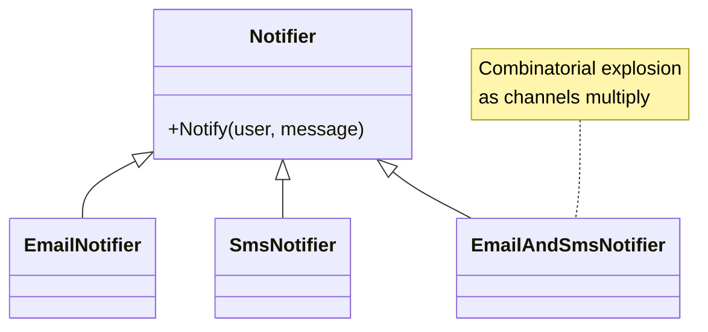
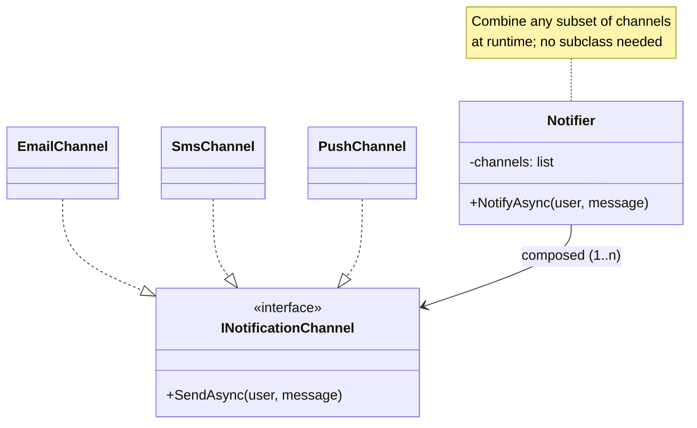
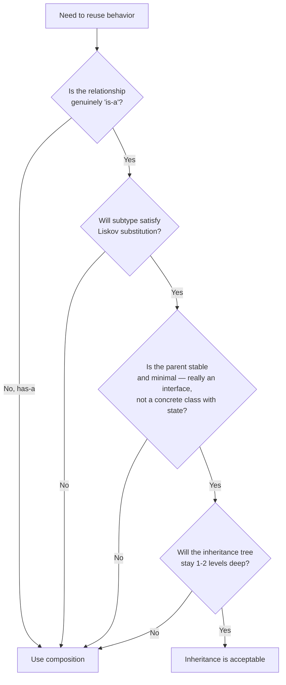

# Composition over Inheritance

## Overview

Two ways to reuse behavior in OOP:

- **Inheritance**: a class declares it *is-a* kind of another class and gets that class's methods and fields.
- **Composition**: a class *has-a* reference to another object and delegates work to it.

The principle says: **prefer composition by default**. Inheritance binds two classes by their entire surface — fields, methods, invariants, lifecycle — and that binding is hard to break later. Composition binds them only at the methods you choose to delegate, leaving each free to evolve.

The principle was popularized by the Gang of Four's *Design Patterns* (1994): *"Favor object composition over class inheritance."* Almost every GoF pattern is essentially "use composition where you'd be tempted to use inheritance."

## Problem

Inheritance is the easiest OOP feature to over-use. The trap is that it works fine for the first two or three levels and then becomes unfixable:

- A `Shape` base class with a `Circle` and `Rectangle` subclass works. Two months later someone adds `Square extends Rectangle` because "a square is a rectangle with equal sides." Six months later, Rectangle adds an `aspect_ratio` setter that breaks Square's invariant.
- A `User` class is subclassed into `AdminUser`, `GuestUser`, `PremiumUser`, `BannedUser`. Real users hold multiple "kinds" simultaneously (a premium admin, a banned guest pending review). The hierarchy can't represent reality without combinatorial subclasses.
- A framework's `BaseController` accumulates utilities — `currentUser()`, `db()`, `cache()`, `flash()`. Every controller now inherits everything, even when it needs only one. Switching to a different web framework means rewriting *every* controller, because they all extend a framework-specific base.

These patterns repeat. The common cause: inheritance was used as a *reuse mechanism* (sharing methods) when it should be used as a *contract* (specifying behavior).

## Key Concepts

### Two valid uses of inheritance

Inheritance is appropriate in two cases:

1. **Behavioral subtype** (LSP-compliant): The subtype is a true behavioral specialization of the base type — you can substitute it anywhere the base type is expected without breaking callers' assumptions. Examples: `LinkedList` and `ArrayList` both inherit from `List`.
2. **Stable abstract interface**: You're inheriting from an abstract base that defines a contract, not from a concrete class with state. Examples: implementing `IEnumerable<T>`, extending an abstract `Stream`.

In both cases, inheritance is **declaring conformance to a contract**, not reusing implementation.

### When inheritance becomes a trap

Inheritance is a problem when used to:

- **Share helper methods** (the "rich base class" anti-pattern). The base class is just a bag of utilities; the subclass relationship is cosmetic.
- **Express orthogonal traits** (a user is *both* premium *and* admin *and* under-review). Single inheritance can't compose orthogonal axes; multiple inheritance creates the diamond problem.
- **Reuse code from a class that has its own concerns** (state, lifecycle). The subclass inherits all of those concerns whether it wants them or not.
- **Specialize a third-party class**. You're then coupled to that class's release cycle, internal design changes, and breaking modifications.

### Composition replaces these

In each problematic case, composition is the cleaner answer:

- **Share helpers** → make them functions or inject a small helper object.
- **Orthogonal traits** → store independent state and behavior pieces, mix at runtime.
- **Reuse code** → hold a reference to the class you'd have inherited from; delegate the calls you need.
- **Specialize a third-party class** → wrap it in your own class and expose only what you need (adapter/facade).

## Prerequisites

- `Encapsulation` — composition relies on stable interfaces; without encapsulation, the contained object's internals leak.
- `Coupling_Cohesion` — inheritance is the strongest form of coupling, so this principle is partly an instance of "lower coupling."

## When to Use

### Use composition when

- The relationship is *has-a* rather than *is-a* in plain language. (A `Car` *has* an `Engine`; it isn't an Engine.)
- You want to combine multiple orthogonal behaviors (a `Logger` that *has* a `Formatter` *and* a `Sink` *and* a `Filter`).
- You're tempted to write `class X extends Y` only to reuse Y's methods. Inject Y into X instead.
- The contained class has its own state and lifecycle you don't want to inherit.
- You're "extending" a class from another package/library.
- The two classes might evolve at different rates or be replaced independently.

### Use inheritance when

- You're implementing a contract defined by an abstract type (interface, abstract class with no state).
- The subtype is a genuine behavioral specialization (`Square` of `Shape`, *if* the contract says shapes are immutable in the relevant way).
- The framework or language idiom expects it (e.g., extending `Component` in some frameworks).
- A small, stable hierarchy (1-2 levels) where Liskov substitution is naturally preserved.

## When NOT to Use (composition)

Composition isn't free. It's the wrong move when:

- **The framework expects inheritance** and going against it costs more than it saves. Some frameworks are inheritance-shaped (older Android, Java Servlets, certain test frameworks).
- **The "is-a" really is the right relationship** and the subclass adds genuine specialization. `IntList` extending `List<int>` is fine.
- **Performance considerations** — composition adds an indirection per method call. In hot loops with millions of calls/sec this can be measurable; in business code it isn't.
- **Hierarchies that are domain-natural and stable** — geometric shapes, AST node types, exception hierarchies. Inheritance models these cleanly when the contract is clear.

## Trade-offs

### Benefits

- **Independent evolution.** The composed object can be replaced or upgraded without touching the consumer's class.
- **Runtime flexibility.** You can swap implementations at runtime (set a new logger, change a strategy mid-execution).
- **Clearer contracts.** Composition forces you to think about the *interface* you actually depend on, instead of inheriting an entire class.
- **Multiple "traits" without inheritance hell.** Compose three orthogonal behaviors by holding three objects; no diamond problem.
- **Easier testing.** A composed dependency is trivially mockable; an inherited base class often isn't.

### Drawbacks

- **More boilerplate.** Delegating methods through a wrapper means writing forwarding methods. Languages with delegation syntax (Kotlin's `by`, Scala's traits) help; older Java/C++ style requires manual forwarding.
- **More objects.** Composed structures often have a higher object count; in some performance-sensitive contexts this matters.
- **Indirection cost.** Every delegation is one more call. Modern JIT compilers usually eliminate it, but pre-JIT environments and very hot paths can feel it.
- **Loss of "free" inherited methods.** With inheritance you get every base method automatically. With composition you choose what to expose, which is a feature *and* an extra step.

### Performance Characteristics

Mostly **performance-neutral** in JIT-compiled languages. Specific notes:

- Virtual dispatch through a composed interface is the same cost as through an inherited base.
- Object size goes up slightly (the composed reference is one extra pointer).
- For very hot loops or kernel-level code, sealed types and direct calls beat both inheritance and composition; that's a different tier of concern.

### Alternatives

- **Mixins / traits** (Scala, Rust, Python): a third option, sitting between inheritance and composition. They share the "behaviors compose orthogonally" upside without the "I inherit your state" downside.
- **Extension methods** (C#, Kotlin): add behavior to an existing class without subclassing or wrapping.
- **Higher-order functions**: when the "behavior" is essentially one operation, pass a function instead of an object.

## Simple Example

The classic case: extending a logger.

### Inheritance approach (problematic)

```csharp
public class Logger
{
    public virtual void Log(string message) => Console.WriteLine(message);
}

public class TimestampedLogger : Logger
{
    public override void Log(string message)
        => base.Log($"[{DateTime.UtcNow:O}] {message}");
}

public class FilteredLogger : TimestampedLogger
{
    private readonly LogLevel _min;
    public FilteredLogger(LogLevel min) => _min = min;
    public void Log(LogLevel level, string message)
    {
        if (level >= _min) base.Log(message);
    }
}
```

What's wrong:

- The hierarchy is rigid. To add "JSON-format" behavior, do you extend `FilteredLogger`? `TimestampedLogger`? Both? Neither?
- Combining behaviors (timestamped + filtered + JSON + remote) requires a combinatorial subclass count or a deep linear chain.
- `FilteredLogger.Log(LogLevel, string)` doesn't override the base — it adds an overload, breaking substitutability.

### Composition approach

```csharp
public interface ILogSink
{
    void Write(string message);
}

public class ConsoleSink : ILogSink
{
    public void Write(string message) => Console.WriteLine(message);
}

public class TimestampDecorator : ILogSink
{
    private readonly ILogSink _inner;
    public TimestampDecorator(ILogSink inner) => _inner = inner;
    public void Write(string message) => _inner.Write($"[{DateTime.UtcNow:O}] {message}");
}

public class LevelFilter : ILogSink
{
    private readonly ILogSink _inner;
    private readonly LogLevel _min;
    private readonly LogLevel _current;  // settable per-call in real impl
    // simplified: assume we pass the current level via a method parameter elsewhere
    public LevelFilter(ILogSink inner, LogLevel min) { _inner = inner; _min = min; }
    public void Write(string message) => _inner.Write(message);  // filtering happens at the entry call
}

// Compose at use site:
var logger = new LevelFilter(new TimestampDecorator(new ConsoleSink()), LogLevel.Info);
```

What's better:

- Each behavior is a separate small class.
- Combining them is a runtime decision: change the wiring, get a different logger.
- Adding "JSON format" or "remote sink" is one more class; no combinatorial explosion.
- Each class is independently testable: `TimestampDecorator` needs a fake `ILogSink`, nothing else.
- This is the classic GoF **Decorator pattern** — composition applied to behavior layering.

### Key takeaways

- The composition version is more code overall but each piece is simpler.
- Behaviors compose at runtime; you can change the chain without recompiling.
- The interface (`ILogSink`) is small and stable — adding new sinks/decorators doesn't change it.
- Most "I want to extend X" cases reduce to: write a class that holds an X and exposes the methods you need, with whatever extra behavior wraps the call.

## Real World Example

### Context — a notification subsystem

The product needs to send notifications via email, SMS, push, and in-app banners. Different events use different channels; some events go to multiple channels.

### Inheritance approach (avoid)

```csharp
public abstract class Notifier
{
    public abstract void Notify(User user, string message);
}

public class EmailNotifier : Notifier { /* ... */ }
public class SmsNotifier   : Notifier { /* ... */ }
public class PushNotifier  : Notifier { /* ... */ }
public class InAppNotifier : Notifier { /* ... */ }
```

So far OK. Now the requirement: "for important events, send email AND SMS."

Tempting solution:

```csharp
public class EmailAndSmsNotifier : Notifier { /* sends both */ }
```

Now: "for VIPs, also push." And: "for trial users, only in-app." The combinatorial subclass count grows exponentially.

### Composition approach

```csharp
public interface INotificationChannel
{
    Task SendAsync(User user, string message, CancellationToken ct);
}

public sealed class EmailChannel  : INotificationChannel { /* ... */ }
public sealed class SmsChannel    : INotificationChannel { /* ... */ }
public sealed class PushChannel   : INotificationChannel { /* ... */ }
public sealed class InAppChannel  : INotificationChannel { /* ... */ }

public sealed class Notifier
{
    private readonly IReadOnlyList<INotificationChannel> _channels;

    public Notifier(IEnumerable<INotificationChannel> channels)
        => _channels = channels.ToList();

    public Task NotifyAsync(User user, string message, CancellationToken ct) =>
        Task.WhenAll(_channels.Select(c => c.SendAsync(user, message, ct)));
}

// Per-event composition at the call site or via configuration:
var importantNotifier = new Notifier(new INotificationChannel[]
{
    emailChannel,
    smsChannel,
});

var vipNotifier = new Notifier(new INotificationChannel[]
{
    emailChannel,
    smsChannel,
    pushChannel,
});
```

What's better:

- Adding a fifth channel (Slack? Telegram?) is one new class implementing `INotificationChannel`.
- Adding a sixth event-channel combination is one new `Notifier` instance.
- No combinatorial subclass explosion.
- Each channel is independently testable, deployable, and ownable (the SMS team owns `SmsChannel`).
- The runtime composition supports feature flags ("ramp Push channel to 10% of users").

### Why inheritance failed here

The original `EmailNotifier extends Notifier` was OK as a *contract conformance* — `EmailNotifier` is a notifier. The trouble started when "compose multiple notifiers" became a requirement and we tried to encode that as another subclass. The mismatch: notification channels are **orthogonal axes**, not a hierarchy.

When you find yourself writing `class XAndY extends Base`, that's the smell. The "and" wants to be composition, not inheritance.

## Diagrams

### Inheritance vs composition





### Decision tree — inheritance or composition?



## Checklist

### Implementation Checklist

- [ ] Before writing `class X extends Y`, ask: would `class X { Y inner; }` work?
- [ ] If you're inheriting only to reuse helper methods, use composition.
- [ ] If the parent class has its own state and lifecycle, prefer composition.
- [ ] If the relationship will need to combine orthogonal behaviors later, start with composition.
- [ ] Keep inheritance trees shallow (≤2 levels) and rooted in abstract types.
- [ ] Verify Liskov substitution holds before sealing an inheritance choice.

### Review Checklist

- [ ] **Subclass overrides most of the parent's methods** — inheritance was the wrong tool; flag for composition refactor.
- [ ] **`base.Method()` calls in overrides that change semantics** — likely LSP violation; composition would be honest about the difference.
- [ ] **Inheritance tree > 2 levels deep** — usually a smell. Justify or flatten.
- [ ] **Class extending a third-party concrete class** — coupling to that library's release cycle. Prefer wrapping.
- [ ] **`NameXAndY` style subclasses** — combinatorial inheritance. Replace with composition.
- [ ] **Subclasses sharing fields they don't all need** — concerns mixed in the parent; refactor the parent first.

### Production Readiness

- [ ] Test seams: composed dependencies are easy to mock; inherited base classes often aren't.
- [ ] Replaceability: a composed behavior can be feature-flagged or A/B tested per request; an inherited one usually requires a full deploy.
- [ ] Observability: composed pipelines have clear stages to instrument; inheritance hides behavior in `base.Method()` calls that don't show up in logs.

## Topic Anti-Patterns

> Anti-patterns *specific to inheritance vs composition*. For generic anti-patterns (God Object, etc.) see [16_AntiPatterns](../16_AntiPatterns/).

### Inheritance for code reuse only

**Description.** A class extends a "rich base" not because it's a behavioral subtype but because the base has helpful methods. The subclass overrides almost nothing; it just gets the helpers.

**Why it's bad.** The relationship lies. Reading `class A extends B` suggests A *is-a* B, but really A just *uses* B's methods. Refactoring B becomes harder because all subclasses inherit its choices.

**Better approach.** Inject the helpers as a collaborator: `class A { B helpers; }`. If they're truly stateless, make them functions.

### The "rich base class" framework trap

**Description.** A web framework provides `BaseController` with `currentUser()`, `db()`, `cache()`, `flash()`, `request()`, etc. Every controller in the app extends it. The app is now coupled to the framework's controller surface forever.

**Why it's bad.**

- Framework upgrades that change `BaseController` cascade to every controller.
- Switching frameworks (or even running controller logic in a non-HTTP context, e.g., a job) is impossible without a rewrite.
- Tests must spin up a controller (and its base) to exercise any logic.

**Better approach.** Make controllers thin and inject what they need. The framework's base can be there, but the actual *work* lives in services that take their dependencies as constructor args.

### Diamond / multi-axis subclassing

**Description.** A user is "premium," "admin," "trial," and "banned" all simultaneously. The hierarchy can't model orthogonal traits, so you get either combinatorial subclasses or single-axis-only types that miss real states.

**Why it's bad.** Real users are made of multiple flags / roles / statuses. Inheritance forces a single tree; reality is multi-dimensional.

**Better approach.** Composition with explicit traits — `User` holds a `Subscription`, a `Role`, a `Status`, a `Quota`. Each evolves independently.

### Implementation inheritance from a class with state

**Description.** Subclassing a non-abstract class that has its own fields and lifecycle — getting all of that, whether you want it or not.

**Why it's bad.** The subclass is now constrained by what the base class does internally. Refactoring the base risks breaking subclasses; refactoring a subclass without understanding the base risks breaking invariants.

**Better approach.** If you need the methods, hold an instance of the class and delegate. If you need a "kind of" relationship, extract an interface and have both implement it.

### LSP violation via inheritance ("Square is-a Rectangle")

**Description.** Subtyping based on shared *attributes* rather than shared *behavior*. `Square extends Rectangle` because both have width and height — but a Square's setters silently couple them, breaking code that assumes independent dimensions.

**Why it's bad.** Compiler accepts the substitution; runtime semantics don't match. Bugs surface far from the cause.

**Better approach.** Composition with a shared interface (both implement `IShape`), or treat them as independent types (Square and Rectangle just don't share an inheritance link).

### Related smells

- **Refused bequest** (subclass throws on inherited methods or overrides almost everything) — strongest signal that composition was the right answer.
- **Parallel inheritance hierarchies** (two trees that grow in lockstep) — usually a missing composition that would unify them.
- **Switch on type** (checking `if x is Subclass`) — defeats inheritance polymorphism, often signals a missed composition opportunity.

## Notes

### Insights

- **Most GoF patterns are composition over inheritance, applied to specific cases.** Strategy, Decorator, Adapter, Composite, Bridge, State — all replace inheritance with composition for some axis.
- **Languages shape the choice.** Inheritance-heavy languages (older Java, classic OO C++) made composition feel verbose. Modern languages (Kotlin's `by`, Rust's traits, Go's struct embedding) make composition almost as ergonomic as inheritance.
- **A class with no virtual methods is leaning toward composition philosophy** — its behavior is fixed; you compose with it from outside.
- **Inheritance is appropriate roughly 10% of the time** in business code; the rest is composition. The exact ratio varies by domain.
- **The principle is older than OOP.** Module systems (Modula, Ada) and functional programming (functions as parameters) embody the same idea: prefer combining smaller pieces over specializing larger ones.

### Edge cases

- **Domain-natural hierarchies.** AST node types, exception hierarchies, well-defined geometric shapes — inheritance is fine. The key: the hierarchy is closed and the contract is clear.
- **Framework integration.** Some frameworks require inheritance for performance or design reasons (e.g., Unity's `MonoBehaviour`, older test frameworks). Don't fight it; encapsulate it.
- **Sealed type hierarchies** (algebraic data types, sealed classes / sum types). Inheritance with a closed set of subtypes is a clean modeling tool — different from extensible class hierarchies.

### Gotchas

- **Composition adds boilerplate.** Without language support (delegation, mixins, extensions), you write forwarding methods. Don't let that push you back to inheritance — the boilerplate is a one-time cost; bad inheritance is a forever cost.
- **Multiple inheritance isn't the answer.** Languages that allow it (C++, Python, Eiffel) have learned that diamond problems and method-resolution complexity outweigh the benefits. Composition handles the same cases more cleanly.
- **Inheritance for testability** is a code smell. If you're subclassing only to override one method for tests, the original design was wrong — that method should have been a strategy, injected at construction.

### Open questions

- *Where's the line between "clear hierarchy" and "fragile inheritance tree"?* — judgment. Two levels deep with stable contracts is fine; three levels with frequent changes is trouble.
- *Are mixins / traits actually composition?* — they're a hybrid. Functionally closer to composition (orthogonal axes) but syntactically inheritance-flavored. Most modern guidance treats them as a separate, useful tool.
- *How does this principle apply to data models?* — somewhat. ORMs sometimes pull you toward inheritance hierarchies for tables (single-table inheritance, etc.); composition (foreign keys, value objects) usually models reality better.

## Related Topics

- `SOLID` — LSP especially is the safety net for the inheritance you do use.
- `Coupling_Cohesion` — inheritance is the strongest form of coupling; composition lowers it.
- `Encapsulation` — composition relies on the contained object's encapsulation to be stable.
- `Separation_of_Concerns` — composition often makes concerns separable; inheritance often blurs them.

## References

- Gang of Four, *Design Patterns: Elements of Reusable Object-Oriented Software* (1994) — popularized the principle ("Favor object composition over class inheritance," p. 20).
- Joshua Bloch, *Effective Java*, Item 18: "Favor composition over inheritance" — the canonical modern restatement.
- Brian Goetz, ["Inheritance is the base class of evil"](https://www.youtube.com/results?search_query=brian+goetz+inheritance+evil) — JVM Language Summit talk.
- Sandi Metz, *Practical Object-Oriented Design in Ruby* — practical case studies of composition over inheritance refactors.
