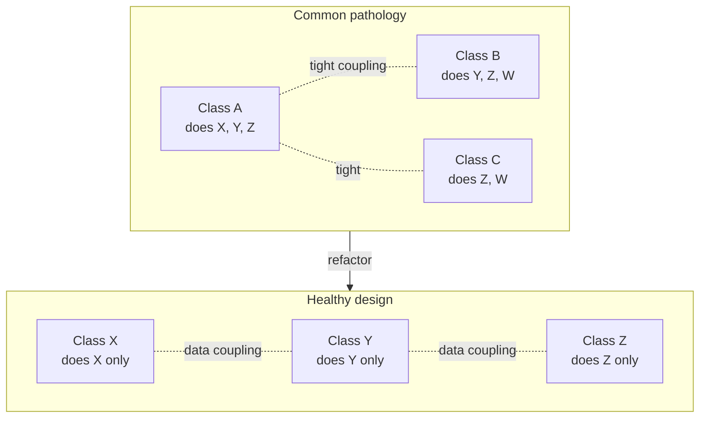

# Coupling Cohesion

## Overview

The two oldest and most useful metrics for measuring software design quality. Introduced by Larry Constantine in the 1960s, refined by Stevens, Myers, and Constantine in 1974, and still load-bearing today.

- **Coupling** — *how strongly two modules depend on each other.* A module is *tightly coupled* to another if changing one forces changes to the other; *loosely coupled* if they can change independently.
- **Cohesion** — *how strongly the elements inside a module belong together.* A *cohesive* module does one well-defined job; an *incohesive* one is a grab-bag of unrelated features.

The design heuristic is short: **low coupling, high cohesion**. Most other principles (SOLID, DDD bounded contexts, microservice boundaries, Clean Architecture) are different ways of pulling code toward that target.

## Problem

Without these two lenses, codebases drift in predictable ways:

- The "shared utilities" module accumulates anything more than one file uses, becoming a god module that everything depends on. **High coupling**: every team change touches it, builds slow down, conflicts pile up.
- A "User" class accumulates account creation, password reset, session tracking, profile editing, billing preferences, and notification settings. **Low cohesion**: the class has six unrelated reasons to change, and unit-testing one slice means standing up the rest.
- A change to the database schema requires updates in 14 files across 4 modules. **Coupling at the data level**: the schema is the de-facto integration point.
- Two services share a "common" library so closely that they have to deploy together. **Hidden coupling**: the architecture says they're independent but reality says otherwise.

These aren't aesthetic complaints. Each maps to a concrete cost: slower changes, bigger blast radius, harder testing, more on-call pages, slower onboarding.

## Key Concepts

### Coupling — gradient from worst to best

Originally formalized by Stevens/Myers/Constantine. Listed roughly worst (highest coupling) to best (lowest):

1. **Content coupling** — module A reaches into module B's internals (private fields, internal data structures). The worst kind. Changes anywhere in B can break A. Examples: monkey-patching, accessing private members via reflection, friend classes.
2. **Common coupling** — modules share a global mutable state (global variables, singletons holding mutable data). Any reader/writer affects all others.
3. **External coupling** — modules share an external constraint: file format, communication protocol, hardware register. Coordinating change requires touching all of them.
4. **Control coupling** — module A passes a flag to B that tells B *what* to do. B's internal logic is exposed in A's call.
5. **Stamp coupling** — modules share a complex data structure but only use parts of it. Changes to unused parts of the structure still trigger recompiles/deploys.
6. **Data coupling** — modules communicate by passing the simplest possible data (primitives, value objects). The cleanest form of intentional coupling.
7. **Message coupling** — modules communicate only through well-defined messages/events, often asynchronously. The lowest practical coupling.

Real systems mix several types. The job isn't to reach "zero coupling" (impossible — modules must talk) but to push toward the right end of the gradient.

### Cohesion — gradient from worst to best

Same lineage, listed worst (lowest cohesion) to best:

1. **Coincidental cohesion** — elements grouped randomly. Classic example: a `Utils` or `Helpers` module with `formatDate`, `hashPassword`, `parseJson`, `validateEmail`. They're together because nobody knew where else to put them.
2. **Logical cohesion** — elements grouped because they're "the same kind of thing" but otherwise unrelated. Example: a `Validators` class with `validateEmail`, `validatePhone`, `validateZipCode` — they all "validate" but operate on different concerns.
3. **Temporal cohesion** — elements grouped because they happen at the same time. Classic: a `StartupTasks` class doing config loading, DB migration, cache warmup, telemetry init.
4. **Procedural cohesion** — elements share a control flow (called in sequence), but not data.
5. **Communicational cohesion** — elements operate on the same data.
6. **Sequential cohesion** — output of one element is input of the next, all working on a single data flow.
7. **Functional cohesion** — every element contributes to a single, well-defined task. The best kind.

Functional cohesion is the goal. A class with functional cohesion has one job, you can name it in one sentence without "and," and you can describe what would change if that job's requirements changed.

### Why both at once

Coupling and cohesion are **dual**. Pulling cohesion up usually pulls coupling down, and vice versa:

- Splitting an incohesive class into two cohesive ones removes the artificial coupling between their unrelated members.
- Reducing coupling between two modules often forces a clearer responsibility boundary, which raises cohesion.

When the two metrics fight each other, that's a sign the boundary is in the wrong place.

## Prerequisites

- `Encapsulation` — coupling tracks across exposed interfaces; encapsulation hides internals so coupling can't form on them by accident.
- Basic familiarity with object-oriented or modular code (any language). The concepts are language-agnostic but easiest to discuss with classes/modules in mind.

## When to Use

These aren't tools you "use sometimes" — they're **lenses you keep with you**. Bring them out when:

- **Reviewing a design** — sketch the dependency graph between modules. Lots of arrows in many directions = coupling is too high. Look for dependency cycles especially.
- **Picking module boundaries** — for a new service, library, or package: ask "what's the *one* job of this thing?" If the answer needs "and," split it.
- **Refactoring legacy code** — coupling/cohesion gives you a measurable target. "Reduce common coupling" or "raise cohesion of the User module" is more actionable than "make it cleaner."
- **Estimating change impact** — high-coupling modules have wider blast radius. Use that to flag risky changes.
- **Microservice boundaries** — services should be data-coupled or message-coupled, never content-coupled. If you can't change one without changing the other, they're effectively one service.

## When NOT to Use

The principles always apply, but **strict optimization doesn't**:

- **Throwaway scripts.** A 50-line build helper doesn't need a 5-class architecture for "low coupling."
- **Hot paths where coupling is intentional.** Some code (game engines, simulators, kernel code) intentionally couples for performance. The cost of an indirection per call is real at 60 fps with millions of objects.
- **Internal helpers within a small cohesive module.** Inside a 200-line class, coupling between two methods is fine — they're meant to work together.
- **Data structures that live behind an interface.** A `Stack<T>` is cohesive *internally* but its consumers shouldn't care about its implementation; coupling is contained.

## Trade-offs

### Benefits

- **Localized change impact.** Modifications to a cohesive, loosely-coupled module stay inside that module. Bug fixes don't ripple.
- **Independent testability.** Low coupling means a unit test for one module doesn't need the entire application to stand up.
- **Parallel work.** Loosely-coupled modules let teams work in parallel without stepping on each other's commits.
- **Replaceability.** A cohesive module with a clear interface can be rewritten or swapped (e.g., to a different language or library) without touching its neighbors.
- **Mental model fit.** Cohesive modules match how humans think about the problem; reading code that mirrors the domain is easier.

### Drawbacks

- **More modules / files.** High cohesion produces smaller, more numerous units. Navigation cost increases.
- **More interfaces / contracts.** Reducing coupling often means introducing abstractions, which adds boilerplate.
- **Risk of premature decomposition.** Splitting too early — before you understand the natural boundaries — produces the *wrong* boundaries, which is worse than no boundaries.
- **Cost of communication.** Loosely-coupled modules talk through interfaces (calls, messages). Each call has some overhead vs. direct field access.

### Performance Characteristics

Coupling and cohesion are largely **performance-neutral** at the machine level. The cost of a virtual call vs a direct call (a few nanoseconds) is measurable in hot loops but invisible in business code.

The performance impact is mostly *indirect*:

- Cohesive modules are easier to profile (you can isolate them).
- Loosely-coupled modules are easier to optimize (you can swap a slow implementation for a fast one without rewriting callers).
- Tight coupling makes performance work expensive — every change to a hot path risks breaking unrelated behavior.

### Scalability

These principles scale with **codebase and team size**:

- Small codebase, small team: coupling/cohesion matters less because everyone knows everything.
- Medium (10-50 devs, ~100k LOC): coupling becomes painful — a tightly-coupled module becomes a contention point for commits and reviews.
- Large (100+ devs, multi-module/multi-service): coupling/cohesion is **load-bearing** — wrong boundaries make organizational scale impossible.

### Alternatives

- **`SOLID`** — the principles in SOLID are largely concrete tactics for achieving low coupling and high cohesion (especially SRP for cohesion, DIP for coupling).
- **`Separation_of_Concerns`** — broader principle that produces high cohesion as a side effect.
- **DDD bounded contexts** — domain-driven equivalent at the macro scale.
- **Information hiding (Parnas, 1972)** — an even older formulation, focused specifically on what should be exposed vs. hidden.

## Simple Example

A small example showing both principles applied to a single class refactor.

### Before — incohesive, with high internal coupling

```python
class UserService:
    def __init__(self, db, smtp, redis, audit_log):
        self.db = db
        self.smtp = smtp
        self.redis = redis
        self.audit = audit_log

    def register(self, email, password):
        # Validate email format
        if "@" not in email or "." not in email.split("@")[1]:
            raise ValueError("invalid email")
        # Hash password
        salt = os.urandom(16)
        hashed = hashlib.pbkdf2_hmac("sha256", password.encode(), salt, 200_000)
        # Save user
        user_id = self.db.insert("users", {"email": email, "password": hashed, "salt": salt})
        # Cache welcome flag
        self.redis.set(f"welcome:{user_id}", "1", ex=86400)
        # Send welcome email
        self.smtp.send(to=email, subject="Welcome!", body=f"Hi, your id is {user_id}.")
        # Audit log
        self.audit.write(f"user_registered:{user_id}")
        return user_id

    def reset_password(self, email):
        # ...

    def update_profile(self, user_id, name):
        # ...

    def list_users(self):
        # ...
```

What's wrong:

- **Cohesion is low.** The class does validation, password hashing, persistence, caching, email sending, and auditing. Each of these would change for different reasons.
- **Coupling is high.** The class depends on four concrete services (`db`, `smtp`, `redis`, `audit_log`) — testing requires mocking all four even when the test is only about, say, password hashing.
- **The class file is going to grow** as more features are added — each new feature drags in new dependencies.

### After — split by responsibility

```python
class EmailValidator:
    def validate(self, email: str) -> None:
        if "@" not in email or "." not in email.split("@")[1]:
            raise ValueError("invalid email")

class PasswordHasher:
    def hash(self, password: str) -> tuple[bytes, bytes]:
        salt = os.urandom(16)
        return hashlib.pbkdf2_hmac("sha256", password.encode(), salt, 200_000), salt

class UserRepository:
    def __init__(self, db):
        self.db = db
    def create(self, email: str, hashed: bytes, salt: bytes) -> int:
        return self.db.insert("users", {"email": email, "password": hashed, "salt": salt})

class WelcomeNotifier:
    def __init__(self, smtp, redis, audit):
        self.smtp, self.redis, self.audit = smtp, redis, audit
    def send(self, user_id: int, email: str) -> None:
        self.redis.set(f"welcome:{user_id}", "1", ex=86400)
        self.smtp.send(to=email, subject="Welcome!", body=f"Hi, your id is {user_id}.")
        self.audit.write(f"user_registered:{user_id}")

class RegistrationService:
    def __init__(self, validator, hasher, repo, notifier):
        self.validator, self.hasher, self.repo, self.notifier = validator, hasher, repo, notifier
    def register(self, email: str, password: str) -> int:
        self.validator.validate(email)
        hashed, salt = self.hasher.hash(password)
        user_id = self.repo.create(email, hashed, salt)
        self.notifier.send(user_id, email)
        return user_id
```

What changed:

- **Cohesion is up.** Each new class has a single job — easy to name, easy to describe.
- **Coupling is down.** `RegistrationService` depends on four small abstractions (validator, hasher, repo, notifier), each replaceable. Tests for `RegistrationService` use trivial fakes.
- **Each piece is independently testable.** `PasswordHasher` doesn't need a database to test. `EmailValidator` doesn't need anything.
- **Adding password-reset, profile-update, etc. now means new orchestrators**, each picking the dependencies it actually needs — `PasswordResetService` doesn't drag in SMTP unless it needs to send mail.

### Key takeaways

- The "incohesive" version had `__init__` taking 4 parameters that not every method used — that's a smell. When parameters are used by some methods but not others, the class probably should be two classes.
- The "after" version has more files but each is simpler. The total cognitive load is lower because each unit is small enough to fit in your head.
- Most of SOLID emerges naturally from chasing high cohesion and low coupling — they're the underlying objective.

## Real World Example

### Context — a "shared kernel" that became a god module

A SaaS company had a `Common` library imported by every service. It started innocently — date helpers, a logger wrapper, a few enums. Three years later it contained:

- 47 utility classes covering everything from string formatting to JWT parsing.
- Hard-coded references to the company's domain entities (`User`, `Account`, `Subscription`).
- Database connection helpers.
- Feature-flag client.
- Logging configuration with environment-specific defaults.
- An HTTP client wrapper.

Every service depended on `Common`. Every change to `Common` required testing **every** service. The shared kernel had become **the** integration point: changes anywhere in any service often required a `Common` update first, which blocked everyone until released.

### What was wrong, in coupling/cohesion terms

- **Cohesion of `Common` was coincidental.** Things were there because nobody had a better place for them. There was no "one job" `Common` was responsible for.
- **Coupling of every service to `Common` was content/external coupling.** Services depended on internal details (helper signatures, default behaviors), not on a stable contract.
- **Cohesion within services suffered too.** A service might use 3 things from `Common` and inherit dependencies on the other 44 anyway because of how the package was structured.

### The fix — split by responsibility

Over six months, `Common` was decomposed:

- **Cross-cutting infrastructure** (logger config, HTTP client, feature flags) → moved to a thin **`Platform`** library, owned by the platform team. Clear ownership, semantic versioning, contractual API.
- **Domain entities** (`User`, `Account`, etc.) → split per bounded context. Each service owns its view of these entities; cross-service communication uses messages, not shared types.
- **Pure helpers** (date math, string formatting) → became individual single-purpose libraries (one purpose each, semver, no transitive domain dependencies). Each ~50-200 lines.
- **Service-specific code that had drifted into Common** → moved back into the relevant service.

### Results

Quantifiable in retrospect:

- A change to a "domain helper" no longer triggered every service's CI.
- The platform team could iterate on infrastructure without coordinating with feature teams.
- Build time for the median service dropped 40% (no longer pulling 47 classes for the 3 it actually used).
- New devs could understand a service end-to-end without first learning `Common`.

The lesson isn't "never share code." It's **share with intention**. Each shared library should have a clear, narrow job (high cohesion) and a stable, minimal contract with consumers (low coupling).

## Diagrams

### Coupling gradient


Aim toward the right. Most production systems mix several types; the goal is to push the high-coupling parts toward the right where it matters.

### Cohesion gradient


Functional cohesion is the goal. A class/module with functional cohesion can be named with a noun phrase that doesn't include "and."

### How they interact



When you see tight coupling between modules, the cause is often that each module is doing too many overlapping things (low cohesion). Splitting them by responsibility removes the artificial coupling.

## Checklist

### Implementation Checklist

- [ ] Can I name what this module/class *does* in one sentence with no "and"?
- [ ] Are all the methods using the same fields, or only a subset?
- [ ] Do the dependencies (constructor args, imports) suggest one focused job, or a grab-bag?
- [ ] If I removed any one method, would the class still make sense as a unit? If yes, that method might belong elsewhere.
- [ ] How does this module communicate with its neighbors — direct field access, shared globals, or via parameters/messages?

### Review Checklist

- [ ] **`Common` / `Utils` / `Helpers` module growing.** Almost always low cohesion. Push for splitting by purpose.
- [ ] **Constructor with 5+ dependencies.** Smell — class is probably doing too many things (low cohesion).
- [ ] **Boolean flag passed into a method.** Often control coupling; consider splitting into two methods.
- [ ] **Method takes a big struct but uses 2 fields.** Stamp coupling; pass just the fields.
- [ ] **Two classes that always change together.** They have hidden coupling — consider merging or rebalancing.
- [ ] **Cyclic dependency** between modules. Usually means the abstraction is in the wrong place.

### Production Readiness

- [ ] Modules have clear ownership in the team — high coupling across team boundaries is organizationally expensive.
- [ ] Cross-service communication is via stable messages/APIs, not shared in-process types.
- [ ] CI pipelines isolate changes — a change in module A doesn't trigger the world's tests.
- [ ] Monitoring is per-module — failures localize to the responsible module.

## Topic Anti-Patterns

> Anti-patterns *specific to coupling/cohesion*. For generic anti-patterns (God Object, Spaghetti Code), see [16_AntiPatterns](../16_AntiPatterns/).

### The Utility Module / Common Library

**Description.** A package called `Utils`, `Common`, `Helpers`, or `Shared` that accumulates anything more than one file uses. Cohesion is coincidental; coupling is universal.

**Why it's bad.**

- Every service depends on it, so changes ripple everywhere.
- Nobody owns it cleanly — features get added without a coherent direction.
- It becomes the de-facto integration point for the system, slowing builds, deploys, and refactors.

**Better approach.** Split by purpose. Each shared library has a single, narrow job. Naming alone helps: `DateHelpers` is better than `Common`, but `BusinessCalendar` (a domain concept) is best.

### Stamp coupling — passing big objects, using few fields

**Description.** A function takes a `User` object but only uses `user.email`. The function is now coupled to all of `User` — a change to `User`'s shape forces recompiles and risks breaking the function.

**Why it's bad.**

- Hides the function's real input requirements.
- Couples the function to changes in unrelated parts of `User`.
- Makes testing harder (you must construct a full `User` even though most of it is irrelevant).

**Bad example.**

```typescript
function sendInvoice(user: User, invoice: Invoice): void {
  smtp.send(user.email, formatInvoice(invoice));
}
```

**Better approach.** Take just what you need.

```typescript
function sendInvoice(toEmail: string, invoice: Invoice): void {
  smtp.send(toEmail, formatInvoice(invoice));
}
```

Now the function's contract is honest — and it works for cases where there's no `User` at all (e.g., guest checkout).

### Control coupling — flags that change behavior

**Description.** A function takes a flag that says *what* to do, and the function branches on it. Callers know about the function's internal modes; the function knows about the callers' intentions.

**Bad example.**

```python
def render(report, as_html):
    if as_html:
        return render_html(report)
    else:
        return render_pdf(report)
```

**Better approach.** Split into two functions, each with one job. Or accept a strategy/sink at the boundary.

```python
def render_html(report) -> str: ...
def render_pdf(report) -> bytes: ...
```

### Hidden coupling via shared mutable state

**Description.** Two modules that "look independent" both read/write the same global, singleton, or process-level state. They affect each other through that state, but the dependency isn't visible in the call graph.

**Why it's bad.**

- Reading the code doesn't reveal the coupling — only running it does.
- Order of operations matters in non-obvious ways.
- Concurrency makes it actively hostile (races, dropped updates).

**Better approach.** Make state-sharing explicit. Pass shared state as a parameter, or replace it with messages/events. If a true singleton is needed (config, logger), make it immutable after init.

### "Just a dependency injection container away" — invisible coupling at composition root

**Description.** Strict adherence to "depend on abstractions" means every class takes 5 interfaces in its constructor. Tests pass because everything's mocked. But the runtime composition wires those interfaces to a single set of implementations, and any non-trivial change to one implementation cascades through the whole system anyway.

**Why it's bad.** The interfaces are cosmetic — they suggest looseness that doesn't exist at runtime. The pain of changing things still hits, just hidden behind a layer.

**Better approach.** Use interfaces where they earn their keep (truly multiple implementations or testing seams). Don't add ceremony for the appearance of low coupling.

### Premature decomposition

**Description.** Splitting a class into 7 classes "to lower coupling" before understanding the natural seams. Now changes that would have been local to one file touch all 7 — coupling is *higher*, just spread across more files.

**Why it's bad.** The split was made along the wrong axis. Real cohesion came from being together; artificial coupling was introduced by splitting.

**Better approach.** Wait until the seams are obvious. The third time you change something and have to update 5 of the same lines, you've earned the right to extract.

### Related smells

- **Shotgun surgery** — one logical change requires edits in many places. Smells like coupling-via-shared-knowledge.
- **Feature envy** — a method uses another class's data more than its own. Smells like the method is in the wrong class (cohesion).
- **God class / large class** — too low cohesion plus too high coupling, in one place.
- **Divergent change** — a class changes for several different reasons. Cohesion smell.

## Notes

### Insights

- **Cohesion is local; coupling is global.** Cohesion is a property of one module; coupling is a property of relationships between modules. They're related but distinct lenses.
- **Most legacy pain is one of these two.** When you hear "this codebase is hard to change," the diagnosis is almost always coupling-too-high or cohesion-too-low — usually both, since they correlate.
- **Microservices ≠ low coupling automatically.** You can have tight coupling between services (shared schemas, synchronous chains, lock-step deploys). The architecture style is independent of these properties.
- **Functional cohesion ≈ "single responsibility."** SRP from SOLID is essentially "have functional cohesion at the class level."
- **The 1974 paper still reads well.** Stevens, Myers, Constantine — "Structured Design" (IBM Systems Journal, 1974) — is short, clear, and basically the same advice we give today.
- **Conway's Law applies.** Module structure mirrors team structure. If two modules are tightly coupled, often two teams are tightly coupled in conversation. Fix the coupling and the social dynamic improves; or fix the team boundary and the code follows.

### Edge cases

- **Layered architectures** legitimately have unidirectional coupling: UI → service → data. That's not a smell — it's the design.
- **Frameworks** often have you implementing methods on classes the framework owns. The coupling direction is *into* the framework. Acceptable when the framework has a stable contract.
- **Shared schemas at service boundaries.** Sometimes unavoidable (CQRS read models, GraphQL federations). Manage them with explicit versioning and contract testing rather than pretending they don't exist.
- **Inheritance is a strong form of coupling.** A subclass is coupled to its base class's invariants, methods, fields. That's why `Composition_over_Inheritance` exists.

### Gotchas

- **"Loose coupling" doesn't mean "no shared types."** Two services using the same JSON schema for a message are appropriately coupled — the schema is the contract.
- **High cohesion can be wrong.** A class so cohesive that it represents a *too-narrow* slice of the domain becomes hard to compose with others. You're aiming for the right *grain*, not maximum cohesion.
- **DI containers don't reduce coupling — they hide it.** The runtime wiring still couples your class to specific implementations; the container just moves where that wiring is declared.
- **"It's just a getter" is how content coupling sneaks in.** Public mutable fields, even via "just a getter," let callers couple to internal representation. Encapsulation is the antidote.

### Open questions

- *How granular should cohesive units be?* — judgment call, depends on team and language. Python tends to fewer larger modules; Java/C# tends to many small classes.
- *Is service mesh / event bus enough to call services "loosely coupled?"* — depends on the messages. Tightly-coupled message contracts can defeat the architectural intent.
- *Can you measure these mechanically?* — partly. Static analysis can flag fan-in/fan-out, cyclomatic complexity, dependency cycles. But "responsibility" and "knowledge" need human judgment.

## Related Topics

- `SOLID` — concrete tactics for the targets defined here. SRP especially is about cohesion.
- `Separation_of_Concerns` — broader principle that yields high cohesion as a side effect.
- `Encapsulation` — prerequisite. Without encapsulation, content coupling is the default.
- `Composition_over_Inheritance` — addresses the inheritance-as-tight-coupling problem.
- `Code_Smells` — many smells (Shotgun Surgery, Feature Envy, God Class) are coupling/cohesion smells in disguise.

## References

- Stevens, Myers, Constantine, ["Structured Design"](https://archive.org/details/SystemsJournalStructuredDesign) (IBM Systems Journal, 1974) — the foundational paper.
- Larry Constantine & Edward Yourdon, *Structured Design* (1979) — the book-length treatment.
- David Parnas, ["On the Criteria To Be Used in Decomposing Systems into Modules"](https://www.win.tue.nl/~wstomv/edu/2ip30/references/criteria_for_modularization.pdf) (1972) — companion classic on information hiding.
- Robert Martin, *Clean Architecture* — modern restatement at the architecture scale.
- Sam Newman, *Building Microservices* — how to keep coupling low at the service level.
