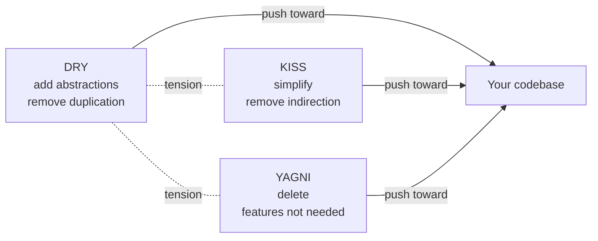
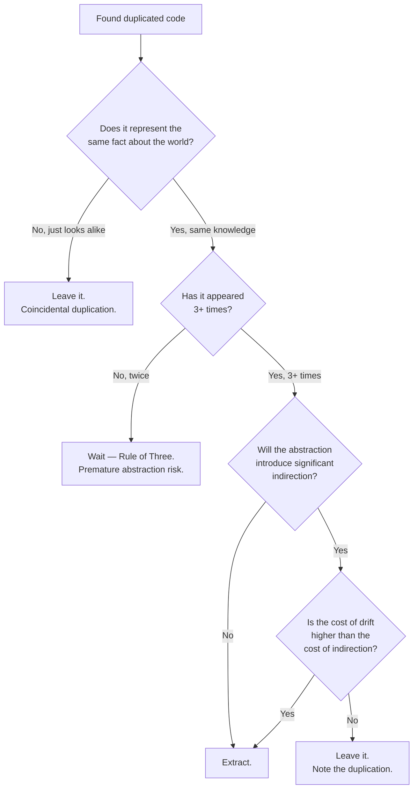

# DRY KISS YAGNI

## Overview

Three of the most-quoted rules in software design. Taken individually they're slogans; taken together they form a **balance system** where each pushes against the others, keeping you from drifting into one kind of mess.

- **DRY** — *Don't Repeat Yourself.* Eliminate duplicated knowledge.
- **KISS** — *Keep It Simple, Stupid.* Prefer straightforward designs over clever ones.
- **YAGNI** — *You Aren't Gonna Need It.* Don't build for needs you don't have yet.

A team that only follows DRY ends up with the wrong abstractions everywhere. A team that only follows KISS misses obvious structural improvements. A team that only follows YAGNI accumulates copy-paste duplication. The skill is knowing **which lever to pull when**.

## Problem

The three rules each address a recurring failure mode:

- **Without DRY**, the same business rule lives in three places. Six months later one place gets fixed, the other two don't, and you have a silent inconsistency that surfaces as a customer complaint.
- **Without KISS**, code is "elegant" but unreadable. The author understood the seven-layer abstraction at write time; nobody else does, and even the author doesn't six months later.
- **Without YAGNI**, you build a flexible plugin system, configuration framework, and abstract pipeline for a feature that turns out to need exactly one implementation forever. Half the codebase is scaffolding for variants that never arrived.

The same three rules also have **opposite failure modes**:

- *DRY taken too far*: forcing two superficially similar pieces of code through a shared abstraction even though they evolve independently. The abstraction becomes a knot — every change to one caller breaks the other.
- *KISS taken too far*: refusing to introduce structure even when the code clearly benefits. A 600-line function "is simple, it's just one function" — except it isn't.
- *YAGNI taken too far*: never extracting helpers, never introducing interfaces, until the code is unrefactorable.

So the three rules are **mutually corrective**. Apply them as a triad, not in isolation.

## Key Concepts

### DRY — Don't Repeat Yourself

> *Every piece of knowledge must have a single, unambiguous, authoritative representation within a system.* — Andy Hunt & Dave Thomas, *The Pragmatic Programmer*.

The original DRY isn't about duplicated **code**. It's about duplicated **knowledge**. Two functions that both compute "weekend = Saturday or Sunday" represent the same fact about the calendar — that's a DRY violation, fix it. Two functions that both happen to add 1 + 1 are *coincidentally* identical — they aren't a DRY violation; they're independent facts.

The pragmatic test: *if this fact about the world changes, do I want one place to update or many?* If one — DRY it. If they're independent and just look alike — leave them.

### KISS — Keep It Simple, Stupid

Originating from US Navy aircraft design (Kelly Johnson, Lockheed Skunk Works), the principle is about **reducing the number of things a reader has to hold in their head**.

KISS isn't about lines of code. A 200-line function with no helpers can be simpler than a 30-line function that calls into a four-class abstraction tree. Simplicity is measured at the **point of reading**, not the point of writing.

The pragmatic test: *if a competent colleague joins tomorrow, can they read this and understand it within minutes?* If yes — it's KISS-compliant. If they need a guided tour — it isn't.

### YAGNI — You Aren't Gonna Need It

> *Always implement things when you actually need them, never when you just foresee that you need them.* — Ron Jeffries.

Originated in Extreme Programming. The observation: **most predictions of future requirements turn out wrong**. Code written for hypothetical needs becomes either dead weight or — worse — a wrong fit when the actual need finally arrives.

The pragmatic test: *am I writing this because I need it now, or because I think I might need it later?* If "later" — drop it. The cost of adding it later is almost always lower than the cost of carrying it through the time when nobody used it.

## When to Use

### Reach for DRY when

- You're about to copy-paste a non-trivial chunk of code (more than a few lines).
- You find yourself fixing the same bug in multiple places.
- Two pieces of business logic encode the same fact about the world (a tax rate, a permission rule, a date format).

### Reach for KISS when

- You're about to write a class hierarchy "for flexibility" but only have one variant.
- You catch yourself reaching for a design pattern because the pattern exists, not because the problem demands it.
- A reviewer asks "why is this an interface" and your answer is "in case we need another implementation."
- The "generic" version of your code is twice as long and three times as confusing as the specific version.

### Reach for YAGNI when

- You're tempted to add a config knob "in case someone wants to tune it."
- A feature is being designed for use cases that don't exist yet.
- You're building a framework for the second implementation of something that doesn't have a second implementation.
- The PR description includes "I also added X to make future Y easier" but Y isn't planned.

## When NOT to Use

The three rules have natural limits — over-applying them is its own problem.

### Don't over-DRY

- **Coincidental duplication** — two functions that look alike but represent independent facts. Forcing them through a shared abstraction couples them artificially.
- **Boundaries between modules/services** — sharing types across module boundaries to avoid "duplication" creates lock-step coupling that's worse than maintaining two slightly redundant types.
- **Test code** — some duplication in tests is fine, even welcome. Test setup that's overly DRY-ed becomes hard to read; the redundancy makes each test self-contained.

### Don't over-KISS

- **Dismissing legitimate complexity.** Some domains are intrinsically complex (compilers, distributed consensus, financial modeling). KISS doesn't mean denying that.
- **Avoiding necessary abstractions.** When the same orchestration appears in 5 places, refusing to abstract because "it's simple as is" isn't KISS — it's denial.

### Don't over-YAGNI

- **Things that are very expensive to retrofit.** Some decisions (data model, public API shape, security boundaries) are hard to change later. For those, a little upfront thinking is justified.
- **Skipping basic structure.** Not adding configuration is fine; refusing to extract a helper because "we'll see if we need it" while shipping copy-paste is just sloppy.

## Trade-offs

### Benefits

- **Less code overall.** Less code means fewer places to look, fewer places where bugs hide, faster onboarding.
- **Fewer wrong abstractions.** YAGNI in particular saves you from building scaffolding around the wrong axis of variation.
- **Cheaper to change later.** Code without speculative complexity is easier to refactor when you finally know what you actually need.
- **Faster feedback loops.** A KISS-compliant codebase is faster to read, debug, and ship.

### Drawbacks

- **Discipline cost.** All three principles ask you to *not do something* you have a natural urge to do (deduplicate, anticipate, optimize). That's harder than it sounds.
- **Risk of under-structuring.** A team that internalizes YAGNI uncritically may resist *any* abstraction, leaving copy-paste code that becomes painful to refactor at scale.
- **Hard to teach.** "When is duplication OK?" or "when is this complex enough to abstract?" are judgment calls that take years to develop.

### Performance Characteristics

The principles are about **maintainability**, not runtime. They don't directly affect performance — but they do affect *how easy* it is to optimize later. KISS-compliant code is easier to profile and improve; over-engineered code often hides performance problems behind layers of indirection.

### Alternatives

- **Rule of Three** (also called *Three Strikes and You Refactor*): tolerate duplication twice; on the third occurrence, abstract. A pragmatic stop-loss against premature DRY.
- **`SOLID`** — pulls in the opposite direction (more abstractions, more types). Use SOLID at boundaries that genuinely need flexibility; KISS+YAGNI inside those boundaries.

## Simple Example

A textbook case where YAGNI wins decisively. Imagine you're writing a quick CSV exporter for an internal report.

### Over-engineered (YAGNI violation)

```csharp
public interface IExportFormat<T>
{
    string Header(IEnumerable<string> columns);
    string Row(T item, IEnumerable<string> columns);
    string Footer();
}

public abstract class ExportFormatBase<T> : IExportFormat<T> { /* ... */ }

public class CsvExportFormat<T> : ExportFormatBase<T>
{
    private readonly char _separator;
    private readonly bool _quoteAll;
    private readonly Encoding _encoding;
    // ... 40 lines of constructor, options, method overrides ...
}

public class ReportExporter<T>
{
    private readonly IExportFormat<T> _format;
    public ReportExporter(IExportFormat<T> format) => _format = format;

    public string Export(IEnumerable<T> items, IEnumerable<string> columns)
    {
        var sb = new StringBuilder();
        sb.AppendLine(_format.Header(columns));
        foreach (var item in items) sb.AppendLine(_format.Row(item, columns));
        sb.AppendLine(_format.Footer());
        return sb.ToString();
    }
}
```

Built for "we might support JSON, XML, and Excel later" — except *later* never came, and now every CSV-related change has to wade through three classes and an interface.

### YAGNI-compliant version

```csharp
public static class ReportExport
{
    public static string ToCsv(IEnumerable<Sale> sales)
    {
        var sb = new StringBuilder();
        sb.AppendLine("Date,Customer,Amount");
        foreach (var s in sales)
            sb.AppendLine($"{s.Date:yyyy-MM-dd},{Escape(s.Customer)},{s.Amount}");
        return sb.ToString();
    }

    private static string Escape(string s) =>
        s.Contains(',') || s.Contains('"') ? $"\"{s.Replace("\"", "\"\"")}\"" : s;
}
```

10 lines, does exactly what's needed. If JSON output is ever required, write `ToJson()` then. Refactoring **toward** an abstraction once you have two real implementations is easy and produces the *right* abstraction. Refactoring **out of** a wrong abstraction is hard.

### Key takeaways

- The "flexible" version is more code, harder to read, and shapes the implementation around a generality that doesn't exist yet.
- "We can always add the abstraction later" is true *and* much cheaper than removing one that turned out wrong.
- The minimal version is also more honest: it tells the reader "today we export to CSV; the abstraction will appear when there's a second format."

## Real World Example

### Context — a permission check that drifted

A SaaS app has a "can edit invoice" permission rule. Three layers of the system check it:

- The **API** rejects PUT/PATCH requests on the invoice endpoint.
- The **service layer** validates before saving.
- The **UI** disables the edit button.

Originally each layer implemented the rule independently:

```csharp
// In the API controller
if (user.Role != "admin" && invoice.OwnerId != user.Id)
    return Forbid();

// In the service
public Invoice Update(Invoice inv, User user)
{
    if (user.Role != "admin" && inv.OwnerId != user.Id) throw new ForbiddenException();
    // ...
}

// In the UI (TypeScript)
const canEdit = (user.role === 'admin') || (invoice.ownerId === user.id);
```

Six months later, business adds a "manager can edit invoices for their team." Two of the three places get updated. The third gets missed. Production: the UI lets a manager click edit, the API rejects the request. Customer support tickets spike.

### DRY refactor

The rule is a single piece of knowledge. It deserves a single, authoritative representation.

```csharp
// Domain — single source of truth.
public static class InvoicePermissions
{
    public static bool CanEdit(Invoice invoice, User user, IEnumerable<string> teamUserIds) =>
        user.Role == "admin"
        || invoice.OwnerId == user.Id
        || (user.Role == "manager" && teamUserIds.Contains(invoice.OwnerId));
}

// API
if (!InvoicePermissions.CanEdit(invoice, user, teamIds))
    return Forbid();

// Service
if (!InvoicePermissions.CanEdit(invoice, user, teamIds))
    throw new ForbiddenException();

// UI: backend exposes the check via /me/permissions endpoint
const canEdit = response.canEditInvoice;
```

Now the rule lives in **one** place. When the business adds another condition, one file changes, and the inconsistency that caused the customer-visible bug becomes structurally impossible.

### What we did NOT do (YAGNI)

We did **not** introduce:

- A "policy framework" with `IPolicy<TResource, TUser>` and a registry.
- A rule DSL stored in the database.
- An "explanation" feature that returns *why* a permission was denied.

All three were tempting and all three were discussed. None had a real use case. They'd be added the day a second permission rule of similar complexity needs the same scaffolding. Until then, a static method does the job.

### KISS preserved

The DRY refactor didn't push complexity up. The check is still a single readable expression. Anyone reading `CanEdit(invoice, user, teamIds)` can scan the implementation in 5 seconds and know what it does.

If the rule grew to 30 lines of conditions, *then* we'd consider extracting it into a builder, a strategy, or a rule engine. Not before. That's the discipline.

## Diagrams

### How the three pull on each other



DRY pushes for *more* structure. KISS pushes for *less*. YAGNI pushes for *less code outright*. Healthy code lives at an equilibrium where all three are mostly satisfied.

### Decision tree — should I extract this duplication?



## Checklist

### Implementation Checklist

- [ ] Before deduplicating: ask "do these encode the same fact, or do they coincidentally look alike?"
- [ ] Before adding an abstraction: ask "do I have at least two real callers/variants today?"
- [ ] Before adding a config option: ask "is there a real, current consumer that needs to set it?"
- [ ] Before introducing a design pattern: ask "is the problem genuinely the one this pattern solves?"
- [ ] If you write helper code "in case we need it," delete it before commit.
- [ ] If two places drift, the rule is in the wrong place, not in too few.

### Review Checklist

- [ ] PR title starts with "Add `<feature flag/option/abstraction>` for future X" → flag YAGNI.
- [ ] New interface/abstract class has exactly one implementer and is unlikely to get a second → flag YAGNI / DRY-cosmetic.
- [ ] A 100-line function was "deduplicated" by extracting a 50-line helper that's called once → flag KISS regression.
- [ ] Two pieces of code that look identical *but encode independent business rules* were merged into a shared helper → flag wrong-DRY.
- [ ] Same business rule appears in 3+ places → flag missing-DRY.

### Production Readiness

These principles aren't directly about production posture, but they show up there:

- [ ] On-call: simpler code (KISS) is faster to debug at 3 AM.
- [ ] Rollbacks: smaller diffs (YAGNI) make rollbacks cleaner.
- [ ] Auditing: a single source for a business rule (DRY) is easier to audit than three.

## Topic Anti-Patterns

> Anti-patterns *specific to DRY/KISS/YAGNI*. For generic anti-patterns (over-engineering, premature optimization), see [16_AntiPatterns](../16_AntiPatterns/).

### Wrong-DRY (forced abstraction over coincidental duplication)

**Description.** Two pieces of code look alike but represent independent facts. A well-meaning developer extracts them into a shared helper. Now the two callers are coupled — every change to one risks breaking the other, even though the logic was independent.

**Why it's bad.**

- Couples things that should evolve separately.
- The shared helper grows to handle both callers' divergent needs, becoming a god-function with conditional branches.
- Future readers waste time figuring out *why* the two callers share an abstraction when they shouldn't.

**Bad example.**

```csharp
// Two functions that incidentally look alike.
public decimal CalculateInvoiceTotal(Invoice inv) =>
    inv.Lines.Sum(l => l.Quantity * l.UnitPrice);

public decimal CalculateOrderShippingFee(Order o) =>
    o.Boxes.Sum(b => b.Weight * b.RatePerKg);

// "DRY-fied" version — wrong:
public decimal CalculateSum<T>(IEnumerable<T> items, Func<T, decimal> a, Func<T, decimal> b) =>
    items.Sum(i => a(i) * b(i));
```

The helper "saves" 4 lines and adds confusion. Invoice line totals and shipping fees are different domain concepts; their formulas are coincidentally similar today but will diverge tomorrow (taxes, discounts, dimensional weight).

**Better approach.** Leave them as two clear, independent functions. They'll diverge naturally when business rules change. If five callers ever appear with truly the same computation, *then* extract.

### KISS as cargo cult ("flat is always better")

**Description.** Using KISS as an excuse to never introduce structure, even when structure would clearly help. The result is 1500-line classes "because they're simple — it's just one class."

**Why it's bad.** Simplicity is about reader effort, not file count. A 1500-line class is harder to read than five 300-line classes with clear names. KISS is for *unnecessary* complexity, not for legitimate structure.

**Better approach.** When extracting helps a reader understand the code in less time, extract. KISS doesn't say "no structure ever"; it says "don't add structure that doesn't earn its keep."

### YAGNI as license for sloppiness

**Description.** Citing YAGNI to avoid extracting any helpers, naming any constants, or thinking ahead at all. The codebase becomes copy-paste central, and the team blames "the rules" for the mess.

**Why it's bad.** YAGNI applies to *speculative features and configurability*, not to basic code hygiene. Naming a magic number is not YAGNI-violating; it's just clarity.

**Better approach.** Apply YAGNI to features and abstractions that exist for hypothetical use cases. Keep applying normal craftsmanship to everything else.

### Premature DRY (unifying the wrong axis)

**Description.** Two different features happen to involve "send a notification." A developer extracts a shared `INotificationSender` abstraction. Then one feature needs SMS templates, the other needs in-app banners. The shared abstraction grows methods for both, becoming a Frankenstein interface that nobody implements correctly.

**Why it's bad.** The two features were unified along the **wrong axis**. They both "send something" but the *what* and *how* are different. The shared abstraction creates lock-step coupling that wasn't intrinsic.

**Better approach.** Wait until you have at least three real cases that share the *same* behavior on the *same* axis before extracting. The Rule of Three exists exactly to prevent this.

### Configurability theatre

**Description.** Every behavior gets a config flag. The result: a 200-line YAML file, a Settings class with 40 fields, and a feature flag system. In practice, every customer runs with the defaults — the flexibility was never used.

**Why it's bad.**

- Each config flag is a code path that must be tested, documented, and supported forever.
- "Configurable" code is harder to reason about than code that just does the thing.
- Flags accumulate; nobody dares delete them in case "someone is using it."

**Better approach.** Default to no-config. Add a flag when a real use case demands it. Periodically audit existing flags and delete the ones with no live consumers (they always exist).

### Related smells

- **Long parameter lists** — often a sign of premature DRY (one function unified over too many cases).
- **Switch statement in helper** — same.
- **Speculative interfaces** — YAGNI smell (an interface with no second implementation in sight).
- **Stale TODOs** — "TODO: handle case X" lingering for years usually signals YAGNI was right and the case never happened; just delete the comment.

## Notes

### Insights

- These are **slogans for behavior change**, not theorems. Their job is to make you pause before doing the thing they discourage.
- The hardest of the three is **YAGNI** for senior developers. Experience makes you *want* to anticipate; YAGNI says don't, and trust that you'll handle it when it actually happens. That's a discipline, not an instinct.
- DRY is the most-misapplied. The original quote is about **knowledge**, but generations have read it as "code." Re-reading the original phrasing every couple of years recalibrates intuition.
- KISS is the most-cited and least-defined. People mean wildly different things by "simple." The sharpest definition is **"a competent reader can understand it in minutes."** That centers the discussion on the reader, not the writer.
- A useful mantra: **"the code I'm proudest of is the code I deleted."** Aligns with all three.

### Edge cases

- **Test code.** Apply DRY weakly to tests. Test setup that's heavily DRY-ed becomes hard to read, defeating the test's purpose as documentation.
- **Public APIs.** YAGNI applies less here. A public interface is hard to change after release; a little anticipation is justified (versioning, extensibility hooks for known directions).
- **Cross-team / cross-service boundaries.** DRY across services creates lock-step deploys, which is usually worse than maintaining slightly-redundant types per service.
- **Domain-Driven Design contexts.** "Same word, different meaning" — `Customer` in Sales context vs Billing context might look like duplication but is independent in the ubiquitous language of each context. Don't DRY across bounded contexts.

### Gotchas

- *"Just in case"* is a YAGNI red flag in commit messages. So is *"to support future..."*.
- *"This will be useful when we add X"* — only valid if X is on the actual roadmap, not a hypothetical.
- *"For consistency"* — sometimes valid, sometimes a forced DRY across unrelated cases.
- *"It's only ten lines"* — applies to YAGNI cuts: ten unneeded lines that ship are still ten lines to maintain forever.

### Open questions

- *Where exactly is the DRY/coincidental-duplication line?* — judgment call; calibrate by trying both and seeing which version reads better six months later.
- *How does YAGNI interact with security / privacy?* — security usually justifies more upfront thinking than YAGNI suggests, because retrofit is expensive *and* risky.
- *Is the Rule of Three (refactor on the third duplication) too late for high-frequency code?* — possibly; for code you touch weekly, refactoring on the second duplication is fine.

## Related Topics

- `SOLID` — pulls in the opposite direction. SOLID adds abstractions; KISS and YAGNI take them away. Healthy designs balance both.
- `Code_Smells` — many code smells are early indicators that DRY/KISS/YAGNI got out of balance.
- `Refactoring_Techniques` — how to *safely* fix imbalances once you spot them.
- `Coupling_Cohesion` — wrong-DRY is usually visible as too-tight coupling between callers of a shared helper.

## References

- Andy Hunt & David Thomas, *The Pragmatic Programmer* (1999, 20th anniversary 2019) — original DRY formulation.
- Kent Beck, *Extreme Programming Explained* — popularized YAGNI.
- Kelly Johnson, Lockheed Skunk Works engineering rules — origin of KISS.
- Sandi Metz, ["The Wrong Abstraction"](https://sandimetz.com/blog/2016/1/20/the-wrong-abstraction) — the canonical essay on over-DRY.
- Martin Fowler, ["Yagni"](https://martinfowler.com/bliki/Yagni.html) — concise modern restatement.
