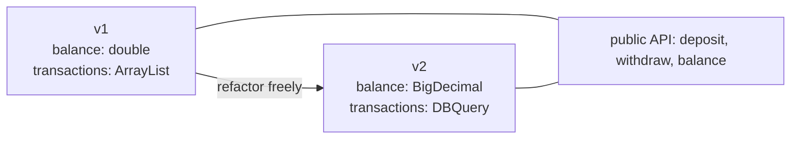

# Encapsulation

## Overview

The discipline of **separating what a unit does from how it does it**. A unit (object, module, package, service) exposes a small, stable surface — methods, queries, or messages — and hides everything else behind that surface: fields, internal data structures, cached state, helper methods.

Encapsulation isn't about `private` keywords. The keyword is *enforcement*; the principle is *intent*. A class can be public-fields-only and still be well-encapsulated if callers respect that those fields are part of the contract; conversely, a class with all-private fields can leak its internals through getters and setters that expose every detail.

Coined formally by David Parnas in 1972 as **information hiding** — the idea that good design groups *secrets* (decisions likely to change) inside modules and exposes only stable contracts.

## Problem

When encapsulation is weak, every part of a system can poke at every other part's internals:

- A change to a private field breaks code that "shouldn't" know about it but does, via reflection / friend access / poorly-disciplined calling code.
- A class's internal data structure (say, a list) is exposed via a getter. Callers mutate it directly. Now the class can't change its representation without breaking those callers.
- A module exposes "everything that could be useful." Two years later it has 80 public methods, half of which were exposed for one consumer that no longer exists.
- A class is rewritten to use a more efficient data layout. Callers that depended on iteration order or the result of `==` comparisons silently break.

The pattern is the same: **leaked internals create coupling that prevents future change**.

## Key Concepts

### What gets hidden

A well-encapsulated unit hides:

- **Fields** — store what you need; don't expose the storage choice. Mutability of internal state especially.
- **Internal data structures** — whether you use a `List`, `Set`, or custom structure shouldn't be visible to callers.
- **Helper methods** — anything not part of the public contract.
- **Implementation algorithm** — sorting strategy, caching strategy, retry logic. Callers care about the result, not the path.
- **External dependencies** — the class uses a database; callers shouldn't know which database, or that there is one.
- **Decisions likely to change** (Parnas's original framing) — anything you'd want freedom to revise without ripple effects.

### What gets exposed

The public surface should be:

- **Minimal** — only what callers genuinely need.
- **Stable** — changes to the public contract are breaking changes; treat them with the gravity that implies.
- **Behavior-oriented** — methods that *do* things, not getters/setters that just expose state.
- **Self-consistent** — the contract is internally coherent (same naming, same conventions, same error semantics).

### Encapsulation vs access modifiers

The two are related but not the same:

- **Access modifiers** (`private`, `internal`, `protected`, `public`) are the language's enforcement mechanism. They prevent some accidental leaks at compile time.
- **Encapsulation** is the design intent. A class with all-public fields can be well-encapsulated *by convention* (callers respect that those fields are part of the documented contract). A class with all-private fields can be poorly-encapsulated if it exposes every internal detail through its public API.

The keyword catches the obvious mistakes; intent catches the rest.

## Prerequisites

None — encapsulation is the prerequisite for many other principles, not vice versa. Helpful background: basic OOP (classes, methods, fields) and at least one programming language with access modifiers.

## When to Use

Encapsulation is a baseline discipline — apply it everywhere, almost always. Specific cases where it pays off most:

- **Anything that holds mutable state** — encapsulation makes the rules of state change explicit and enforceable.
- **Anything that might evolve** — and most things do. A unit you might refactor next year benefits enormously from a stable public surface.
- **Anything called by code you don't control** — public APIs, library exports, microservice boundaries. These especially.
- **Concurrent code** — encapsulation lets you control how state is accessed, which is the foundation of thread-safety.

## When NOT to Use

Encapsulation has limits. Don't over-apply when:

- **Pure data transfer objects (DTOs / records).** A type whose entire purpose is "carry a few values across a boundary" doesn't need behavior-oriented encapsulation. Public read-only fields are fine.
- **Performance-critical code.** Sometimes you need direct field access for cache locality or to avoid call overhead. Document the trade-off; don't pretend it's good design — accept the pragmatic choice.
- **Internal types in a small module.** Helper classes used only within a module don't need full public-API treatment. Keep them simple.
- **Throwaway scripts.** A 100-line CLI tool doesn't need every internal helper to have a defined contract.

## Trade-offs

### Benefits

- **Refactor safety.** You can change internals without breaking callers, as long as the public contract holds.
- **Lower coupling.** Callers depend on the contract, not the implementation. Coupling is contained at the seam.
- **Concurrency control.** State only changes through methods you wrote, so you can serialize or coordinate access.
- **Defensive validation.** Methods can enforce invariants on entry; raw field access can't.
- **Clearer documentation surface.** The public methods *are* the documentation of how the unit is meant to be used.

### Drawbacks

- **More boilerplate** — getters, setters, validation methods, sometimes interface declarations.
- **Indirection cost** — going through a method call instead of a direct field access. Negligible in 99% of code; measurable in tight loops.
- **Discipline cost** — encapsulation is a constant judgment call. "Should this be public?" gets asked thousands of times in a codebase.
- **Risk of leaky encapsulation** — getters that return mutable references, methods that expose internal state under different names, all of which look encapsulated but aren't.

### Performance Characteristics

Mostly **performance-neutral**. Method calls cost a few nanoseconds in compiled languages with good JITs. In hot loops with millions of iterations, this can be measurable; in everything else, it's invisible.

For ultra-hot code (game engines, kernels, database internals), direct memory access often wins. Treat that as a documented optimization, not as a default.

### Alternatives

- **Immutable data + pure functions.** A different style: instead of encapsulating mutable state, eliminate the state. The object's "internals" are read-only fields, and behavior lives in functions that produce new objects. Common in functional languages and increasingly in OOP (Kotlin data classes, C# records).
- **Public-by-default + convention.** Some languages and communities (early Python, much Go code) lean on conventions instead of access modifiers. Works in small/disciplined teams; breaks down at scale.

## Simple Example

A bank account class. Two ways to model it.

### Bad — public fields, no encapsulation

```java
public class BankAccount {
    public String owner;
    public double balance;
    public List<Transaction> transactions;
}
```

Callers do whatever they want:

```java
account.balance = -500.00;          // can violate invariant trivially
account.transactions.add(fake);     // can mutate the history
account.owner = null;               // breaks all kinds of assumptions
```

Every consumer that touches a field is now coupled to the storage choice. Want to change `balance` from `double` to `BigDecimal` for precision? Every caller must change too. Want to log transactions to a stream instead of a list? Every caller breaks.

### Better — encapsulated, behavior-oriented

```java
public final class BankAccount {
    private final String owner;
    private BigDecimal balance;
    private final List<Transaction> transactions = new ArrayList<>();

    public BankAccount(String owner, BigDecimal openingBalance) {
        if (owner == null || owner.isBlank()) throw new IllegalArgumentException("owner required");
        if (openingBalance.signum() < 0)      throw new IllegalArgumentException("negative opening balance");
        this.owner = owner;
        this.balance = openingBalance;
    }

    public String owner() { return owner; }
    public BigDecimal balance() { return balance; }
    public List<Transaction> transactionHistory() {
        return Collections.unmodifiableList(transactions);  // no leak of internal list
    }

    public void deposit(BigDecimal amount) {
        if (amount.signum() <= 0) throw new IllegalArgumentException("must be positive");
        balance = balance.add(amount);
        transactions.add(new Transaction(Type.DEPOSIT, amount, Instant.now()));
    }

    public void withdraw(BigDecimal amount) {
        if (amount.signum() <= 0)      throw new IllegalArgumentException("must be positive");
        if (balance.compareTo(amount) < 0) throw new InsufficientFundsException();
        balance = balance.subtract(amount);
        transactions.add(new Transaction(Type.WITHDRAWAL, amount, Instant.now()));
    }
}
```

What's better:

- **Invariants are enforced.** You can't put the account in a bad state from outside.
- **Storage choice is hidden.** Switching from `BigDecimal` to a custom `Money` type, or from `ArrayList` to a database query, is a private change.
- **Audit history is consistent.** Every balance change is paired with a transaction record automatically.
- **Read-only views protect internal collections.** `transactionHistory()` returns an unmodifiable view — callers can read, can't tamper.
- **The public API is small.** Five methods plus a constructor. Anyone reading the class understands the contract immediately.

### Common leak — returning mutable internals

```java
public List<Transaction> transactionHistory() {
    return transactions;  // BAD: caller can mutate the field
}
```

Looks like encapsulation; isn't. The caller has direct access to the internal list and can mutate the account's history. The fix is `Collections.unmodifiableList(transactions)` or returning a defensive copy.

This pattern repeats: a class is "encapsulated" but a getter returns a reference to a mutable internal structure. The keyword `private` provides false comfort; the leak is real.

### Key takeaways

- Access modifiers help, but don't substitute for thinking about *what's part of the contract*.
- Returning collections, builders, or other mutable internals is a common silent leak — wrap with read-only views or copy.
- Constructors are the place to enforce "you can't construct an invalid instance." Validate eagerly.
- Behavior-oriented APIs (`deposit`, `withdraw`) document intent better than data APIs (`setBalance`, `getBalance`).

## Diagrams

### What gets hidden, what gets exposed

```mermaid
flowchart TB
  subgraph Public["Public surface (stable contract)"]
    M1[deposit&#40;amount&#41;]
    M2[withdraw&#40;amount&#41;]
    M3[balance&#40;&#41;]
    M4[transactionHistory&#40;&#41;]
  end
  subgraph Private["Private internals (free to change)"]
    F1[balance: BigDecimal]
    F2[transactions: ArrayList]
    F3[validateAmount&#40;...&#41;]
    F4[appendAudit&#40;...&#41;]
  end
  Public --- Private
```



The wall between public and private is the encapsulation boundary. Outside callers see only the top half; refactoring the bottom half is local.

### Encapsulation enables refactoring



The public API is the same in v1 and v2; only the internals changed. Callers don't notice.

## Checklist

### Implementation Checklist

- [ ] Are mutable fields private?
- [ ] Are getters returning immutable views or defensive copies for collections?
- [ ] Are setters justified, or could the operation be behavior-oriented (`deposit` vs `setBalance`)?
- [ ] Does the constructor reject invalid initial state?
- [ ] Is the class final / sealed by default? (Subclassing breaks encapsulation.)
- [ ] Do public methods preserve invariants under all valid call sequences?

### Review Checklist

- [ ] **Public mutable fields** — flag immediately. Either narrow the visibility or wrap in a method.
- [ ] **Getter returns a reference to a mutable internal** — silent leak, flag for `unmodifiable`/copy.
- [ ] **`set` methods that allow violating invariants** — replace with behavior-oriented methods.
- [ ] **Method names that expose implementation** (`getCacheList`, `getDbConnection`) — rename to behavior or hide.
- [ ] **`protected` fields in non-final classes** — subclasses can leak them transitively. Prefer protected methods or final classes.
- [ ] **Reflection / `friend` / privileged access** to other classes' internals — usually a coupling smell.

### Production Readiness

- [ ] Public API documented (Javadoc, XMLdoc, docstrings) — that's the contract you're committed to.
- [ ] API changes follow semantic versioning if the unit is shared across teams or services.
- [ ] Defensive validation in the public methods — don't trust callers, even internal ones.
- [ ] Thread-safety documented — encapsulation is the foundation of thread-safety guarantees.

## Topic Anti-Patterns

> Anti-patterns *specific to encapsulation*. For generic anti-patterns (God Object, etc.) see [16_AntiPatterns](../16_AntiPatterns/).

### Getter/setter for every field

**Description.** Every private field has a corresponding `getX` and `setX`. The class is "encapsulated" by the keyword but exposes every implementation detail through the API.

**Why it's bad.** No different from public fields, just more boilerplate. The contract is the storage layout; refactoring is impossible without breaking callers.

**Better approach.** Expose behavior, not state. Ask "what does the caller need to *do*?" rather than "what fields do I have?"

### Returning mutable internal state

**Description.** A getter returns a direct reference to an internal collection or builder. Callers can mutate the class's internals from outside without realizing.

**Bad example.**

```java
public List<Item> getItems() {
    return items;  // direct internal reference
}
```

**Better approach.** Return an immutable view, a defensive copy, or restructure so callers don't need the collection at all (provide methods that operate on it).

### Train wreck (Law of Demeter violation)

**Description.** Code that reaches across multiple objects to do something: `a.getB().getC().doSomething()`. Each `.get*()` call is encapsulation breaking the chain — the caller now knows about A's internal B, B's internal C, and so on.

**Why it's bad.** Callers couple to the entire chain of internal structure. Any refactor of any link breaks them.

**Better approach.** Tell, don't ask. Expose a method on A that does the work: `a.doSomething()` internally walks to B and C, hidden from callers.

### Encapsulation by access modifier alone

**Description.** Marking everything `private` and feeling done. The actual API still exposes implementation details — collections, internal types, half-baked invariants — through a barrage of `public` methods.

**Why it's bad.** Modifier-level encapsulation catches the obvious leaks; intent-level encapsulation catches the rest. The first without the second is a false sense of security.

**Better approach.** Review what's *exposed*, not just what's *private*. Each public method is a commitment.

### Anemic domain models

**Description.** Classes with only fields and getters/setters; all behavior lives in separate "service" classes that operate on those data bags.

**Why it's bad.** The domain has no encapsulation — every "service" can construct or mutate domain objects however it wants. Invariants can't be enforced; the data model has no defenders.

**Better approach.** Put behavior on the domain object when the behavior depends on the object's state. Reserve "services" for orchestration that genuinely cuts across multiple domain types.

### Related smells

- **Feature envy** (a method in class A uses class B's data more than its own) — usually means the method is in the wrong class, or B has weak encapsulation.
- **Inappropriate intimacy** (two classes too entangled with each other's internals) — encapsulation broken between them.
- **Message chains** — Train wrecks, see above.

## Notes

### Insights

- **Encapsulation is the prerequisite for low coupling.** You can't lower coupling between modules whose internals are wide open.
- **The public API is a promise.** Once you make something public, removing it is a breaking change. Treat the surface like an OS API: deliberate, documented, versioned.
- **Defensive copies are usually the right tradeoff.** A few extra allocations beat silent leaks. For perf-critical hot paths, reach for immutable types instead — they don't need defending.
- **Encapsulation pairs with naming.** A method named `recalculatePriceSubtotal` exposes implementation; a method named `priceSubtotal` exposes intent. Names are part of the contract.
- **Languages help to varying degrees.** C# `init` and `readonly`, Java `final`, Rust ownership, Kotlin `val` all reduce the surface area of mistakes. Use them.

### Edge cases

- **Records / data classes** are intentionally low-encapsulation: they exist to expose data. That's fine when the type is genuinely data-only and immutable. Don't confuse them with domain objects.
- **Builders** expose fluent APIs that look like they're mutating; that's by design. Encapsulation here is *where* the build happens — usually inside a final `build()` step that produces the immutable result.
- **Test code** sometimes reaches around encapsulation with reflection / access tricks. Acceptable for limited cases; usually a code smell pointing at insufficient public seams.

### Gotchas

- *"Just one more public method"* compounds. Each public addition is permanent friction.
- *"It's only used internally"* — until it isn't. Mark internal/private now, raise the visibility later if needed.
- *Returning `List<T>` is fine if it's read-only.* But Java's `List` interface is mutable by default; consumers may try to add/remove and crash at runtime. Consider `Collection<T>` (more general, still mutable) or domain-specific read-only types.
- *Kotlin `var` properties auto-generate getter and setter*. The "encapsulation" is syntactic. Switch to `val` or expose only what you need.

### Open questions

- *Where does encapsulation end and "object-orientation" begin?* — they overlap heavily but aren't identical. Functional code without classes can still encapsulate (modules, opaque types).
- *How strict should encapsulation be in modern dynamic languages?* — Python convention (`_leading_underscore`) is enough for many teams; some prefer stricter via tools (`__name_mangling`, `@dataclass(frozen=True)`).
- *Is full encapsulation possible with serialization / ORMs?* — partly. ORMs sometimes need access to internals; document and minimize the leak.

## Related Topics

- `Coupling_Cohesion` — encapsulation is the prerequisite for keeping coupling low.
- `Separation_of_Concerns` — encapsulation protects the seams once concerns are separated.
- `Law_of_Demeter` — concrete tactic for keeping callers from reaching past the encapsulation boundary.
- `SOLID` — encapsulation enables LSP (subtypes preserve invariants) and DIP (depend on contracts, not internals).

## References

- David Parnas, ["On the Criteria To Be Used in Decomposing Systems into Modules"](https://www.win.tue.nl/~wstomv/edu/2ip30/references/criteria_for_modularization.pdf) (1972) — the founding paper on information hiding.
- Joshua Bloch, *Effective Java* — Items 15-19 cover encapsulation pragmatics in depth.
- Wikipedia: [Encapsulation (computer programming)](https://en.wikipedia.org/wiki/Encapsulation_(computer_programming)).
- Bertrand Meyer, *Object-Oriented Software Construction* — design-by-contract framing of encapsulation.
