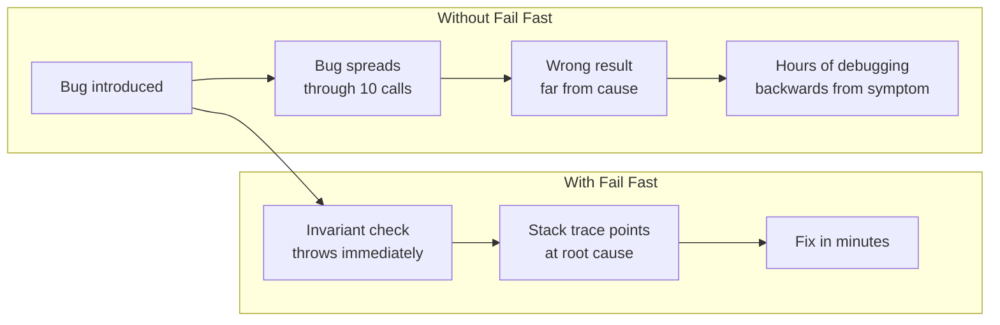
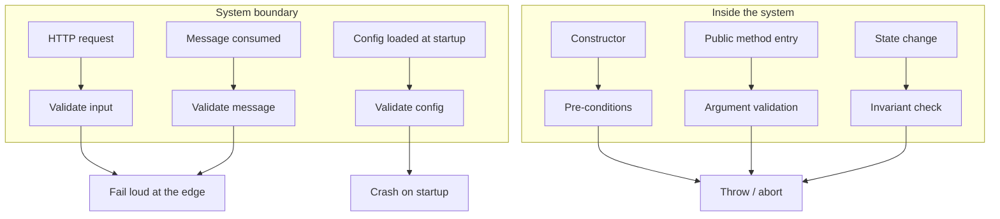

# Fail Fast

## Overview

When an invariant is violated or an unexpected state is detected, **stop immediately** with a clear, loud error. Don't continue with corrupted state, don't return a placeholder value, don't paper over the problem with default behavior, don't catch-and-ignore.

The principle is short: *bugs that crash near their root cause are cheap; bugs that surface far from their cause are expensive*. Fail Fast trades a louder failure right now for a quieter, much more painful failure later.

Coined by Jim Shore in a 2004 IEEE Software column. Predates by decades in defensive-programming culture, but Shore's framing made it canonical.

## Problem

The opposite of Fail Fast — call it "fail slowly," "fail silently," or "patch and continue" — produces:

- A null reference is silently substituted with an empty string. Twenty function calls later, code that depends on the real value produces a wrong result. The original bug is in the function that returned null; debugging starts at the wrong-result call site.
- A configuration value is missing. The app uses a hardcoded default. The default is wrong for production. The bug surfaces at 2 AM as a customer complaint, three weeks after the deploy.
- An invariant ("balance ≥ 0") is silently allowed to drift. A negative balance creeps into the database. Audits, reports, and statements derived from it are wrong. By the time anyone notices, the database has thousands of corrupted records.
- A try/catch swallows an unexpected exception. The function returns a "success" status. The user thinks the operation worked. The downstream system that depends on the operation having actually happened produces a different bug.

The shared pattern: **a small, local mistake produces a delayed, distant symptom**. Debugging the symptom backwards to the cause takes hours. The mistake itself, if surfaced immediately, would have taken minutes.

## Key Concepts

### What "fail" means here

- **Throw an exception** in languages that have them. Loud, with a clear message.
- **Return an explicit error** in languages that prefer it (Result/Either types, errno, status codes). Don't return a sentinel that callers might miss.
- **Crash the process** for unrecoverable invariant violations. A corrupted memory state isn't something to "handle" — it's something to surface immediately so an operator can intervene.
- **Log loudly and assert** in development. In production, the equivalent is alerting on the error metric.

What it does NOT mean:

- Don't catch network errors and crash the process. Those are *recoverable* — different category.
- Don't crash on user input. Validate it, return a clean error, let them try again.

The principle distinguishes **bugs** (your invariants are violated; surface NOW) from **failures** (the world is misbehaving; handle gracefully).

### Where to fail fast

The **system boundary** is the canonical place:

- **Constructor / factory.** If an object can't be safely constructed, throw. Never return a half-built object that callers must remember to check.
- **Method entry.** Validate parameters and preconditions at the top of public methods. Don't let bad inputs propagate through five lines of work before erroring.
- **External boundary** (HTTP request, message consumed, file read). Validate immediately on receipt. Reject at the edge.
- **State invariants.** When a class can detect that its state is inconsistent (a balance that should be ≥ 0 went negative), throw and stop.

### What to NOT fail fast on

- **Recoverable errors.** Transient network issues, rate limits, ephemeral resource shortages. These have proper recovery strategies — retry, circuit breaker, queue.
- **Expected user mistakes.** A user typing an invalid email shouldn't crash anything. Return a 400, show the error.
- **Tolerated optional fields.** A user without a profile picture isn't an invariant violation; it's a normal state.

The bright-line: *bugs* fail fast; *expected exceptional conditions* don't.

## Prerequisites

- `Encapsulation` — invariants live inside encapsulated objects. Without encapsulation, you can't even tell when one is violated.
- A debugger, a logger, or an error reporting tool — Fail Fast pays off when failures get observed quickly.

## When to Use

Always — but especially:

- **At system boundaries.** HTTP entry, message handlers, scheduled job entry points. Validate, then proceed.
- **In constructors / initialization.** Reject impossible state before the object exists.
- **On invariant detection.** State checks inside business code that catch impossible states.
- **In configuration loading.** Validate config at startup. A missing required value should crash *now*, before any traffic.
- **Critical correctness paths.** Financial calculations, security-relevant code, anything where "wrong" is much worse than "stopped."

## When NOT to Use

- **Network / I/O boundaries with retry semantics.** A failed HTTP call isn't a bug; it's the world. Retry, backoff, circuit-break — that's the right pattern.
- **User-facing input validation.** Don't crash on bad input; return a clean error.
- **Optional features.** Missing analytics tracker shouldn't take down the request path.
- **Performance-critical hot loops.** Validating every iteration's preconditions costs cycles. Validate at entry; trust internally.
- **Legacy systems with poor error infrastructure.** If a Fail Fast crash will be silently restarted by a process supervisor and produce no signal, you've gained nothing.

## Trade-offs

### Benefits

- **Bugs surface near their cause.** Debugging time drops from hours to minutes.
- **Forces explicit handling decisions.** Code can't accidentally ignore problems by silent default.
- **Cleaner error reporting.** Loud, structured failures show up in logs, alerts, and crash reports immediately.
- **Reduces corrupted-state risk.** A process that exits at the first sign of trouble can't write inconsistent records to the database for the next hour.
- **Tightens contracts.** Methods declare what they expect; callers learn to provide it.

### Drawbacks

- **More crashes in development** while the team learns. (This is actually a benefit, but it can feel like noise initially.)
- **Loud failures need observability.** A crash in the woods that nobody hears doesn't help.
- **Misuse on recoverable errors makes the system fragile.** Failing fast on a transient network blip = unnecessary outage.
- **Some invariants are hard to define cleanly.** Distinguishing "bug" from "edge case" can be subtle.

### Performance Characteristics

Validation has a cost — typically a few nanoseconds for a precondition check. Negligible in 99% of code. In hot loops at millions of operations/sec, removing checks from internal helpers (after validation at entry) is the standard optimization.

### Alternatives

- **Defensive programming** (broader umbrella) — Fail Fast is the *aggressive* form; the *graceful* form catches and recovers.
- **Design by contract** (Eiffel-style preconditions/postconditions/invariants) — formal Fail Fast.
- **Tolerant reader** (Postel's law / "be liberal in what you accept") — opposite philosophy at protocol boundaries. Each has its place.

## Simple Example

### Without Fail Fast

```python
def calculate_discount(user, order_total):
    rate = user.discount_rate  # what if user is None?
    if rate is None:
        rate = 0  # silently default
    return order_total * rate

# Caller:
discount = calculate_discount(get_user(user_id), order.total)
final = order.total - discount
```

If `get_user` returns `None` (user not found), the chain quietly produces `discount = 0` and `final = order.total` — no error, no log. The user sees the original price; the company silently misses applied discounts; the bug is invisible until somebody notices revenue is wrong.

### With Fail Fast

```python
def calculate_discount(user, order_total):
    if user is None:
        raise ValueError("user is required")
    if order_total < 0:
        raise ValueError(f"order_total must be non-negative, got {order_total}")
    rate = user.discount_rate
    if rate is None:
        raise ValueError(f"user {user.id} has no discount_rate set")
    return order_total * rate

# Caller — get_user must return a real user, not None:
user = get_user(user_id)
if user is None:
    return error_response(404, "user not found")
discount = calculate_discount(user, order.total)
final = order.total - discount
```

Now the violation surfaces immediately and points at the root cause. If `get_user` returns `None`, the caller handles it explicitly *at the appropriate boundary* (the HTTP layer, returning a 404). If a user really does have `discount_rate=None`, that's a data integrity issue surfaced loudly — not silently turned into "no discount, no problem."

### Key takeaways

- The "graceful default" version was actually less graceful — it silently produced wrong results.
- Fail Fast pushes responsibility for handling missing values *up* to where it can be handled correctly (the boundary that knows whether 404 or "create on demand" or "use anonymous" is right).
- Each precondition check is a single line; the cost is small, the payoff is large at debug time.

## Real World Example

### Context — a configuration drift bug

A SaaS app reads its database connection string from an environment variable `DB_URL`. A migration moved one service to a new database. The new service was deployed; the env var update was missed in one environment.

#### Without Fail Fast

```python
# Old code
def db_connection():
    url = os.environ.get("DB_URL", "postgres://localhost/dev")  # default to dev DB
    return psycopg.connect(url)
```

The service starts. It connects to the *dev* database (the fallback default). It serves traffic — but its writes go to dev. The bug is detected three days later when production reports show stale data, and the team has to reconcile traffic written to the wrong database.

#### With Fail Fast

```python
def db_connection():
    url = os.environ.get("DB_URL")
    if not url:
        raise RuntimeError("DB_URL is required (no default)")
    return psycopg.connect(url)
```

The service crashes on startup. The container restart loop alerts on-call. The missing env var is identified within minutes. Zero data written to the wrong database. The "outage" lasts twenty minutes; the silent corruption that the default would have caused would have lasted three days and required reconciliation work.

The lesson: **a loud failure on startup is much cheaper than a silent corruption in production**. Defaults should only exist for genuinely optional configuration; required configuration must Fail Fast.

## Diagrams

### When the bug appears



### Where to fail fast



## Checklist

### Implementation Checklist

- [ ] Constructors validate their arguments and reject impossible state.
- [ ] Public methods check preconditions at the top, with clear error messages.
- [ ] Configuration is validated at startup; required values without defaults cause immediate crash.
- [ ] Invariant violations (state that "should never happen") throw rather than continue.
- [ ] Catch blocks catch *specific* recoverable exceptions, not `Exception` catch-all.
- [ ] Default values are only for genuinely optional things, never for required state.

### Review Checklist

- [ ] **`if x is None: return ...`** that silently substitutes a default — flag for review. Is the default actually correct, or is it hiding a missing-data bug?
- [ ] **`try: ... except: pass`** — flag immediately. The empty handler is hiding something.
- [ ] **A method takes a parameter and never validates it** — what happens with bad input?
- [ ] **Constructor that "tolerates" missing fields** — almost always a smell. Reject and surface.
- [ ] **Default config value for something that should be configured** — flag for review.

### Production Readiness

- [ ] Crashes are visible — error tracking, log aggregation, alerts on error rates.
- [ ] Process supervisor restarts cleanly but alerts on flapping (so silent crash loops surface).
- [ ] Errors carry enough context (request ID, user ID, structured fields) to diagnose without reproduction.
- [ ] Critical assertions (financial invariants, security checks) cannot be disabled by config or compile flags.

## Topic Anti-Patterns

> Anti-patterns *specific to Fail Fast* (and its inverse). Generic anti-patterns are in [16_AntiPatterns](../16_AntiPatterns/).

### Catch-all and ignore

**Description.** A `try` block wraps a chunk of work; the `catch` is empty or just logs. Any failure is silently swallowed.

**Bad example.**

```python
try:
    process_payment(order)
except Exception:
    pass  # silent
```

**Why it's bad.** Bugs in `process_payment` never surface. Failures look like successes to callers.

**Better approach.** Catch *specific* exceptions you have a real recovery for. Let everything else propagate. Log with context.

### Default values for required state

**Description.** Configuration, database connection strings, feature flags — given fallback defaults so the program "always starts." If the real value is missing, the default silently takes over.

**Why it's bad.** Operations that should have alerted on misconfiguration produce silent, wrong behavior.

**Better approach.** Required = no default. Crash on startup if it's missing. Optional = sensible default.

### Sentinel return values that callers ignore

**Description.** A function returns `null`, `-1`, or `""` to signal failure, expecting the caller to check. The caller doesn't.

**Why it's bad.** The "signaled" failure becomes a silent corruption two function calls later.

**Better approach.** Throw exceptions or use a Result/Either type that *makes* the caller handle both branches. Force the choice.

### Excessive defensive guards (the opposite anti-pattern)

**Description.** Every method top has 20 lines of `if (param == null) return null` and similar. Failure is hidden behind no-op returns instead of loud crashes. Code is "robust" but bugs are invisible.

**Why it's bad.** Same outcome as silent defaults — bugs propagate quietly.

**Better approach.** Validate at the boundary, then trust. Internal helpers can assume valid inputs because the entry validated them. Don't double-guard.

### "Best effort" anti-pattern

**Description.** A method tries to do work, swallows partial failures, returns a "best effort" result. Caller has no way to know what succeeded and what didn't.

**Why it's bad.** Partial success is the worst kind of state — neither cleanly failed (so the caller can recover) nor fully succeeded (so the caller can move on).

**Better approach.** Either succeed atomically, or fail and roll back. If partial success is genuinely OK (e.g., notifying 100 users; some failures are acceptable), return a structured result that lists successes and failures separately. Don't pretend it all worked.

### Related smells

- **Empty catch blocks** — direct anti-pattern.
- **Logging without rethrowing** — usually the same thing in disguise.
- **Magic sentinel values** that callers may or may not check.
- **Silent string truncation, integer wraparound, etc.** — language-level versions of the same problem.

## Notes

### Insights

- **The principle pays off most for *bugs*.** Network errors, user mistakes, ephemeral resource issues — those need different handling.
- **Loud failures need observability infrastructure.** If a process crashes and nobody notices, Fail Fast didn't fail-fast — it failed silently. Pair with monitoring.
- **Many "experienced" developers reflexively add defensive guards everywhere.** That's *not* Fail Fast — that's the opposite. Validate at boundaries; trust internally.
- **Fail Fast is most useful in code with mutable state.** Pure functional code rarely needs it because the absence of state means there's less to corrupt.
- **`assert` in many languages is for development only**. For invariants that must hold in production, use real exceptions, not asserts that get compiled out.

### Edge cases

- **Async code.** Failing fast in async code requires care — exceptions thrown inside an async task that nobody awaits get swallowed. Use task-fail handlers or unhandled-promise-rejection handlers.
- **Distributed systems.** Failing fast on a node still requires graceful failure at the system level (other nodes detect and recover). Fail Fast inside the node, fail gracefully across nodes.
- **Init/teardown.** A failure during cleanup can mask the real cause. Try to capture the original error first; report the cleanup failure separately.

### Gotchas

- *"Just log and continue"* is the most common Fail-Fast violation in real codebases.
- *Tolerating malformed config "to be friendly"* often means production silently runs in dev mode.
- *Catch-all exception handling at the framework boundary is fine* — it should *report* and *return a clean error*, not *silently continue*.

### Open questions

- *How fast is "fast enough"?* — pragmatically, "as soon as the violation is detected, before doing further work that would obscure the cause."
- *What about distributed invariants?* — partly. You can fail fast locally; you can't always fail fast across nodes without coordination.

## Related Topics

- `Encapsulation` — invariants enforced by encapsulation are what Fail Fast detects when violated.
- `SOLID` — methods with clear contracts (preconditions, postconditions) are easy to validate fast.
- `Code_Smells` — many smells are markers for places where Fail Fast was missed.

## References

- Jim Shore, ["Fail Fast"](https://martinfowler.com/ieeeSoftware/failFast.pdf) (IEEE Software, 2004) — the canonical paper.
- Bertrand Meyer, *Object-Oriented Software Construction* — design by contract framework.
- Andy Hunt & Dave Thomas, *The Pragmatic Programmer* — "Crash Early" tip.
- Erlang's "let it crash" philosophy — Fail Fast at process scale, paired with supervision for recovery.
