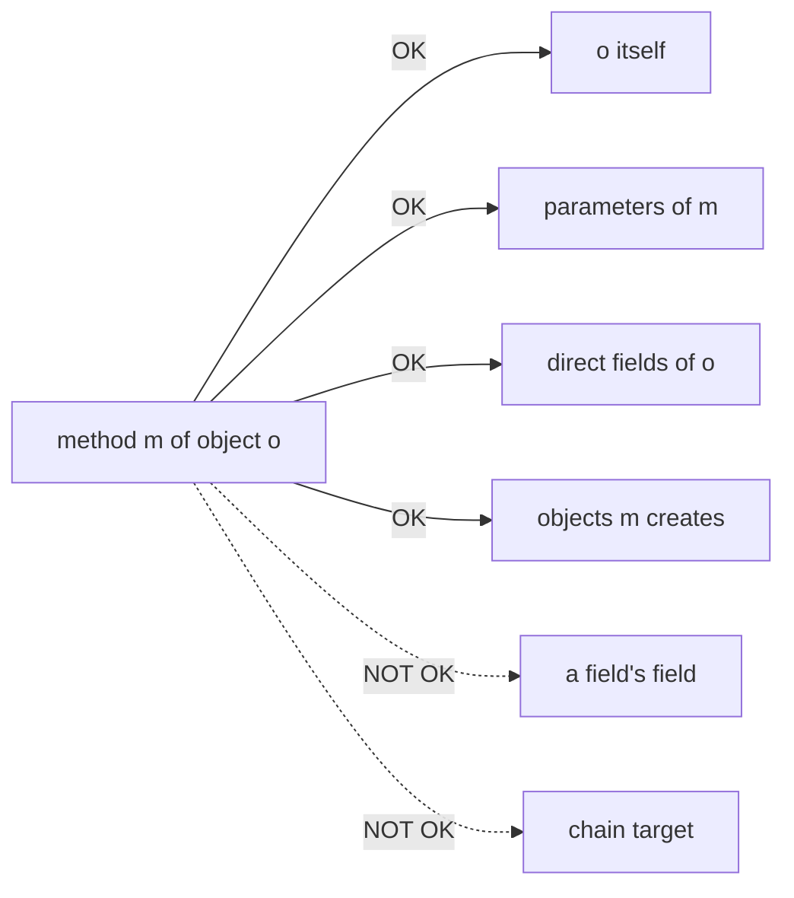
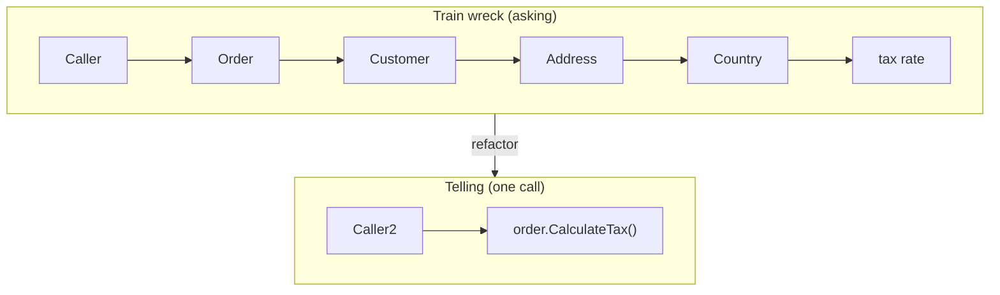

# Law of Demeter

## Overview

Also called the **Principle of Least Knowledge**: a method should only call methods on objects in a small, well-defined set:

- The object's own fields and methods (`this.something()`).
- Parameters passed into the method.
- Objects the method itself creates.
- Direct components / fields of the receiving object.

**It should not** chain through other objects to reach further (`a.getB().getC().doX()`). Each `.get*()` step is a piece of knowledge the caller shouldn't have.

The rule was formulated by Ian Holland's PhD work on the Demeter Project at Northeastern University in 1987. Despite the name "Law," it's a heuristic about **how widely your method's knowledge should reach**, not a hard rule.

## Problem

Code that violates the Law of Demeter is brittle in a specific way: a refactor *anywhere* in the chain breaks the calling code. The classic train-wreck call:

```python
total = order.get_customer().get_billing_address().get_country().get_tax_rate() * order.amount
```

This single line knows about:

- `Order` having a `customer`.
- `Customer` having a `billing_address`.
- `Address` having a `country`.
- `Country` having a `tax_rate`.

If any of those four classes restructures — `Customer` gets multiple addresses, `Address` becomes a value object without `country`, `Country` moves the tax rate to a separate `TaxPolicy` — the caller breaks.

The deeper problem: **the caller is doing work that a domain object should be doing**. The chain is calculating a tax-relevant figure by reaching across four objects' internals. That logic belongs *inside* one of those objects.

## Key Concepts

### "Talk to friends, not to strangers"

The popular shorthand. A method `m` on object `o` should only invoke methods on:

1. **`o` itself.** `this.something()`.
2. **Objects passed as parameters to `m`.** Including the receiver.
3. **Objects `m` creates locally.** `new Helper().do()` is fine.
4. **Direct components of `o`.** Fields owned by `o` (not their fields, transitively).

Anything beyond that — reaching into a field's field — is a "stranger" the method shouldn't know.

### Tell, Don't Ask

The closely related design heuristic: instead of *asking* an object for its data and then doing something with it, *tell* the object what you want done.

```python
# Asking — knows about internal structure
if order.customer.billing_address.country.code == "IT":
    apply_italian_tax(order)

# Telling — domain object handles its own concern
order.apply_tax()
```

The "telling" version doesn't care what the order needs to consult internally — that's the order's business.

### What's not a violation

Some chains are fine:

- **Fluent builders / DSLs.** `query.where(x).limit(10).order_by(y)` returns the same builder each time. No new objects' internals are exposed.
- **Pure data transformations.** `numbers.filter(...).map(...).sum()` operates on a sequence's protocol, not on hidden internals.
- **Same-type chains.** If each `.parent` returns another node of the same type, you're walking a tree, not crossing strangers' internals.

The rule is about **crossing class boundaries to access internal structure**, not about chained syntax in general.

## Prerequisites

- `Encapsulation` — Demeter is enforced by good encapsulation. If neighbors are encapsulated, you literally *can't* reach past them.
- `Coupling_Cohesion` — Demeter violations are usually visible as high coupling (often stamp coupling).

## When to Use

The principle applies almost everywhere:

- **Domain code.** When working with rich domain objects, callers should rarely chain. Behavior lives on the objects themselves.
- **Cross-module calls.** Anywhere you're crossing a module/service boundary. The caller shouldn't know the receiver's internal structure.
- **Public APIs.** A library you ship. Chains through your types tie callers to your internal hierarchy.

## When NOT to Use

The "Law" overstates itself in some cases:

- **Pure data structures (DTOs, records).** A response shape from an HTTP API is *meant* to expose its structure. Reading `response.user.email` from a JSON-shaped result is fine.
- **Fluent APIs.** Builders, query DSLs, assertion libraries. Chaining is the design.
- **Walking homogeneous structures.** Tree traversal (`node.parent.parent`) doesn't violate Demeter — same type, intentional structure.
- **Internal helper code within one cohesive module.** Two helper classes that work closely together can reach into each other; the cost of strict Demeter inside a small unit is higher than the cost of mild coupling.

## Trade-offs

### Benefits

- **Lower coupling.** Each method depends on a smaller graph of types.
- **Refactor freedom.** Reorganizing internal structure of a class doesn't break callers.
- **Tells, doesn't asks.** Forces business logic onto the object that owns the data.
- **Clearer interfaces.** When you can't chain, you have to design proper methods on the receiver.

### Drawbacks

- **More methods on receiving classes.** Telling-not-asking moves work onto the receiver, growing its API.
- **Wrapper / facade methods accumulate** if applied dogmatically. `getCustomerCountry()`, `getCustomerCountryName()`, `getCustomerCountryCode()` start cluttering the class.
- **Sometimes the chain is the clearest expression.** Forcing a refactor for the sake of the rule can make code less readable.

### Performance Characteristics

Performance-neutral. Method calls have constant cost; whether you chain or move logic onto the receiver, the same number of operations happens.

### Alternatives

- **Tell, Don't Ask** (the related heuristic) — same idea phrased as design advice.
- **Encapsulation** — proper encapsulation makes Demeter enforce itself.
- **Domain-Driven Design rich domain models** — the architectural answer at scale: domain objects own behavior, callers call methods, no chaining needed.

## Simple Example

### Train wreck

```csharp
// In a service or controller
public decimal CalculateTax(Order order)
{
    var rate = order.GetCustomer()
                    .GetBillingAddress()
                    .GetCountry()
                    .GetTaxRate();
    return order.Amount * rate;
}
```

The caller has knowledge of: `Order` has a customer, `Customer` has a billing address, `Address` has a country, `Country` has a tax rate. That's four pieces of structural knowledge in one line.

Any of these classes restructures — for example, a customer can have multiple billing addresses (one per currency) — and this code breaks.

### Refactor: tell, don't ask

Move the logic to the object that owns the relevant data:

```csharp
public class Order
{
    private readonly Customer _customer;
    public decimal Amount { get; }

    public decimal CalculateTax()
        => Amount * _customer.TaxRateForBilling();
}

public class Customer
{
    private readonly BillingAddress _billing;
    public decimal TaxRateForBilling()
        => _billing.TaxRate();
}

public class BillingAddress
{
    private readonly Country _country;
    public decimal TaxRate()
        => _country.TaxRate;
}
```

Now the original caller becomes:

```csharp
var tax = order.CalculateTax();
```

The caller knows nothing about customers, addresses, or countries — just that an order can compute its own tax. If `Customer` adds multiple billing addresses, the change is local to `Customer.TaxRateForBilling()` (which now picks the right one). The caller doesn't notice.

### Note on the trade-off

The refactored version has a method per layer, each delegating to the next. Some critics call this "Demeter delegation tax." Counter-argument: each method is a *meaningful operation* in the language of its class. `Customer.TaxRateForBilling()` is a domain question worth asking; chasing through the chain wasn't.

When the delegation chain is long and *each step is trivial*, the smell is real — usually meaning the layering is wrong, not Demeter. Reconsider whether `Country.TaxRate` should really live on `Country`, or whether the design needs a `TaxPolicy` service that knows how to look it up given an order.

### Key takeaways

- A single `a.b.c.d` chain is the canonical violation. Each `.` after the first is a step into a stranger.
- The fix is rarely "shorten the chain" mechanically. It's "move the operation to where it belongs."
- DTOs and fluent APIs are exceptions — chains through homogeneous data or builder protocols are fine.

## Diagrams

### What "talk only to friends" means



### Train wreck vs telling



## Checklist

### Implementation Checklist

- [ ] Does this method call objects beyond `this`, parameters, fields, or local objects? If yes, it's a Demeter violation candidate.
- [ ] Could the call chain be replaced by a method on the receiver that answers the higher-level question?
- [ ] Is the chained call walking a homogeneous structure (a tree, a list)? Then it's fine.
- [ ] Is the chained call going through a fluent API / builder? Also fine.
- [ ] If the chain *can't* be moved cleanly to a domain object, reconsider the data model — maybe the layering itself is wrong.

### Review Checklist

- [ ] **`a.getB().getC().doX()`** — flag immediately. Discuss whether it's a real violation or one of the legitimate exceptions.
- [ ] **A method's body has many `.` traversals to access state.** Likely a missing operation on a domain object.
- [ ] **A test sets up `customer.billingAddress.country.taxRate = 0.22` to exercise some logic.** That's the test confessing the production code knows too much about the chain.
- [ ] **Long chain followed by mutation.** `obj.getList().add(x)` — almost always wrong; expose `obj.add(x)` instead.

## Topic Anti-Patterns

> Anti-patterns *specific to Law of Demeter*. For generic anti-patterns (God Object, Spaghetti), see [16_AntiPatterns](../16_AntiPatterns/).

### Strict Demeter without thought (delegation explosion)

**Description.** Mechanically applying "no more than one dot per line" until classes accumulate dozens of single-line wrapper methods that just forward to a contained object's method.

**Why it's bad.** Each wrapper method is API surface that has to be maintained, named, documented. The class becomes 80% delegation, 20% real logic.

**Better approach.** Apply the rule with judgment. The point is "don't reach across class boundaries to do business logic"; if you genuinely need a thin pass-through and the alternative is real coupling, take the pass-through.

### Hiding the violation behind a "facade"

**Description.** A `CustomerFacade` is created that wraps `Customer` with methods like `getBillingCountryCode()`. The chain now goes through the facade, but the facade itself just chains through internally. The violation is moved, not removed.

**Why it's bad.** Adds a layer without changing the fundamental problem. Callers still depend on the chain's structure; they just go through one extra hop.

**Better approach.** Push the operation onto the data owner where it actually applies. A real refactor, not a renaming.

### Asking instead of telling for behavior, not just data

**Description.** Pulling a flag or status from a chain (`order.status.code == "shipped"`) and branching on it externally, when the operation depended on the status should live on the order itself.

**Why it's bad.** The order's behavior is now scattered across every caller that asks about its state.

**Better approach.** `order.canBeCanceled()`, `order.markAsShipped()` — methods that encapsulate the status interpretation.

### Related smells

- **Feature envy** — a method uses another class's data more than its own. Almost always a Demeter violation in disguise.
- **Inappropriate intimacy** — two classes too entangled with each other's internals. Demeter violation chronic.
- **Message chains** — explicit name in Fowler's *Refactoring* for the chain pattern.
- **Middle man** — a class that does little except delegate. Sometimes a sign the strict Demeter rule was applied without thought (the opposite anti-pattern).

## Notes

### Insights

- **The "Law" name is a misnomer.** It's a heuristic, not a theorem. Treat violations as warnings, not errors.
- **Demeter formalizes Encapsulation.** Where Encapsulation says "hide internals," Demeter says "don't let callers reach past them."
- **The hardest cases are when the receiver doesn't yet have the right method.** That's a sign the receiver is missing a domain operation — design opportunity.
- **Tools can detect the syntactic pattern but not the semantic one.** Lint rules that flag `.` count miss the legitimate exceptions and flag fluent APIs. Use as a hint.
- **In strongly typed languages, Demeter often surfaces as "I need to add a method here."** Listen to it — usually right.

### Edge cases

- **Method chaining returning `this`** is fine — same object, no strangers crossed.
- **Iterators / streams** chain by nature; not a violation.
- **DTOs** are intended-public data carriers; chained access is acceptable.
- **Test code** can be more permissive — tests sometimes need to set up deep object graphs and that's OK.

### Gotchas

- *"Just a getter"* is how chains start. Once `getCustomer()` is exposed, callers will use it.
- *Refactoring blindly to satisfy Demeter* without understanding the domain produces over-decomposed code.
- *Fluent APIs are an exception, not a license to chain everywhere.* Don't use "but jQuery does it" to justify domain logic chains.

### Open questions

- *How does Demeter apply in functional languages?* — sort of. Pure functions don't have "internals," so the principle becomes about not destructuring deep into nested types.
- *Is `.` chain count the right metric?* — proxy at best. Some 4-dot chains are fine; some 1-dot accesses are violations. Judgment required.

## Related Topics

- `Encapsulation` — Demeter enforces what encapsulation hides.
- `Coupling_Cohesion` — Demeter violations are coupling smells.
- `SOLID` — SRP and DIP both push designs in the Demeter-friendly direction.
- `Composition_over_Inheritance` — composition with proper interfaces makes Demeter natural; deep inheritance often makes it harder.

## References

- Karl Lieberherr & Ian Holland, ["Assuring good style for object-oriented programs"](https://www2.ccs.neu.edu/research/demeter/papers/law-of-demeter/oopsla88-law-of-demeter.pdf) (IEEE Software, 1989) — the formal introduction.
- Wikipedia: [Law of Demeter](https://en.wikipedia.org/wiki/Law_of_Demeter).
- Martin Fowler, *Refactoring* — "Message Chains" smell and the "Hide Delegate" refactoring.
- David Bock, ["The Paperboy, the Wallet, and the Law of Demeter"](http://www.ccs.neu.edu/research/demeter/demeter-method/LawOfDemeter/paper-boy/demeter.pdf) — the canonical illustrative example.
