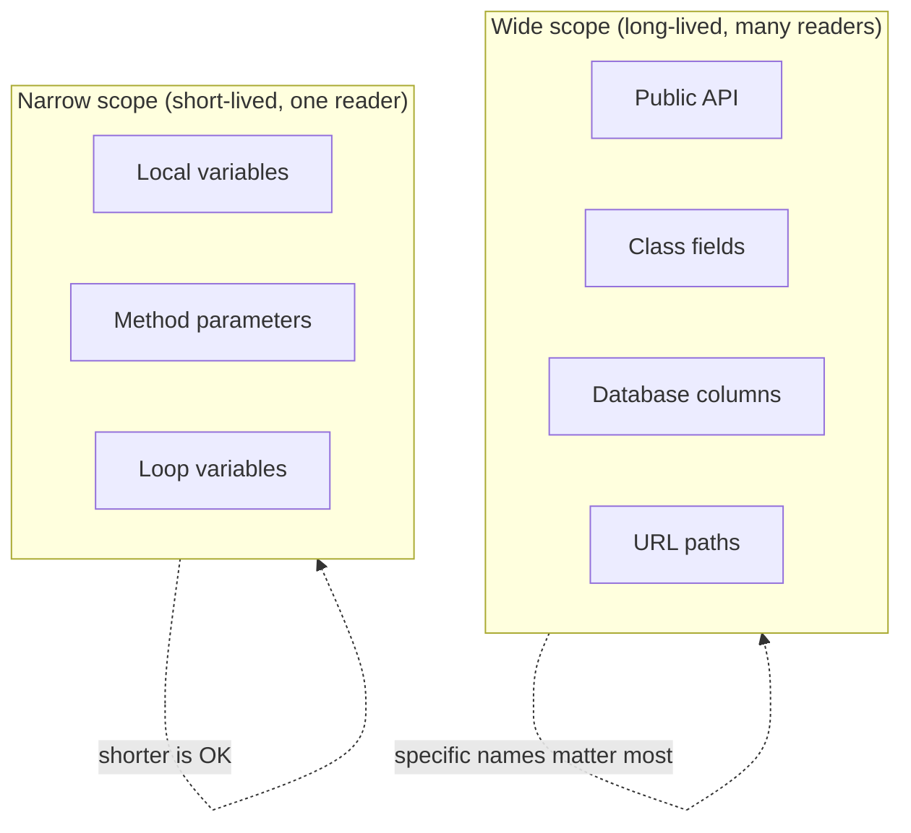
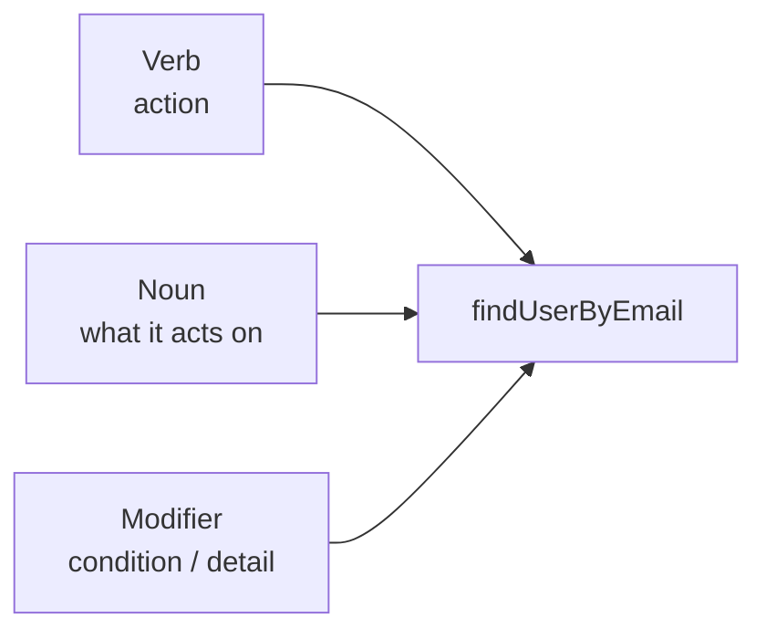

# Naming Conventions

## Overview

Names are the most-read part of code. Every reader who hits a function call, a variable reference, or a class name forms an expectation from the name and proceeds based on that expectation. **Bad names mislead readers; good names eliminate the need for most comments.**

The discipline has two layers:

1. **Convention** — the syntactic rules (camelCase vs snake_case, prefixes, suffixes) that match the language and ecosystem.
2. **Semantics** — the actual choice of words that carries meaning. Calling a thing the right thing.

Convention without semantics is `getX()`-ish boilerplate. Semantics without convention is correct content in formatting that distracts the reader. Both matter.

## Problem

Bad names cost real time:

- Reading `process(item)` and having to open the function to find out what "process" means.
- Wading through `data`, `info`, `obj`, `temp`, `result` variables with no semantic content.
- Decoding Hungarian-style prefixes that no longer match the type they encode (`strFoo` that's now an `int`).
- Single-letter variables outside of tiny scopes (`x`, `i`, `e` used 30 lines deep).
- Class names that are nouns where verbs would fit (or vice versa) — `OrderProcessor` when the class actually represents an *order in flight*, not a *thing that processes orders*.
- Names that lie: `validate()` that mutates, `getUser()` that creates, `equals()` that compares by reference.

Each ambiguous name forces a reader to scroll, search, or run the code to find the meaning. Multiplied across a codebase of thousands of names, this is a major drag on every change.

## Key Concepts

### What a good name does

A good name:

- **Reveals intent.** A reader who hasn't seen the implementation can predict what the thing does or contains.
- **Matches the level of abstraction.** A high-level domain function uses domain words; a low-level helper uses lower-level words.
- **Distinguishes from siblings.** When two things look similar, their names tell them apart at a glance.
- **Survives evolution.** A name should still fit the entity after a year of feature additions.

### Convention vs. semantics

Conventions vary by language:

| Element | Java/C#/JS | Python | Rust/Go | C/C++ |
|---|---|---|---|---|
| Class | `PascalCase` | `PascalCase` | `PascalCase` | `PascalCase` |
| Function | `camelCase` | `snake_case` | `snake_case` | `snake_case` or `camelCase` |
| Variable | `camelCase` | `snake_case` | `snake_case` | varies |
| Constant | `UPPER_SNAKE` | `UPPER_SNAKE` | `UPPER_SNAKE` | `UPPER_SNAKE` |
| Module / file | varies | `snake_case` | `snake_case` | `snake_case` or PascalCase |

Follow the language's convention. Mixing breaks ecosystem familiarity (a Pythonic `MyClass.MyMethod()` is jarring; a Java-style `my_class.my_method()` is jarring). Conventions are arbitrary; consistency with the wider community isn't.

### What to name

The categories that matter most:

- **Variables**: nouns, optionally with modifiers. `count`, `userEmail`, `pendingOrders`.
- **Functions / methods**: verbs (or verb phrases). `calculateTotal`, `findUserByEmail`, `isAvailable`.
- **Classes / types**: nouns or noun phrases. `Order`, `PaymentProcessor`, `RetryPolicy`.
- **Booleans**: predicates. `isActive`, `hasItems`, `canCheckout` — read as a yes/no question.
- **Constants**: nouns describing what they represent. `MAX_RETRIES`, `DEFAULT_TIMEOUT_MS`.
- **Modules / packages**: nouns or short phrases describing what's inside. `auth`, `pricing`, `billing.invoices`.

### Length and context

Length should match scope. A loop counter `i` over three lines is fine; a `i` used 30 lines later is bad. A method parameter `u` is OK if the function is one line; a class field `u` is bad even if it's one line.

Heuristic: **the wider the scope, the more specific the name needs to be**. A field is read in many contexts; a local variable is read in one.

## Prerequisites

None — naming is a fundamental discipline. Helpful background: familiarity with the conventions of whatever language you're working in.

## When to Use

Always — every name is an opportunity to clarify or confuse:

- **Public APIs** — every name is a contract. Hard to change later.
- **Domain concepts** — names should match the domain language (Ubiquitous Language in DDD terms).
- **Error messages and logs** — names that propagate to operators and on-call.
- **Database schemas, JSON keys, URL paths** — exposed externally; renames are breaking changes.

## When NOT to Use (less stringently)

- **Throwaway one-off scripts.** A 30-line script can have `x` and `data` without much harm.
- **Mathematical / algorithmic code where conventions are well-established.** `i, j, k` for loop indices, `n` for size, `eps` for epsilon — these are fine because the algorithmic context establishes the convention.
- **Test code.** Test variables that exist for half a test method's lifespan can be terse. Even so, a clear name in the test reveals intent.

## Trade-offs

### Benefits

- **Faster reading.** Good names eliminate the need to open the implementation in many cases.
- **Fewer comments.** A method called `isReadyForCheckout()` doesn't need a comment explaining what it returns.
- **Easier refactoring.** Searching for usages by name works when names are specific.
- **Better autocomplete experience.** Specific names produce focused suggestions; generic names produce noise.
- **Onboarding speed.** New developers can read code top-down and follow it without lookup tables of abbreviations.

### Drawbacks

- **Long names take more keystrokes.** IDEs help; without them, terseness has its own appeal.
- **Naming takes thought.** Quick coding sessions get slowed by "what should I call this?" debates.
- **Renaming is a real cost.** Once a name escapes a class into the world (database column, API field, log keyword), changing it is operational work.
- **Risk of bikeshedding.** Naming arguments can consume disproportionate review time.

### Performance Characteristics

Zero. Names are stripped to symbols at compile time (or interpreted as labels at run time). The same code with different names runs identically.

### Alternatives

There aren't really alternatives — every program has names. The choice is *good ones* vs *bad ones*. The *minimal naming* style (very short names) is a stylistic alternative that depends heavily on context and discipline.

## Simple Example

A function that calculates an order's total.

### Bad

```python
def proc(o, l):
    t = 0
    for i in l:
        t += i.q * i.p
    if o.t == "vip":
        t *= 0.9
    return t
```

The reader has to decode every name. `proc` does what? `o` and `l` are what? `t` mutates inside the loop — what is it accumulating? `o.t == "vip"` — what's `o.t`?

### Better

```python
def calculate_order_total(order, lines):
    subtotal = 0
    for line in lines:
        subtotal += line.quantity * line.unit_price
    if order.tier == "vip":
        subtotal *= 0.9
    return subtotal
```

Same code, different names. A reader unfamiliar with the codebase can follow it linearly. The function name promises a calculation; the variable names reveal what's being calculated; the field names match domain words.

### Even better — domain alignment

If the team uses "discount" rather than "VIP markdown" in conversations, encode that:

```python
def calculate_order_total(order, lines):
    subtotal = sum(line.quantity * line.unit_price for line in lines)
    if order.tier == "vip":
        subtotal -= subtotal * VIP_DISCOUNT_RATE
    return subtotal

VIP_DISCOUNT_RATE = 0.1
```

The constant name explains the magic number. The domain language ("subtotal," "VIP discount rate") is in the code, not in commit messages or comments.

### Key takeaways

- **Names earn their length when they reveal intent.** `t` is short but uninformative; `subtotal` is long but explanatory — and `subtotal` is read more often than typed.
- **Magic numbers should usually become named constants.** `0.9` becomes `1 - VIP_DISCOUNT_RATE`; the name explains the intent.
- **Domain words in code reduce the translation tax** between business conversations and the codebase.

## Real World Example — patterns and pitfalls

A non-exhaustive collection of patterns that recur in good codebases.

### Boolean predicates

Read like questions:

```python
is_valid(email)
has_overdraft(account)
can_be_refunded(transaction)
should_retry(attempt, response)
```

Not:

```python
valid(email)            # ambiguous: predicate or "make valid"?
overdraft(account)      # could be a noun (the overdraft amount)
refundable(transaction) # adjective alone — works in some languages, less clear
retry(attempt)          # is this a predicate or an action?
```

### Methods that mutate vs. methods that don't

```python
order.cancel()          # mutates: cancels the order
order.cancellation_fee  # query: returns a value, doesn't mutate

list.sort()             # mutates in-place (Python convention)
sorted_list = sorted(list)  # returns a new sorted list (Python convention)
```

When in doubt, **the verb form ending in -ed/-ing or the noun form is for queries**; **bare verbs are for mutations**.

### Avoid noise words

Words that add length but no meaning:

- `Manager`, `Helper`, `Util`, `Handler`, `Processor` — usually a sign the class doesn't have a clear responsibility. If `OrderManager` is just a class, what's it managing?
- `Data`, `Info` — almost always replaceable. `userData` → `user`. `accountInfo` → `account`.
- `MyXyz`, `TheXyz`, `XyzObject` — pure noise.
- `Get` prefix on every getter, even when the language convention doesn't require it. In some communities (Java) `getX()` is convention; in others (Python, Rust) it's noise.

### Avoid encoding type

Hungarian notation (`strName`, `iCount`, `pUser`) was useful in pre-IDE days. Today the type system or IDE shows you the type; the prefix becomes noise that gets out of sync with reality.

Exceptions: when the type isn't obvious and matters (`emailRaw` vs `emailHtml`), the suffix can carry intent.

### Use the domain vocabulary

If the team calls a thing an "invoice line item," call it that in code. Don't translate to "purchase entry" because it sounds nicer. The translation tax compounds across thousands of names.

### Names should be searchable

Single-letter variables can't be grep'd usefully. `e` returns dozens of false positives. Even `data` is too common. Specific names are findable.

```python
EMPLOYEE_TENURE_THRESHOLD_YEARS  # easy to find every reference
n                                # impossible
```

### Names of similar length make code easier to align

Aesthetics, but real:

```python
employee_id     = ...
employee_name   = ...
employee_email  = ...
```

reads better than:

```python
id    = ...
n     = ...
email = ...
```

### Plurals and singulars

Use plural for collections, singular for individual items:

```python
users = repo.find_active()
for user in users:
    user.notify()
```

Don't conflate (`user` for a list of users is confusing).

### Avoid abbreviations except for the universally understood

`id`, `url`, `db`, `http`, `i/j/k` (loop indices), `n` (count), `tmp` (in narrow scope) — generally fine. `usr`, `acct`, `cfg`, `mgr` — usually noise. The cost of one extra word is small; the cost of decoding an abbreviation is paid by every reader.

## Diagrams

### Naming considerations by scope



The wider the scope, the more carefully the name should be chosen. A loop counter `i` is fine in 5 lines; a database column `i` is a problem forever.

### Anatomy of a method name



`findUserByEmail` = verb (`find`) + noun (`User`) + modifier (`ByEmail`). A reader can predict the signature without seeing the code: takes an email, returns a user.

## Checklist

### Implementation Checklist

- [ ] Method names are verbs or verb phrases.
- [ ] Class names are nouns or noun phrases.
- [ ] Boolean variables and predicates read as yes/no questions.
- [ ] Variable scope justifies length: wide = specific, narrow = shorter is acceptable.
- [ ] Magic numbers and strings have named constants.
- [ ] Names match domain vocabulary (no in-code translation of stakeholder language).
- [ ] No type-encoding prefixes / Hungarian notation (unless the codebase pattern explicitly uses them).
- [ ] No `Manager`/`Helper`/`Util` suffix unless genuinely warranted.
- [ ] Plural for collections, singular for individuals.

### Review Checklist

- [ ] **Single-letter variables outside of small loops or math** — flag.
- [ ] **Generic names like `data`, `info`, `temp`, `obj`** — flag and ask for specifics.
- [ ] **Abbreviations that aren't the standard short forms** — flag.
- [ ] **Names that don't match behavior** — `getX` that mutates, `validate` that saves. Critical to catch.
- [ ] **Domain-foreign words** — code uses "buyer" while the team says "customer," or vice versa.
- [ ] **Inconsistent naming across siblings** — `user_id` and `accountId` mixed in the same module.
- [ ] **Magic numbers** — extract to constants with descriptive names.

### Production Readiness

- [ ] Public API names follow language conventions and don't change between minor versions.
- [ ] Database column names follow the agreed convention (snake_case typically).
- [ ] Log keywords / structured fields are consistent across services (one team uses `userId`, another uses `user_id` — pick one).
- [ ] URL path segments are user-readable and consistent.

## Topic Anti-Patterns

> Naming-specific anti-patterns. For generic anti-patterns, see [16_AntiPatterns](../16_AntiPatterns/).

### Lying names

**Description.** Method names that don't match behavior. Already covered as a POLA violation; here it's also a naming failure.

**Example.** `getUser()` mutates state. `validate()` saves to disk. `equals()` returns true for objects that aren't equal in the domain sense.

**Better approach.** Rename to match. If the operation is genuinely complex, the name should hint (`fetchAndUpdateUser`, `validateAndPersist`, `deepEquals`).

### Generic names everywhere

**Description.** A codebase where many things are called `data`, `info`, `obj`, `result`, `item`. These names work everywhere because they're meaningless.

**Why it's bad.** Every variable requires reading the surrounding code to understand. Search becomes useless. Refactoring tools can't help.

**Better approach.** Replace with domain-specific names. `data` → `users` or `transactions` or `pricing_rules`. `result` → `subtotal` or `count` or `match`.

### Abbreviations / single-letter names in wide scope

**Description.** A class field `n` that's used in 50 lines of methods, or a parameter `e` of a public API.

**Why it's bad.** Every reader pays the cost. The author saved a few keystrokes once; everyone since has spent extra seconds figuring out what's meant.

**Better approach.** Single letters are for very narrow scopes (loop indices, mathematical conventions). Otherwise, spell out.

### Noise suffixes — `Manager`, `Helper`, `Util`

**Description.** Class names like `OrderManager`, `EmailHelper`, `StringUtil`. These reveal that the class doesn't have a clear single responsibility, just "stuff related to X."

**Why it's bad.** A class without a clear job tends to grow without a clear job. The suffix obscures the smell.

**Better approach.** Find the *responsibility* and name for that. `OrderManager` might really be `OrderRepository` (persistence) or `OrderWorkflow` (orchestration) or `OrderValidator`. If you can't pick a more specific name, the class probably needs splitting.

### Hungarian notation in modern code

**Description.** Type prefixes like `strName`, `iCount`, `bIsValid`, `pData`.

**Why it's bad.** Modern IDEs show types on hover. The prefix is redundant noise — and worse, it gets out of sync when types change.

**Better approach.** Trust the type system / IDE. Drop the prefixes. Sole exception: when the type carries meaningful semantic distinction not in the type system (e.g., `emailRaw` vs `emailNormalized` are both `string`; the suffix carries the intent).

### Pluralization confusion

**Description.** A variable named `user` that holds a list of users. Or `users` that's actually a single user.

**Why it's bad.** Every loop or assignment becomes confusing.

**Better approach.** Plural for collections, singular for individuals. Always.

### Cryptic domain abbreviations

**Description.** A finance system uses `pnl`, `vmr`, `iban`, `dcf`, `mtm`, `lhs`, `rhs` everywhere assuming readers know.

**Why it's bad.** New developers waste days decoding the dictionary. Some abbreviations are genuinely standard in the domain (`IBAN`, `ISO`); others are house jargon.

**Better approach.** Spell out non-universal abbreviations on first introduction in a module, or always. `profitAndLoss` is longer but readable; new hires don't need a glossary.

### Related smells

- **Inconsistent capitalization** within one codebase.
- **Comments that explain a name** ("// totalAmt is the order's pre-tax total") — usually means the name should be `preTaxTotal`.
- **Method names that need a long parameter doc to clarify behavior** — name probably hides too much intent.

## Notes

### Insights

- **Names are the cheapest documentation.** Every reader of every line of code reads the names. Each pays the cost of bad names; each benefits from good ones.
- **The hardest names are for things you don't fully understand yet.** When the abstraction is unclear, the name will be too. Sometimes the right move is to write the code with placeholder names, see what it does, and rename when the meaning crystallizes.
- **The Sapir-Whorf hypothesis applies.** The names you choose shape how the team thinks about the system. Calling a thing `OrderManager` makes you think procedurally; calling it `Order` (with methods on it) makes you think object-oriented.
- **Renaming is the safest refactor.** Modern IDEs can rename across an entire codebase reliably. Use that ability — don't carry a bad name forever because "it's used in 30 places."
- **Test names matter as much as production names.** A test named `it_works` is useless; `it_charges_the_customer_when_payment_is_authorized` documents both the test and the production behavior.

### Edge cases

- **Math / algorithm code** has its own conventions. `i`, `j`, `k` for loop indices, `n` for size, `eps` for epsilon. Don't fight these — they're a domain language.
- **Code generators** (protobuf, OpenAPI, ORMs) produce names from external sources. You can't always rename freely.
- **Cross-language interop** sometimes forces naming compromises. A C# class exposed to JavaScript through a generator may have to bridge two conventions.

### Gotchas

- *"It's just a temp variable"* in the start of a long function eventually becomes referenced 50 lines later. Name it well from the start.
- *Renaming a database column* is a real operational task. Get it right at creation time.
- *Auto-generated names* (`tmp1`, `lambda_42`, `__anon_class`) are technically valid but indicate the code wasn't intentional. Name them.

### Open questions

- *How much should team-internal style differ from community convention?* — preferably not at all. Internal consistency matters; the cost of diverging from community norms is high.
- *Is there a metric for naming quality?* — partial. Comment density, search precision, time-to-find-method are all proxies.

## Related Topics

- `Principle_of_Least_Astonishment` — names that match behavior contribute most to least surprise.
- `Code_Smells` — many smells (Mysterious Name, Magic Number) are naming smells.
- `Refactoring_Techniques` — Rename Variable / Method / Class is the most common (and safest) refactor.
- `Encapsulation` — interface names are part of the encapsulation contract.

## References

- Robert C. Martin, *Clean Code* — Chapter 2 ("Meaningful Names") is the canonical practical reference.
- Steve McConnell, *Code Complete* — chapter on variable naming.
- Joshua Bloch, ["How to Design a Good API and Why it Matters"](https://www.youtube.com/results?search_query=joshua+bloch+how+to+design+a+good+api) — naming is half the talk.
- Ottinger, Tim, ["Ottinger's Rules for Variable and Class Naming"](http://agileinaflash.blogspot.com/2009/02/meaningful-names.html) — short and sharp.
- *PEP 8* (Python), *Effective Java* (Java), *Idiomatic Rust* — language-specific encodings of these conventions.
