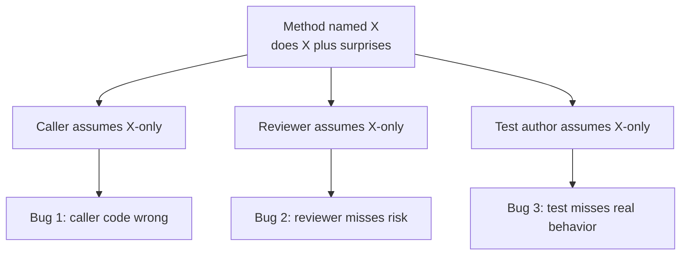
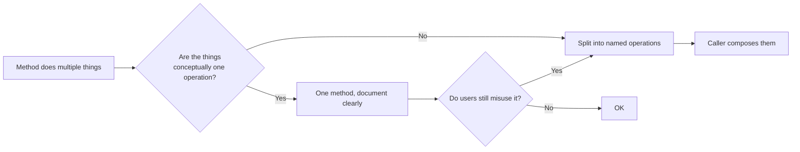

# Principle of Least Astonishment

## Overview

Also called **POLA** (or sometimes **Principle of Least Surprise**). The rule:

> *A function or feature should behave the way most users will expect it to.*

When a name, a method signature, an API shape, or a UI element promises one behavior, deliver that behavior. If your code surprises a competent reader who's done their homework, the surprise is a defect — even if everything is technically correct.

The principle is older than software (it shows up in user-interface design literature from the 1970s). In code, it became a pillar of API design culture: a good library is one whose users guess right.

## Problem

Code that astonishes its users produces a specific category of bugs:

- A method called `getUser()` mutates state. The caller didn't expect a getter to do anything; their reasoning is off because of an assumption your method violated.
- A `==` comparison on two value objects returns false because the class compares by reference. The caller wrote the code assuming value semantics; the language allowed both.
- A `parseInt("08")` returns `0` in some languages because of octal interpretation. The caller wrote what looked like obvious code; the language astonished them.
- A `save()` method returns successfully but the data is only in memory until a separate `flush()` is called. The caller didn't know about the buffering.
- A "delete user" UI button doesn't actually delete; it soft-deletes. The user assumes it's gone; six months later they find their data still in some report.

The pattern: **a reasonable expectation, formed from context, name, or convention, is violated by the actual behavior**. Bugs born this way are hard to find because the code "looks right."

## Key Concepts

### Whose expectations?

The principle leaves "least astonishment" relative to a user — but *which* user?

The right framing: **a competent practitioner of the relevant domain, reading the code or API in good faith, with reasonable familiarity but without inside knowledge of your implementation**.

- For a public API, that's any developer in the language community.
- For an internal team API, that's anyone on the team.
- For a UI, that's the target user persona.

The principle isn't "no surprises ever" — it's "surprises proportional to how unusual the situation is."

### Sources of astonishment

Common ways code surprises:

- **Naming lies.** `getX()` mutates. `process()` blocks for ten seconds. `delete()` soft-deletes. `equals()` compares by reference.
- **Convention violations.** Returning `null` where the language community expects an empty collection. Throwing where Result types are idiomatic. Mutating arguments.
- **Hidden side effects.** A "validation" function that updates a database. A "logger" that retries operations.
- **Asymmetric behavior.** `add()` and `remove()` work — but `add()` is sync and `remove()` is async. `read()` and `write()` are paired — but `write()` may be buffered.
- **Locale / context dependence.** A function that works fine in CET but breaks in UTC+8. Implicit `Locale.default` in formatting.
- **Number quirks.** Integer overflow that wraps silently. Floating-point comparison without epsilon. Implicit type conversion (`"1" + 2` → `"12"` in some languages).
- **Threading model violations.** A "thread-safe" method that isn't, or that is but only on one platform.

### How to design for least astonishment

- **Names match behavior.** If `getX()` mutates, rename it. If `process()` is async, the name should hint.
- **Follow the conventions of the language and ecosystem** unless you have a *strong* reason not to.
- **No hidden side effects** in code that looks pure.
- **Fail fast on surprising states** rather than continuing with surprising defaults (see `Fail_Fast`).
- **Document deviations.** When you have to violate convention, say so prominently.
- **Symmetry where the user expects it.** If `start()` and `stop()` are both available, they should pair. If you offer `add(x)`, callers reasonably expect `remove(x)`.

## Prerequisites

None — the principle is meta-level guidance. Helpful background: the conventions of whatever language and ecosystem you're working in. POLA is calibrated against expectations, so knowing the prevailing expectations matters.

## When to Use

POLA applies any time someone other than yourself (including your future self) will read or use your code:

- **Public APIs / libraries** — most stringent application. A surprising library is dropped.
- **Cross-team interfaces** — APIs between services, modules between teams.
- **Internal classes used widely** — a class used in 50 places shouldn't surprise.
- **Configuration formats** — file structure, key names, default values, units.
- **CLI tools** — flag names, argument order, exit codes, output format.

## When NOT to Use

The principle has limits — sometimes legitimate considerations override it:

- **Domain-mandated behavior.** If the financial domain requires rounding "half away from zero" but most languages default to "half to even," follow the domain. Document the deviation.
- **Performance hot paths.** Sometimes a more efficient API surface is worth a slight surprise (e.g., methods that mutate in-place to avoid allocation).
- **Power-user tools.** A command-line tool aimed at experts may legitimately use terse, compositional flags rather than verbose obvious names.
- **Established convention in the codebase.** Internal consistency can outweigh broader-community surprise. If your codebase has called these things `Service` for ten years, naming a new one `Manager` is more astonishing than continuing the tradition.

## Trade-offs

### Benefits

- **Lower bug rate.** Misuse is less likely when intuition matches behavior.
- **Faster onboarding.** New developers guess right, instead of needing tribal knowledge.
- **Smaller documentation burden.** Self-evident APIs need less prose.
- **Better debug experience.** When code does what it looks like, you read top-down without surprises.

### Drawbacks

- **Sometimes constrains technical choices.** "Least astonishing" might be slower or more memory-intensive than a clever option.
- **Hard to define objectively.** "What an experienced reader expects" is calibrated against a moving target — language conventions change.
- **Can reinforce mediocrity.** Consistently meeting average expectations may keep you from designing genuinely better APIs that surprise positively.

### Performance Characteristics

The principle is about the *interface*, not the implementation. The internal algorithm can be optimized without violating POLA, as long as the observable behavior matches expectations.

### Alternatives

- **Convention over configuration** — POLA's cousin in framework design. Reasonable defaults so users don't have to specify.
- **Idiomatic style guides** — language-specific encoding of POLA (PEP 8, Effective Java, Idiomatic Rust).
- **Prototype-driven design** — build, watch a real user try, fix the things that surprise. Empirical POLA.

## Simple Example

A function meant to retrieve the current user.

### Astonishing

```python
def get_user(user_id):
    user = users.find_by_id(user_id)
    if user is None:
        user = User(id=user_id, name="anonymous")
        users.insert(user)
    user.last_seen = now()
    users.update(user)
    return user
```

The name says *get*. The implementation:

1. Reads — fine.
2. **Creates** the user if missing — surprising.
3. **Mutates** `last_seen` — surprising.
4. **Writes** to the database — very surprising.

A caller reading `user = get_user(id)` doesn't expect any of points 2-4. If they call this in a logging or validation path, they're now creating users and updating timestamps as a side effect.

### Least astonishing

Split into named operations that each do one thing:

```python
def get_user(user_id):
    """Read-only lookup. Returns None if not found."""
    return users.find_by_id(user_id)

def get_or_create_user(user_id):
    """Lookup or auto-create. Side effect: may write."""
    user = users.find_by_id(user_id)
    if user is None:
        user = User(id=user_id, name="anonymous")
        users.insert(user)
    return user

def touch_last_seen(user):
    """Mutates and persists last_seen."""
    user.last_seen = now()
    users.update(user)
```

Now each function name promises a behavior the caller can predict. Composition is explicit:

```python
user = get_or_create_user(uid)
touch_last_seen(user)
```

If a future maintainer reads this two lines later, the operations are visible. No invisible mutations hidden inside an innocent-looking `get_user`.

### Key takeaways

- **Names are contracts.** A name that promises one thing and delivers another is a defect.
- **Splitting "do many things" into "do one thing each"** is also good for SRP, testability, and readability — POLA aligns with the other principles.
- **The cost is a few extra method names.** The benefit is no surprise to callers.

## Real World Example

### Context — a billing library

A team published a Python library for billing operations. One method:

```python
invoice = create_invoice(customer_id, items)
```

In version 1, this method:

- Created the invoice in memory.
- Optionally validated against the tax service.
- *Sometimes* persisted to the database — depending on whether the global `BillingMode` config was set to "auto-persist" (default in production, manual in tests).
- *Sometimes* sent the invoice email — same config.

Test environments and production behaved differently for the same call. Consultants writing integration scripts couldn't tell whether `create_invoice` would persist or not without reading the global config and the source.

### How POLA was violated

- The name says `create_invoice`. Most readers expect: returns a new invoice object. They don't expect "sometimes saves, sometimes emails, depends on global state."
- The same code path in production and test produced different observable effects. That's astonishment with a side of testability problems.

### The fix — explicit operations

Version 2 split the method into three with clear names:

```python
invoice = build_invoice(customer_id, items)  # in-memory only, no I/O
save_invoice(invoice)                        # persists, returns nothing
send_invoice(invoice, to_email=...)          # emails it
```

Compose explicitly:

```python
invoice = build_invoice(customer_id, items)
save_invoice(invoice)
send_invoice(invoice, to_email=customer.email)
```

Each step is visible in the caller's code. Tests don't need to flip global config; they just don't call the steps they don't want.

The library's bug reports about "create_invoice mysteriously not saving" / "create_invoice mysteriously sending an email in tests" went to zero. Onboarding documentation shrank to a paragraph.

The lesson: **a "convenient" method that does several things based on context is less convenient than three explicit methods**. Convenience that surprises isn't.

## Diagrams

### How astonishment spreads



### Path to least astonishment



## Checklist

### Implementation Checklist

- [ ] Method name describes what the method does, not what it's *for*.
- [ ] Methods that look pure (`get`, `find`, `is`) don't mutate state or produce I/O.
- [ ] Methods that look fast don't block on the network silently.
- [ ] Symmetric pairs (`open`/`close`, `add`/`remove`, `start`/`stop`) actually pair.
- [ ] Standard operators (`==`, `<`, `+`) behave according to ecosystem convention.
- [ ] Default values match what users would write if asked.

### Review Checklist

- [ ] **Methods with surprising side effects** — flag for naming or splitting.
- [ ] **Methods whose behavior varies based on global config** — flag and ask if the variants should be separate methods.
- [ ] **Async vs sync inconsistency** — methods named the same in two related classes should both be sync or both async, not mixed.
- [ ] **Implicit defaults that don't match common expectations** — flag (e.g., a `parse()` that defaults to a non-standard time zone).
- [ ] **`get`/`find`/`load` methods that mutate** — almost always astonishing.

## Topic Anti-Patterns

> Anti-patterns *specific to POLA*. For generic anti-patterns (Spaghetti, etc.), see [16_AntiPatterns](../16_AntiPatterns/).

### Misleading names

**Description.** Method names that don't match behavior. `getUser` mutates. `validate` saves. `process` is async. `equals` compares by reference.

**Why it's bad.** Callers reason from names. A wrong name produces wrong reasoning.

**Better approach.** Rename to match. If the operation genuinely does multiple things, the new name should hint (`fetchAndUpdateUser`, `validateAndPersist`).

### Surprising defaults

**Description.** A function takes optional parameters with defaults, and the defaults aren't what most callers would write.

**Bad example.** A `parseDate()` function that defaults to the system locale's parsing rules — works on the developer's machine, fails in a different time zone in production.

**Better approach.** Defaults should match the most common expectation. If there's no clear "obvious" default, require the parameter explicitly.

### Inconsistent asymmetry

**Description.** A class exposes paired operations that don't actually pair. `add(x)` is synchronous; `remove(x)` is async and queued. Or `open()` returns a handle; `close()` takes the original parameter.

**Why it's bad.** Symmetry is a strong expectation. Breaking it for one operation surprises every caller.

**Better approach.** Make pairs symmetric. If they can't be (one is genuinely async), document very prominently.

### Hidden state-modifying queries

**Description.** A method named like a query (`getCount()`, `findActive()`) lazily computes and caches the result, modifying the object. Concurrent callers see different behavior depending on who got there first.

**Why it's bad.** Surprises both readers (who see "just a query") and threading (state changes nobody tracked).

**Better approach.** Cache externally, or compute eagerly, or rename to make the side-effect visible (`computeCount`).

### Cleverness over convention

**Description.** Using language features in unusual ways for "elegance." Operator overloading that doesn't match common semantics. Macro magic. Implicit type coercion.

**Why it's bad.** The clever code surprises readers who expected the conventional behavior.

**Better approach.** Use language features for what they're conventionally used for. Save cleverness for genuinely novel problems.

### Related smells

- **Inconsistent naming** across a codebase (sometimes `delete`, sometimes `remove`, sometimes `destroy`).
- **Stateful "static" methods** that look pure but secretly cache or memoize globally.
- **Unexpected exceptions** — a `getUser` that throws `IllegalStateException` when no user is logged in.
- **Time-zone-dependent defaults** (very common gotcha).

## Notes

### Insights

- **POLA is empirically validated.** Watch a new developer use your API. The places they pause, scroll back, or write `print` to figure out behavior — those are POLA violations.
- **Idioms vary by language and ecosystem.** Pythonic isn't Rustic. Designs that fit one community can astonish another. Calibrate to your audience.
- **The principle compounds with `Encapsulation` and `Naming_Conventions`.** Hidden internals + clear names = least astonishment.
- **POLA fails most often at the boundary between two technologies.** ORM that doesn't quite map to SQL semantics. Async wrapper around a sync library. These boundaries breed astonishment.
- **The biggest POLA violations are often historical.** A method was created with a name that fit, then evolved to do more, and the name was never updated. Rename when behavior changes.

### Edge cases

- **Library evolution.** Adding a parameter to a function with a default changes nothing for existing callers — but if the default is surprising, you've widened the astonishment surface.
- **Power features.** Some APIs have a "simple form" that meets POLA and a "power form" that breaks it but is more flexible. Document the split clearly.
- **Domain-specific languages.** A DSL might intentionally violate general expectations to embody domain conventions. That's fine, *if* the DSL's own conventions are taught and consistent.

### Gotchas

- *"It works on my machine"* is often a POLA failure caused by hidden environment dependence (locale, time zone, file path conventions).
- *"The user should know the difference"* is rarely a good defense for surprising behavior.
- *Compatibility shims* preserve old surprising behavior. Sometimes necessary; document and plan deprecation.

### Open questions

- *Is POLA culture-dependent?* — somewhat. What surprises a JavaScript developer doesn't surprise a Haskell developer. Calibrate to your audience.
- *How much novelty is acceptable in a new framework / language?* — judgment. Genuinely better ideas can surprise positively. The bar is high — most "innovative" surprises turn out to be just surprising.

## Related Topics

- `Naming_Conventions` — half of POLA is about names matching behavior.
- `Encapsulation` — hides internals so callers don't get surprised by them.
- `SOLID` — SRP-compliant methods do one thing, which makes them easier to name accurately.
- `Fail_Fast` — failures aligned with expectations (loud where things break) is itself low-astonishment.

## References

- Geoffrey James, *The Tao of Programming* — early popular reference to "Least Astonishment."
- *The PERL programming language documentation* — credited with bringing the term into wide programming use.
- Wikipedia: [Principle of least astonishment](https://en.wikipedia.org/wiki/Principle_of_least_astonishment).
- Joshua Bloch, ["How to Design a Good API and Why it Matters"](https://www.youtube.com/results?search_query=joshua+bloch+how+to+design+a+good+api) — talks heavily on naming and avoiding surprise.
- Ben Schneiderman, *Designing the User Interface* — origin of the term in UI design.
