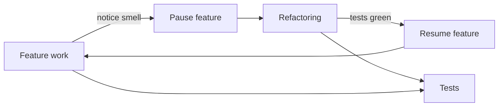
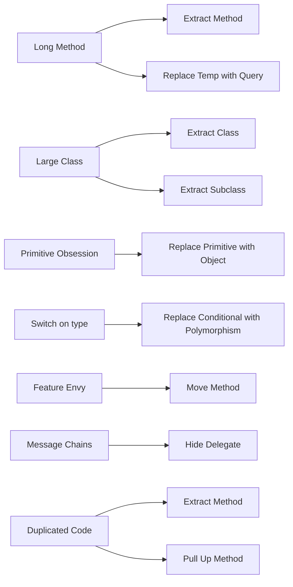
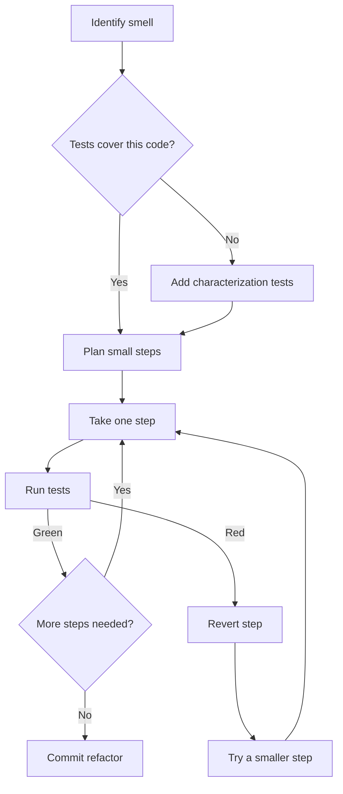

# Refactoring Techniques

## Overview

**Refactoring** is *changing the structure of code without changing its observable behavior*. The hallmark: tests stay green throughout. You're not adding features; you're improving the design.

Coined as a discipline by William Opdyke (PhD thesis, 1992) and turned into a practical catalog by Martin Fowler in *Refactoring* (1999, 2nd edition 2018). Each refactoring is a **named, mechanical, reversible** transformation, with steps small enough to verify between commits.

The discipline pairs with the smell catalog (see `Code_Smells`): smells tell you where the code wants to be improved; refactorings tell you how to improve it safely.

## Problem

Without disciplined refactoring, codebases drift toward:

- "We're going to rewrite this someday" — a declaration that improvements are too big to attempt incrementally.
- "We can't change that — it's used everywhere" — a fear of touching legacy code because changes ripple unpredictably.
- "We'll clean it up after the deadline" — clean-up that never comes; the deadline ships, the smell stays.
- Big-bang rewrites that take 18 months and produce a worse system because they re-derive every nuance from memory.

Disciplined refactoring offers a third path: continuous, small, safe improvements that compound over time. Each individual change is small enough to review and verify; the cumulative effect is significant.

## Key Concepts

### The two-hat rule

> *When you're adding a feature, you're wearing the "feature hat." When you're refactoring, you're wearing the "refactor hat." Don't wear both at once.* — Kent Beck, paraphrased.

The discipline is to **separate refactoring commits from feature commits**. Each refactoring should:

1. Leave behavior unchanged.
2. Pass all tests, all the way through.
3. Be reviewable as "this changes structure, not behavior."

Mixing makes review harder ("did this commit change behavior or not?") and increases regression risk.

### Tests as the safety net

Refactoring without tests is risky. Refactoring with thorough tests is mechanical.

If existing code lacks tests:

1. Add **characterization tests** first — tests that capture the *current* behavior (including any bugs/quirks). The goal isn't to verify correctness, just to lock down what the code does today.
2. Refactor under those tests.
3. Once the refactor is done, the tests are now well-organized and you can update them to reflect intended behavior.

Working without a safety net is sometimes necessary (legacy code, no tests, no time). In that case, prefer **micro-refactorings** — single-step changes the IDE can do automatically — and verify by manual smoke testing.

### Steps small enough to verify

A refactoring is a *sequence* of small steps, each of which:

- Changes one thing.
- Is reversible.
- Leaves the code compilable and tests passing.

Skipping verification between steps is the most common refactoring mistake. The discipline is to keep tests green at every point — if a step breaks them, you stop, revert, and try a smaller step.

## Prerequisites

- `Code_Smells` — knowing *what* to refactor toward.
- Test coverage on the area being refactored, or willingness to add it.
- An IDE with refactoring support, ideally — Rename, Extract Method, Inline are all safer when the tool does them.

## Refactoring Catalog

A non-exhaustive selection of the most useful refactorings. Each: when to use, mechanics in brief, what changes.

### Composing methods

#### Extract Method

When a method is too long, or a chunk inside it has a self-contained purpose.

**Mechanics:**

1. Identify the chunk.
2. Create a new method with a name describing the chunk's intent.
3. Move the chunk into the new method.
4. Replace the chunk with a call to the new method.
5. Run tests.

**Result:** A smaller, more readable original method, plus a new well-named helper.

**Example.**

```python
# Before
def render_invoice(invoice):
    total = 0
    for line in invoice.lines:
        total += line.quantity * line.unit_price * (1 - line.discount)
    output = f"<h1>Invoice {invoice.id}</h1>\n"
    for line in invoice.lines:
        output += f"<p>{line.description}: {line.quantity} x {line.unit_price}</p>\n"
    output += f"<h2>Total: {total}</h2>"
    return output

# After
def render_invoice(invoice):
    total = calculate_total(invoice.lines)
    return format_invoice_html(invoice, total)

def calculate_total(lines):
    return sum(l.quantity * l.unit_price * (1 - l.discount) for l in lines)

def format_invoice_html(invoice, total):
    body = f"<h1>Invoice {invoice.id}</h1>\n"
    body += "".join(f"<p>{l.description}: {l.quantity} x {l.unit_price}</p>\n" for l in invoice.lines)
    body += f"<h2>Total: {total}</h2>"
    return body
```

#### Inline Method

When a method's body is as clear as its name, or the indirection is unhelpful.

**Mechanics:**

1. Verify all callers.
2. Replace each call site with the body.
3. Delete the method.
4. Run tests.

**Result:** Simpler call site; one fewer method to navigate.

#### Extract Variable

When a sub-expression's purpose isn't obvious from context.

**Mechanics:**

1. Introduce a `var x = sub_expression`.
2. Replace the sub-expression with `x`.
3. Pick a name that explains intent.
4. Run tests.

**Result:** The sub-expression is named; the original expression reads more clearly.

```python
# Before
if order.amount * 1.22 > customer.spending_limit_cents / 100:
    ...

# After
total_with_tax = order.amount * 1.22
limit_currency = customer.spending_limit_cents / 100
if total_with_tax > limit_currency:
    ...
```

#### Replace Temp with Query

When a temp variable holds the result of an expression that could be a method.

**Mechanics:** turn the assignment into a call to a new method that computes the value.

**Result:** the value is reusable; the original method is shorter.

#### Decompose Conditional

When a complex `if/else` has lots of logic per branch.

**Mechanics:** extract each branch's body and the condition itself into named methods.

**Result:** the conditional reads as `if (is_eligible_for_discount) apply_discount() else apply_full_price()`.

### Moving features between objects

#### Move Method

When a method is more interested in another class's data than its own (Feature Envy smell).

**Mechanics:**

1. Examine the method's references to fields/methods.
2. Create the method on the target class.
3. Update callers to use the new location.
4. Remove from the original class (or leave a delegating wrapper temporarily).
5. Run tests.

**Result:** the method is now on the class with the relevant data; coupling drops.

#### Move Field

When a field is mostly used by a different class.

**Mechanics:** add the field on the target class; update all readers/writers; remove from the source.

**Result:** the field lives where it's used; behavior naturally migrates with it.

#### Extract Class

When a class has multiple responsibilities (Large Class / Divergent Change smells).

**Mechanics:**

1. Identify the responsibility being extracted.
2. Create the new class.
3. Move the relevant fields and methods into it.
4. The original class holds an instance of the new class and delegates as needed.
5. Run tests.

**Result:** two classes, each with a clearer single responsibility.

#### Inline Class

When a class doesn't do enough to justify itself (Lazy Class smell).

**Mechanics:** opposite of Extract Class. Fold the small class's contents into its primary user; delete the small class.

#### Hide Delegate

When callers chain through `a.getB().doX()` (Message Chain / Law of Demeter smell).

**Mechanics:** add a method on `A` that does `getB().doX()`; replace caller chains with the new direct call; remove `getB()` from the public API if possible.

**Result:** callers don't depend on `B`'s presence inside `A`.

#### Remove Middle Man

When a class does little except delegate (Middle Man smell — opposite case).

**Mechanics:** replace calls to the middle man with direct calls to the underlying object.

### Organizing data

#### Replace Magic Number with Symbolic Constant

When unexplained literals appear in code.

**Mechanics:** create a `const TAX_RATE = 0.22`; replace the literal everywhere.

**Result:** the meaning is in the name; one place to change the value.

#### Replace Type Code with Class / Subclasses / State

When a class has a "type" field driving conditionals (Switch Statement smell).

**Mechanics:**

- *Replace Type Code with Class*: turn the type field into an instance of a `Type` class; methods on that class encode the type's behavior.
- *Replace Type Code with Subclasses*: subclass per type; methods become polymorphic.
- *Replace Type Code with State/Strategy*: when the type can change at runtime; the state object encapsulates the conditional behavior.

#### Replace Primitive with Object

When a primitive carries domain meaning (Primitive Obsession smell).

**Mechanics:** introduce a class for the concept (e.g., `Email`, `Money`, `OrderId`); replace primitive uses; let the new class carry validation and behavior.

#### Encapsulate Field / Encapsulate Collection

When a field or collection is publicly mutable.

**Mechanics:** make the field private; expose getters/methods that preserve invariants; for collections, return immutable views or copies.

### Simplifying conditional expressions

#### Replace Conditional with Polymorphism

When a `switch` / `if-elif` chain on a type tag drives different behavior.

**Mechanics:** replace each case with a subclass overriding a virtual method; replace the conditional with a polymorphic call.

**Result:** adding a new case = adding a new subclass; OCP-friendly.

#### Replace Nested Conditional with Guard Clauses

When deeply nested `if`s muddy the main flow.

**Mechanics:** for each early-exit condition, return / throw at the top.

**Result:** the main path is at the leftmost indentation; edge cases handled and exited up front.

```python
# Before
def can_proceed(user, order):
    if user is not None:
        if user.is_active:
            if order.is_valid:
                if not user.has_overdrafts:
                    return True
    return False

# After
def can_proceed(user, order):
    if user is None: return False
    if not user.is_active: return False
    if not order.is_valid: return False
    if user.has_overdrafts: return False
    return True
```

#### Introduce Null Object

When `None`/`null` checks are sprawling.

**Mechanics:** create a "null" implementation of the relevant interface that does nothing safely; replace null checks with the null object.

**Result:** code paths simplified — no more "if user is None" branches.

### Simplifying method calls

#### Rename Method (or Variable, Class, Module)

The most common — and safest — refactoring. When a name doesn't match its intent.

**Mechanics:** use the IDE rename feature, which updates all references atomically.

**Result:** clearer code. Always worth it.

#### Add Parameter / Remove Parameter

When a method's information needs change.

**Mechanics:** straightforward when adding (with a default if breaking) or removing (verifying no caller depends on the parameter).

#### Replace Parameter with Method Call

When a parameter's value can be computed by the receiver itself.

**Mechanics:** change the receiver to compute the value internally; remove the parameter.

#### Preserve Whole Object

When a method takes several fields all from the same source object.

**Mechanics:** change the parameter to be the source object itself; method internally accesses what it needs.

**Result:** parameter list shorter; if the method needs another field later, no signature change.

#### Introduce Parameter Object

When several parameters always travel together.

**Mechanics:** create a class holding the group of parameters; pass that instead.

**Result:** Long Parameter List smell removed; the group becomes a domain concept.

### Dealing with generalization

#### Pull Up Method / Field

When subclasses share identical methods or fields.

**Mechanics:** move the shared element to the parent class; remove from each subclass.

#### Push Down Method / Field

Opposite. When a parent has methods only some subclasses need.

**Mechanics:** move from parent to the relevant subclass(es).

#### Extract Superclass

When two classes have similar fields and methods.

**Mechanics:** create an abstract parent; move shared elements up; have both classes inherit from it.

#### Extract Interface

When two unrelated classes have a common subset of methods that callers actually use.

**Mechanics:** create the interface; declare both classes as implementing it; callers depend on the interface.

#### Replace Inheritance with Delegation

When a subclass doesn't really use most of what it inherits (Refused Bequest smell).

**Mechanics:** stop inheriting; hold an instance of the former parent; delegate the methods that are still needed.

**Result:** composition replaces inheritance; coupling drops.

#### Replace Delegation with Inheritance

The opposite — rare, but valid when delegation has become a heavy tax with no benefit.

### Big refactorings

These are sequences of smaller refactorings, applied over weeks/months.

#### Strangler Fig

When replacing a legacy module gradually. New code intercepts traffic, gradually takes over more cases, until the legacy is unused and can be removed. See dedicated topic in 26_Refactoring section (when written).

#### Branch by Abstraction

Introduce an abstraction over both old and new implementation; route calls through it; gradually swap the implementation behind the abstraction. Avoids long-lived feature branches.

#### Parallel Change

Add the new structure (field, method, type) alongside the old; migrate callers one at a time; remove the old when no callers remain.

These three are large enough that they have their own conventions and tooling. They're listed here as references; details belong in the dedicated `26_Refactoring` topics.

## Diagrams

### The two-hat workflow



Tests are the contract. Both hats run them; only the feature hat changes them.

### Smells → refactorings (sample mapping)



### Step-by-step refactor with tests



## Checklist

### Implementation Checklist

- [ ] **Behavior preserved**: tests pass before, during, and after.
- [ ] **Steps were small**: each commit/sub-commit is one named refactoring.
- [ ] **No new behavior**: no new features, no bug fixes mixed in.
- [ ] **Tests added if missing**: characterization tests precede risky refactors.
- [ ] **IDE used where possible**: Rename, Extract Method, Inline are safer when automated.
- [ ] **Reviewed in isolation**: refactor commits are reviewable on their own merits.

### Review Checklist

- [ ] **Single responsibility per commit**: refactor or feature, not both.
- [ ] **Tests not weakened**: a refactor that needed test changes didn't actually preserve behavior.
- [ ] **Public API stable**: refactors of internals shouldn't break consumers.
- [ ] **Performance not regressed**: refactors generally are perf-neutral; if they aren't, the commit message should say so.
- [ ] **Code measurably better**: the smell is reduced; the new structure passes the "would I review this" test.

### Production Readiness

- [ ] **Deployed gradually if risky**: large refactors often paired with feature flags or canary rollouts.
- [ ] **Observability preserved**: log fields, metric names, error messages remain consistent (consumers downstream depend on them).
- [ ] **Backward compatibility maintained at boundaries**: refactors of public APIs follow deprecation cycles, not silent renames.

## Topic Anti-Patterns

> Anti-patterns *specific to refactoring practice*. For generic anti-patterns, see [16_AntiPatterns](../16_AntiPatterns/).

### Refactoring + feature in one commit

**Description.** Mixing structural changes and behavior changes in the same commit/PR.

**Why it's bad.** Review becomes hard ("did this change behavior or not?"). Bisecting a regression months later is harder. Risk of accidentally introducing bugs.

**Better approach.** Separate. If you notice a smell while doing a feature, either fix it first (and commit), then do the feature; or finish the feature, then fix the smell in a separate commit.

### Big-bang rewrites under "refactor" label

**Description.** Calling a 6-month total rewrite "refactoring." It isn't — refactoring is small, incremental, behavior-preserving steps.

**Why it's bad.** Big-bang rewrites lose institutional knowledge, take much longer than expected, often produce worse outcomes. Calling them "refactoring" hides the risk.

**Better approach.** Use Strangler Fig, Branch by Abstraction, Parallel Change. Real big refactors are decomposed into small, reversible steps.

### Refactoring without tests

**Description.** "I'll be careful" — refactoring complex code with no test coverage and no characterization tests.

**Why it's bad.** Refactoring assumes preserved behavior. Without tests, there's no way to verify.

**Better approach.** Add characterization tests first. If the code is genuinely too tangled to test, that's a stronger signal you need to refactor — but start with the smallest possible test-and-refactor pair.

### Speculative refactoring

**Description.** Refactoring code "to make future changes easier" — without a current pain or upcoming change.

**Why it's bad.** YAGNI. The future changes might not happen, or might require a different shape than you predicted. Refactoring has cost; investing it speculatively is bad math.

**Better approach.** Refactor in response to a smell that's actively impeding work, or to make a current/imminent feature easier. Otherwise, leave it.

### Aggressive refactoring on legacy without buy-in

**Description.** A new developer joins, looks at legacy code, sees smells everywhere, opens 12 PRs. The team rejects most because the smells were known and accepted, the PRs disrupt unrelated work, and the new dev didn't read the room.

**Why it's bad.** Ignores team context. Even technically correct refactors create review/risk burden if done wrong.

**Better approach.** Land features first, learn the codebase, then propose targeted refactors with reasoning ("this smell is making feature X harder, here's a small fix").

### "Refactor" that's actually rewrite

**Description.** "I refactored the auth module" — when the actual change rewrote it from scratch, kept the public API, but changed every line of the implementation.

**Why it's bad.** The risk profile is rewrite risk, not refactor risk. Calling it refactoring downplays the risk and misses opportunities for review/coordination.

**Better approach.** Be honest. If it's a rewrite, say "rewrite" — and then plan it accordingly.

### Related smells

- **Comments saying "// TODO: refactor this"** that are years old — the refactor never happened.
- **Code that's been "about to be replaced any day now" for two years** — the rewrite didn't happen; the smells compounded.
- **PRs labeled "small refactor"** that touch 50 files — small in spirit, large in blast radius.

## Notes

### Insights

- **Refactoring is a daily activity, not a special event.** The Boy Scout Rule: leave the code a little cleaner than you found it. Tiny improvements compound over time.
- **The IDE is your safety net for the simple refactorings.** Rename, Extract Method, Move Method are reliable when the IDE does them. Don't do these by hand if a tool can.
- **Tests are the safety net for the hard refactorings.** No tests, no safety. Add tests first.
- **Commit often during refactoring.** Each step a commit. Bisect-friendly. Easy to revert.
- **Pair programming amplifies refactoring.** A second pair of eyes catches the moment a refactor has gone wrong, before the test suite would.

### Edge cases

- **Refactoring across service boundaries** is harder. Backwards compatibility, contract tests, deprecation cycles all apply. Strangler Fig and Parallel Change are the workhorses.
- **Refactoring with feature flags.** When new behavior must coexist with old during a migration. The flag *is* the safety mechanism; tests must run both paths.
- **Refactoring database schemas.** Different discipline — schema migrations, backfills, gradual cutover. The principle (small, reversible, behavior-preserving) still applies.

### Gotchas

- **A "tiny" refactor** that touches 50 files because of widespread coupling is a *signal* — the code structure has hidden coupling. The right move is sometimes to skip the refactor and address the coupling first.
- **Refactoring revealed a bug.** Sometimes a refactor exposes a latent bug (the old code worked by accident). Fix the bug separately, with tests; don't conflate.
- **Performance regressions from refactoring** are real but rare. Profile if performance matters; benchmark before and after.

### Open questions

- *How much refactoring should a sprint include?* — Boy Scout Rule baseline; periodic dedicated refactor work for accumulated debt. Strict rules don't fit every team.
- *Is "refactor" a real engineering category for the business?* — depends on org. Some orgs accept ongoing refactor work as a cost of doing business; others demand each refactor justify itself with a feature outcome.

## Related Topics

- `Code_Smells` — what to refactor away from.
- `SOLID` — the structural targets.
- `DRY_KISS_YAGNI` — the principles guiding the choice of *which* refactor and *how far*.
- `Coupling_Cohesion` — most refactorings move code toward lower coupling and higher cohesion.
- *(Future)* `26_Refactoring/Refactoring_Catalog`, `Branch_by_Abstraction`, `Parallel_Change` — these large-scale techniques deserve their own topics.

## References

- Martin Fowler, *Refactoring: Improving the Design of Existing Code* (2nd ed. 2018) — the canonical catalog.
- William Opdyke, *Refactoring Object-Oriented Frameworks* (PhD thesis, 1992) — formal foundation.
- Joshua Kerievsky, *Refactoring to Patterns* — connects refactoring to design pattern targets.
- Michael Feathers, *Working Effectively with Legacy Code* — refactoring code without (or with poor) tests.
- Refactoring.guru: [Refactoring catalog](https://refactoring.guru/refactoring/techniques) — visual reference.
