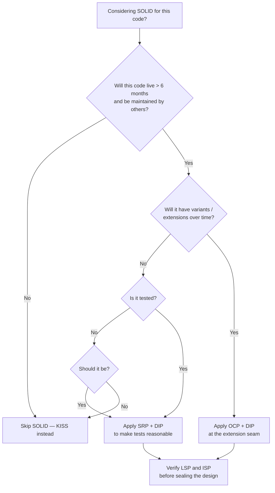
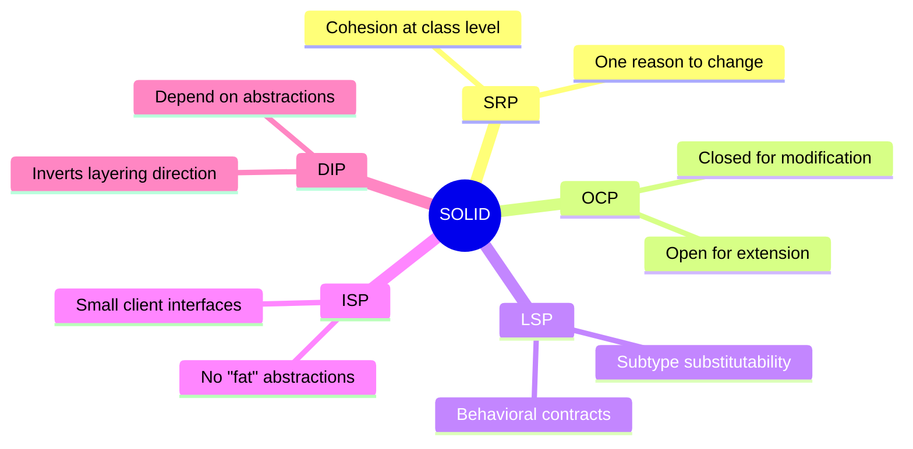
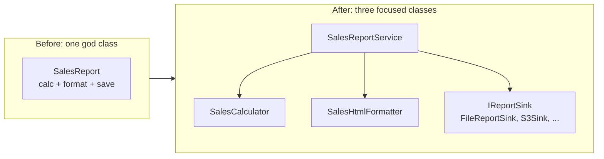
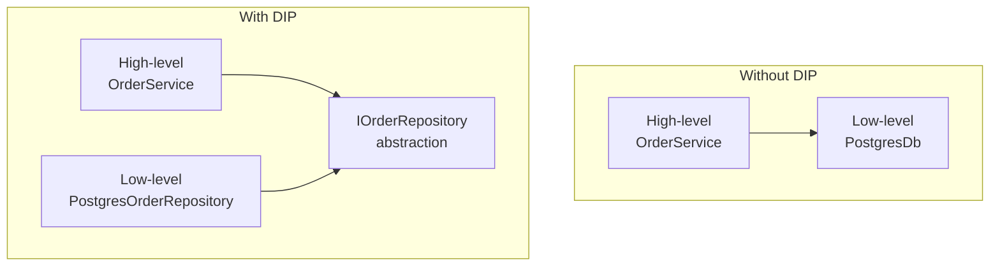
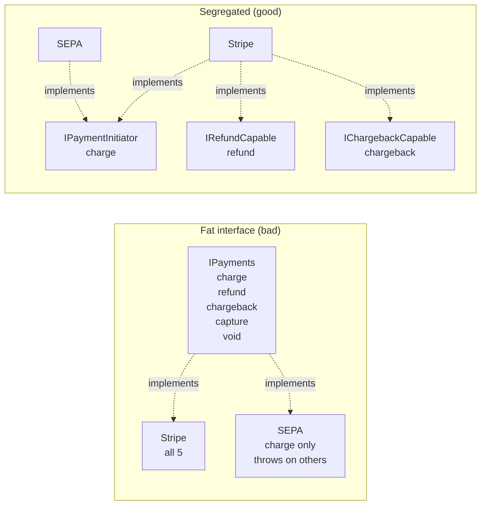
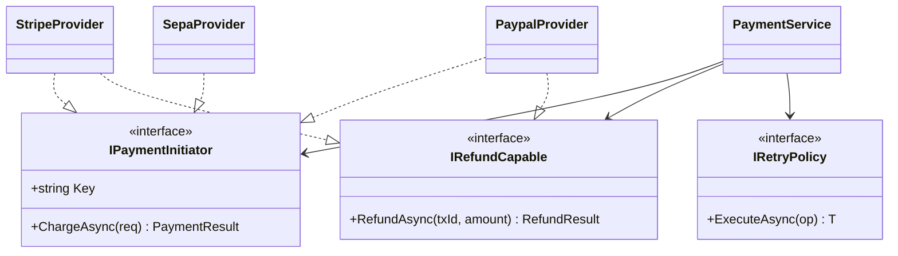

# SOLID

## Overview

Five OOP design principles popularized by Robert C. Martin (Uncle Bob). Each addresses a specific failure mode that shows up as object-oriented codebases grow: god classes, rigid inheritance, untestable modules, brittle changes that ripple unpredictably.

The acronym is a mnemonic, not an ordering. The principles are interdependent — applying one well usually pulls the others along.

## Problem

OOP gives you classes, inheritance, polymorphism, and interfaces. Without discipline, those tools produce:

- Classes with five reasons to change, where every bug fix risks breaking something unrelated.
- Inheritance trees that calcify, where adding a feature means modifying ten existing classes.
- Modules so coupled that you can't unit-test one without standing up half the system.
- Subclasses that quietly violate their parent's contract, surfacing weird bugs later.
- Fat interfaces that force every consumer to depend on methods they never call.

SOLID gives you five lenses to spot these failure modes and guide refactors away from them.

## Key Concepts

The five principles, each in one sentence:

- **SRP — Single Responsibility Principle.** *A class should have one reason to change.* "Reason" maps to a stakeholder or a category of change (business rule vs. presentation vs. persistence).
- **OCP — Open/Closed Principle.** *Open for extension, closed for modification.* You add a new behavior by adding a new class, not by editing existing ones.
- **LSP — Liskov Substitution Principle.** *Subtypes must be substitutable for their base types* without breaking callers' expectations. Inheritance implies a behavioral contract, not just shared methods.
- **ISP — Interface Segregation Principle.** *Many small client-specific interfaces beat one fat general-purpose interface.* Don't force a consumer to depend on methods it doesn't use.
- **DIP — Dependency Inversion Principle.** *High-level modules and low-level modules both depend on abstractions.* Abstractions don't depend on details. This inverts the natural dependency direction in layered architectures.

The first three (SRP, OCP, LSP) are about **what a class is and how it grows**. The last two (ISP, DIP) are about **how classes relate to each other**.

## Prerequisites

What you should already understand:

- OOP basics: classes, methods, inheritance, polymorphism, interfaces.
- `Encapsulation` — hiding internals behind a stable surface.
- `Coupling_Cohesion` — SOLID is partly a recipe for low coupling and high cohesion.
- Basic unit testing: SOLID's payoff shows up most clearly when you try to write tests.

## When to Use

### Use Cases

- **Long-lived business code.** Domain logic that will be maintained by multiple people over years.
- **Code under unit test.** SOLID and testability are deeply linked — DIP and SRP make tests easy; the lack of them makes tests painful.
- **Plugin/extension points.** OCP shines when you'll add new variants over time (payment providers, export formats, notification channels).
- **Multi-team or multi-module systems.** Clear contracts (ISP, DIP) let teams work in parallel without stepping on each other.
- **Legacy refactors.** SOLID is most useful as a *direction* during refactoring, not as a green-field upfront design.

### Indicators

Signals that suggest reaching for SOLID:

- A class file is over a few hundred lines or has more than ~7 methods.
- You're afraid to change a class because three other modules depend on it.
- A change request requires editing five existing classes instead of adding one new one.
- Tests for one class need to mock five collaborators or set up a database.
- You're about to write the second `if (type == "X")` branch in a switch — abstraction is calling.
- You're inheriting from a base class but overriding most of its methods.

### Decision Tree



### Real Scenarios

- **Adding a new payment provider.** Existing `StripeService` works. You're asked to add PayPal. Without SOLID you copy-paste and modify; with OCP+DIP you extract `IPaymentProvider`, both providers implement it, and `PaymentService` is unchanged.
- **Splitting a god service.** `OrderService` has grown to handle pricing, inventory, notifications, and persistence. SRP says split. The refactor extracts four focused services, each unit-testable, each with one stakeholder driving its changes.
- **Replacing the database.** Business code calls `DbContext` directly throughout. Hard to test, hard to swap. DIP says introduce `IOrderRepository`; concrete EF implementation lives at the edge. Tests use an in-memory implementation.
- **Mocking pain.** Tests for `EmailNotifier` need to mock SMTP, file system, time, and a logger. ISP suggests its dependencies are too broad: split `IClock`, `ITemplateLoader`, `IMailTransport` so each test sets up only what it needs.
- **Accidental inheritance violation.** A `BankAccount` base class assumes positive balances. `OverdraftAccount` inherits but allows negative balances, breaking calling code that relied on the invariant. LSP flags the violation; composition (with a balance policy) fixes it.

## When NOT to Use

Signals that SOLID is overkill or actively harmful here:

- **Throwaway scripts.** Build scripts, data migrations, one-off ETL — KISS first.
- **Prototypes and spikes.** When the goal is to learn, not to ship, friction from indirection slows discovery.
- **Trivial CRUD with no business logic.** A controller that maps HTTP to a single SQL call doesn't need three layers of abstraction.
- **Performance hot paths.** Virtual dispatch and indirection have real cost in tight loops; sometimes a switch on a sealed enum is the right answer.
- **Data classes / DTOs.** A record with five fields and no behavior doesn't need SRP; it has zero responsibilities.
- **Code with a single concrete implementation that will never change.** Premature DIP creates ceremony without value (see [Topic Anti-Patterns](#topic-anti-patterns)).

## Trade-offs

### Benefits

- **Localized changes.** A new feature touches one new class instead of editing several existing ones (OCP).
- **Testability without heroics.** Dependencies behind interfaces (DIP) make swapping in fakes/stubs trivial; SRP keeps test setup small because each class has few collaborators.
- **Parallel development.** Clear contracts (ISP, DIP) let teams work against interfaces without blocking on each other's implementations.
- **Easier reasoning.** SRP keeps each class small enough to fit in your head. LSP keeps inheritance honest.
- **Refactor safety.** Cohesive small classes can be moved, renamed, or deleted with low blast radius.
- **Replaceability.** With DIP you can swap an implementation (DB, message broker, logger) without rewriting business logic.

### Drawbacks

- **More files, more types.** A SOLID-adherent module often has 3-5x the file count of a "just write the code" version. New readers face more navigation.
- **Indirection cost (cognitive).** Following a call chain through interfaces and DI containers is harder than reading a straight-line method.
- **Easy to over-engineer.** "Interface for everything" is a real trap. An interface with one implementation that will never have a second is pure noise.
- **Risk of premature abstraction.** OCP applied before you know the axes of change creates the wrong abstractions, which are worse than no abstraction.
- **Onboarding tax.** Junior devs hit a learning curve understanding why a controller calls an interface that's wired by a container to a class three layers away.
- **Ceremony cost.** DI containers, factories, and abstract base classes add boilerplate that pays off only at scale.

### Performance Characteristics

SOLID is largely **performance-neutral** in compiled languages with good optimizers. Specific notes:

- **Virtual dispatch overhead.** Method calls through interfaces use vtable/JIT-table lookups. In hot loops with millions of calls/sec, this is measurable; in 99% of business code, invisible.
- **Memory.** Each object instance carries a vtable pointer (~8 bytes). DI containers retain singletons; transients allocate per request.
- **JIT/compiler inlining.** Modern JITs (RyuJIT, HotSpot, V8) can devirtualize and inline through monomorphic interface calls — neutralizing most overhead in practice.
- **Allocation pressure.** Per-request DI scopes allocate small objects often; in GC languages this creates garbage. In C++/Rust, lifetimes are explicit so this is a non-issue.

For tight numerical/graphics loops or kernel-level code, prefer composition by value, sealed types, or generic specialization over interfaces. Everywhere else, don't optimize SOLID away preemptively.

### Scalability

SOLID scales with **team size and codebase size**, not with users:

- 1-2 devs, 10k LOC: SOLID is mostly overhead.
- 5-15 devs, 100k LOC: SOLID becomes load-bearing — boundaries enable parallel work.
- 50+ devs, 1M+ LOC: SOLID at module/service boundaries is essential; inside modules it becomes a matter of style.

### Maintainability

The strongest argument for SOLID is the maintenance phase:

- **Bug fixing**: defects localize to the responsible class instead of being smeared across modules.
- **Adding features**: new variants slot in via OCP; existing tests stay green.
- **Removing features**: cohesive modules can be deleted cleanly when a feature retires.
- **Reading code 6 months later**: small focused classes describe themselves through their structure.

### Operational Cost

- **Setup**: low — no infrastructure beyond what your language already provides. DI containers add some config.
- **Run-time**: minimal in 99% of cases (see Performance).
- **On-call burden**: indirectly improves it — easier-to-reason-about code means faster diagnosis at 3 AM.

### Alternatives

- **`DRY_KISS_YAGNI`** — for small, single-purpose code, KISS-first beats SOLID-first. Don't apply five principles where two suffice.
- **Procedural / transaction script.** For simple CRUD apps, a flat function-per-endpoint design is often clearer than ceremony around CRUD entities.
- **Functional core, imperative shell.** An alternative discipline that gets similar testability via pure functions instead of interfaces.
- **Data-oriented design** — for performance-critical systems, organize by data layout instead of object hierarchies (game engines, databases).
- **`Composition_over_Inheritance`** — a single principle that delivers most of SOLID's value without all the framework apparatus.

## Simple Example

The classic SRP smell: a single class does **calculation**, **formatting**, and **persistence**. Each of those will change for different reasons, driven by different stakeholders:

- *Calculation* changes when business rules change (driven by product/finance).
- *Formatting* changes when presentation requirements change (driven by UX/marketing).
- *Persistence* changes when storage tech changes (driven by infra/ops).

Three "reasons to change" living inside one class is the textbook SRP violation. The refactor splits into three classes, each owning one concern. Bonus: testing each becomes trivial.

### Before — one class, three responsibilities

```csharp
public class SalesReport
{
    public decimal CalculateTotal(IEnumerable<Sale> sales)
    {
        return sales.Sum(s => s.Amount * (1 - s.DiscountRate));
    }

    public string FormatAsHtml(decimal total)
    {
        return $"<h1>Sales report</h1><p>Total: <b>{total:C}</b></p>";
    }

    public void SaveToFile(string content, string path)
    {
        File.WriteAllText(path, content);
    }

    public void GenerateAndSave(IEnumerable<Sale> sales, string path)
    {
        var total = CalculateTotal(sales);
        var html  = FormatAsHtml(total);
        SaveToFile(html, path);
    }
}
```

What's wrong:

- A change to discount rules forces redeployment of code that also handles HTML and file I/O.
- A unit test for the calculation has to construct an instance that knows about the file system.
- Switching to PDF output, or to S3 instead of disk, means editing this class — possibly breaking the calculation tests in the process.

### After — three small classes, each with one reason to change

```csharp
public class SalesCalculator
{
    public decimal Total(IEnumerable<Sale> sales)
        => sales.Sum(s => s.Amount * (1 - s.DiscountRate));
}

public class SalesHtmlFormatter
{
    public string Format(decimal total)
        => $"<h1>Sales report</h1><p>Total: <b>{total:C}</b></p>";
}

public interface IReportSink
{
    void Write(string content);
}

public class FileReportSink : IReportSink
{
    private readonly string _path;
    public FileReportSink(string path) => _path = path;
    public void Write(string content) => File.WriteAllText(_path, content);
}

public class SalesReportService
{
    private readonly SalesCalculator   _calc;
    private readonly SalesHtmlFormatter _fmt;
    private readonly IReportSink        _sink;

    public SalesReportService(SalesCalculator calc, SalesHtmlFormatter fmt, IReportSink sink)
        => (_calc, _fmt, _sink) = (calc, fmt, sink);

    public void Generate(IEnumerable<Sale> sales)
    {
        var total = _calc.Total(sales);
        var html  = _fmt.Format(total);
        _sink.Write(html);
    }
}
```

The refactor incidentally introduces **DIP** (`SalesReportService` depends on `IReportSink`, an abstraction) and sets up **OCP** (a new sink — S3, email, stdout — plugs in without changing `SalesReportService`).

### Key takeaways

- "Reason to change" is the SRP test. If two stakeholders drive changes to the same class, it has too many responsibilities.
- The refactor is small. Three classes of ~5 lines each are not "more complex" than one class of 25 lines — they're easier to read, test, and change.
- SRP often pulls DIP and OCP along for free. Apply one, and seams for the others appear naturally.
- The test for `SalesCalculator` no longer touches the file system, no longer mocks anything, runs in microseconds. That's the payoff.

## Real World Example

### Context

A payment processing module for an e-commerce backend. Today it integrates **Stripe**; in three months marketing wants **PayPal**; in six months ops wants to add **bank transfer (SEPA)** for European B2B customers. The module is unit-tested and runs in a service that handles tens of requests per second per instance.

This is a good fit for SOLID because:

- New providers are coming — you know the axis of change (OCP).
- Multiple stakeholders drive changes (finance for fees, fraud team for risk checks, infra for retries) — SRP matters.
- The module is tested — DIP makes mocking the provider trivial.
- Different providers expose different capabilities (Stripe supports refunds, SEPA doesn't) — ISP is real.

### Requirements

- Charge a customer for an order, returning a transaction ID and status.
- Issue refunds for completed transactions (only providers that support refunds).
- Capture observability: log each attempt, emit a metric, record the chosen provider.
- Retry transient failures with exponential backoff.
- Make it impossible to call refund on a provider that doesn't support it (compile-time, not runtime).

### Architecture

Five collaborators, one orchestrator. See [Diagrams](#diagrams) for the class diagram.

- `IPaymentInitiator` — segregated interface, all providers implement it (ISP, DIP).
- `IRefundCapable` — separate interface, only providers that support refunds implement it (ISP).
- `StripeProvider`, `PaypalProvider`, `SepaProvider` — concrete providers (OCP: adding a fourth touches no existing class).
- `PaymentService` — orchestrator. Knows nothing about Stripe or PayPal; depends on the abstractions (DIP).
- `IRetryPolicy` — separate concern (SRP); injected by the host.

The orchestrator has a single responsibility: coordinate a payment attempt with logging, metrics, and retries. Provider details live elsewhere.

### Flow

1. Caller invokes `PaymentService.Charge(order, providerKey)`.
2. Service resolves the provider from the registry by key.
3. Service wraps the provider call in the retry policy.
4. Each attempt logs at info, increments a metric, records latency.
5. On terminal success, returns `Success(transactionId)`.
6. On terminal failure, returns `Failure(reason)` — never throws across the boundary.

### Code

```csharp
// --- Abstractions (DIP, ISP) ---

public interface IPaymentInitiator
{
    string Key { get; }                                   // "stripe", "paypal", "sepa"
    Task<PaymentResult> ChargeAsync(ChargeRequest req, CancellationToken ct);
}

public interface IRefundCapable
{
    Task<RefundResult> RefundAsync(string transactionId, decimal amount, CancellationToken ct);
}

public delegate Task<T> RetryableOp<T>(CancellationToken ct);

public interface IRetryPolicy
{
    Task<T> ExecuteAsync<T>(RetryableOp<T> op, CancellationToken ct);
}

// --- Concrete providers (OCP) ---

public sealed class StripeProvider : IPaymentInitiator, IRefundCapable
{
    public string Key => "stripe";
    private readonly StripeClient _client;
    private readonly ILogger<StripeProvider> _log;

    public StripeProvider(StripeClient client, ILogger<StripeProvider> log)
        => (_client, _log) = (client, log);

    public async Task<PaymentResult> ChargeAsync(ChargeRequest req, CancellationToken ct)
    {
        var resp = await _client.Charges.CreateAsync(req.ToStripe(), ct);
        return resp.Status == "succeeded"
            ? PaymentResult.Success(resp.Id)
            : PaymentResult.Failure(resp.FailureReason);
    }

    public async Task<RefundResult> RefundAsync(string txId, decimal amount, CancellationToken ct)
    {
        var resp = await _client.Refunds.CreateAsync(new() { ChargeId = txId, Amount = (long)(amount * 100) }, ct);
        return RefundResult.Success(resp.Id);
    }
}

public sealed class SepaProvider : IPaymentInitiator   // intentionally NOT IRefundCapable
{
    public string Key => "sepa";
    // ... implementation: SEPA refunds aren't supported in this product, so no IRefundCapable.
}

// --- Orchestrator (SRP) ---

public sealed class PaymentService
{
    private readonly IReadOnlyDictionary<string, IPaymentInitiator> _initiators;
    private readonly IReadOnlyDictionary<string, IRefundCapable>    _refunders;
    private readonly IRetryPolicy _retry;
    private readonly ILogger<PaymentService> _log;
    private readonly IMetrics _metrics;

    public PaymentService(
        IEnumerable<IPaymentInitiator> initiators,
        IEnumerable<IRefundCapable> refunders,
        IRetryPolicy retry,
        ILogger<PaymentService> log,
        IMetrics metrics)
    {
        _initiators = initiators.ToDictionary(i => i.Key);
        _refunders  = refunders.OfType<IPaymentInitiator>()
                               .Zip(refunders, (i, r) => (i.Key, r))
                               .ToDictionary(t => t.Key, t => t.r);
        _retry   = retry;
        _log     = log;
        _metrics = metrics;
    }

    public async Task<PaymentResult> ChargeAsync(ChargeRequest req, string providerKey, CancellationToken ct)
    {
        if (!_initiators.TryGetValue(providerKey, out var provider))
            return PaymentResult.Failure($"unknown provider '{providerKey}'");

        using var _scope = _log.BeginScope(new Dictionary<string, object> { ["provider"] = providerKey });
        var sw = Stopwatch.StartNew();
        try
        {
            var result = await _retry.ExecuteAsync(t => provider.ChargeAsync(req, t), ct);
            _metrics.RecordPaymentLatency(providerKey, sw.Elapsed);
            _metrics.IncrementPaymentOutcome(providerKey, result.IsSuccess ? "success" : "failure");
            return result;
        }
        catch (Exception ex)
        {
            _log.LogError(ex, "Charge failed for provider {Provider}", providerKey);
            _metrics.IncrementPaymentOutcome(providerKey, "exception");
            return PaymentResult.Failure(ex.Message);
        }
    }

    public Task<RefundResult> RefundAsync(string providerKey, string txId, decimal amount, CancellationToken ct)
    {
        // Compile-time guarantee: only providers in _refunders can be refunded.
        // If the caller picks a non-refundable provider, they get a clear error, not a silent runtime failure.
        if (!_refunders.TryGetValue(providerKey, out var refunder))
            return Task.FromResult(RefundResult.Failure($"provider '{providerKey}' does not support refunds"));

        return _retry.ExecuteAsync(t => refunder.RefundAsync(txId, amount, t), ct);
    }
}
```

How each principle shows up:

- **SRP**: `PaymentService` orchestrates only. Logging, metrics, retry, and provider details each live elsewhere.
- **OCP**: adding a fourth provider means writing one new class implementing `IPaymentInitiator` and registering it. Zero changes to `PaymentService`.
- **LSP**: every implementer of `IPaymentInitiator` returns a `PaymentResult` with the same semantics. No subtype throws where the contract says return.
- **ISP**: `IRefundCapable` is separate. SEPA's class doesn't implement it, so no caller can ever ask SEPA to refund — checked at compile time. No "throw NotSupportedException" anti-pattern.
- **DIP**: `PaymentService` depends only on `IPaymentInitiator`, `IRefundCapable`, `IRetryPolicy`, `IMetrics`, `ILogger`. The Stripe SDK only appears in `StripeProvider`. The host wires concretes via DI at startup.

### Notes on the example

- `PaymentResult` is a result type (`Success` / `Failure`) instead of throwing for business failures. Throwing is reserved for bugs and infrastructure issues.
- The retry policy is a single seam, not scattered `try/catch` per provider. SRP at the cross-cutting level too.
- `IRetryPolicy` would typically be backed by Polly or a similar library. The interface keeps the orchestrator independent.
- `ChargeRequest.ToStripe()` is an extension that maps the domain request to the provider's SDK model — adapter pattern at the edge keeps domain types clean.

### Improvements

- **Idempotency keys.** Pass a client-supplied idempotency key into `ChargeAsync` and propagate to the provider — see `Idempotency (05_Distributed_Systems)`.
- **Circuit breaker.** Wrap each provider in a circuit breaker so a 30-second Stripe outage doesn't drag the rest of the system down.
- **Outbox pattern.** Persist payment intent before calling the provider; reconcile asynchronously. Avoids "charged but not recorded" failures.
- **Metrics tags.** Cardinality-safe tags (provider, outcome, currency) — avoid customer ID.
- **Distributed tracing.** Open spans around each provider call so end-to-end latency is visible per-provider in tools like Jaeger/Tempo.
- **Feature flag** to fall back from a new provider to the previous one if error rates spike during rollout.

## Diagrams

### The five principles at a glance



### SRP refactor — before / after



### Dependency direction (DIP)

The arrow points to **what depends on what**. Without DIP, high-level policy depends on low-level detail. With DIP, both depend on a stable abstraction owned by the high level.



The abstraction lives in the **same package as the consumer**, not with the implementation. That's what "inversion" means — the dependency direction at compile time is opposite to the runtime call direction.

### ISP — fat interface vs. segregated interfaces



In the fat version, SEPA is forced to implement methods it doesn't support — leading to runtime exceptions. In the segregated version, the type system makes the capability gap explicit and impossible to misuse.

### Class diagram of the payment example



Notice: `PaymentService` knows nothing about Stripe, PayPal, or SEPA. New provider = new class implementing the interface(s) it actually supports. That's OCP, ISP, and DIP working together.

## Checklist

### Implementation Checklist

When designing or refactoring a class/module, walk through these:

#### SRP — Single Responsibility
- [ ] Can I describe what this class does in one sentence without using "and"?
- [ ] Are all the methods talking to the same set of fields? (Cohesion check.)
- [ ] If a stakeholder asked for a change, would only this class change?
- [ ] Could I delete the class and the responsibility would be cleanly gone, with no leftover behavior?

#### OCP — Open/Closed
- [ ] If a new variant is added, do I have to modify existing code, or can I add a new class?
- [ ] Are extension points placed at the right axes of change (the ones I actually expect to vary)?
- [ ] Am I avoiding speculation? OCP for axes that *might* vary in the future is YAGNI.

#### LSP — Liskov Substitution
- [ ] Can a caller swap any subtype for the base type without changing behavior?
- [ ] Do subtypes preserve invariants the base type promises (return values, exceptions thrown, side effects)?
- [ ] Are preconditions weakened (or unchanged) and postconditions strengthened (or unchanged) in subtypes?
- [ ] Does the inheritance reflect "is-a" behaviorally, or just "shares-data-with"?

#### ISP — Interface Segregation
- [ ] Does each implementer use *every* method on the interface, or are some unused?
- [ ] Would splitting the interface let consumers depend on only what they need?
- [ ] Are there `NotImplementedException` / `throw new NotSupportedException()` in implementers? That's ISP failing.

#### DIP — Dependency Inversion
- [ ] Does the high-level class depend on a concrete low-level type, or on an abstraction?
- [ ] Does the abstraction live with the consumer (high-level), not the implementation?
- [ ] Are concrete types wired only at the composition root (DI container, `Program.cs`, `main`)?

### Review Checklist

Things to flag in a pull-request review:

- [ ] **Class is over ~300 lines or has > ~7 public methods.** Probably violates SRP. Ask the author what stakeholders drive changes.
- [ ] **`switch` on a type or string** in business logic. Often a missed OCP opportunity — extract a polymorphic abstraction.
- [ ] **`if (x is StripeProvider)`** or similar. Same — the abstraction leaked.
- [ ] **`throw new NotSupportedException()`** in an implementer. ISP smell.
- [ ] **High-level module imports a concrete from a low-level module.** DIP violation. The dependency direction should be inverted.
- [ ] **Subclass overrides every method of its parent.** Inheritance is wrong here — prefer composition.
- [ ] **`base.Method()` calls in overrides that *change* the result.** Likely LSP violation.
- [ ] **Test setup creates 5+ collaborators just to instantiate the SUT.** SRP failing — the SUT has too many responsibilities.
- [ ] **An interface has only one implementation that will never have a second.** Premature DIP — drop the interface or be honest that it's there for testing only.
- [ ] **DI registrations growing without bound.** Sign that the system is fragmenting into too-small classes; SRP can be over-applied.

### Production Readiness

SOLID is a *design* concern, but it shows up in production posture:

- [ ] **Tests exist and run fast.** A SOLID-correct module should be unit-testable in milliseconds.
- [ ] **Boundaries match deployment units.** Module/service boundaries should align with classes that genuinely have different reasons to change.
- [ ] **Provider/adapter classes have integration tests.** SOLID isolates business logic from I/O — but you still need to verify the I/O code talks to the real thing.
- [ ] **No reflection-based dispatch in hot paths.** DI containers and dynamic resolution are fine in setup; not on the request path.
- [ ] **Logging tags identify which implementation handled the request.** When `IPaymentProvider` failed, knowing it was Stripe vs PayPal saves 10 minutes at 3 AM.
- [ ] **Feature-flag / gradual rollout possible at the abstraction seam.** New `IPaymentProvider` implementation? Roll it out at 1% via flag, observe, ramp.
- [ ] **Failure modes documented per implementation.** Each adapter has its own quirks (timeouts, error codes, rate limits). Don't pretend they're identical.

## Topic Anti-Patterns

> Anti-patterns *specific to SOLID*. For generic anti-patterns (God Object, Spaghetti Code, etc.) see [16_AntiPatterns](../16_AntiPatterns/).

### Interface for everything

**Description.** Creating an interface for every class "just in case" we'll need a second implementation. The interface has exactly one implementer, will never have a second, and forces every test or caller to chase one extra layer of indirection.

**Why it's bad.**

- Adds files, types, and import statements with zero benefit.
- Makes navigation worse (Go to Definition lands on the interface, not the code).
- Hides simple value classes behind a façade that suggests polymorphism that doesn't exist.
- Violates YAGNI in the name of SOLID — the wrong kind of religious adherence.

**Bad example.**

```csharp
// One implementation, will never have another.
public interface IUser
{
    string Name { get; }
    int    Age  { get; }
}

public class User : IUser
{
    public string Name { get; init; }
    public int    Age  { get; init; }
}
```

**Better approach.** Use the concrete type. Add the interface *when* the second implementation arrives (or when a test needs to fake the dependency — that's a real reason).

**Good example.**

```csharp
public sealed record User(string Name, int Age);
```

### "I made it SOLID" by sprinkling interfaces

**Description.** A refactor adds `IFoo` for every class but the underlying coupling and responsibilities are unchanged. The system is now wider (more types) and exactly as tangled, but the team feels accomplished because there are interfaces.

**Why it's bad.** SOLID isn't about syntax (interfaces, DI). It's about *structure* — what depends on what, and what changes for what reason. Adding an interface in front of an unchanged class doesn't fix coupling.

**Bad example.**

```csharp
// God class, just with an interface in front.
public interface IOrderService { /* 30 methods */ }

public class OrderService : IOrderService
{
    public void Validate(Order o) { /* ... */ }
    public void CalculateTax(Order o) { /* ... */ }
    public void ApplyDiscount(Order o) { /* ... */ }
    public void ChargeCustomer(Order o) { /* ... */ }
    public void SendConfirmationEmail(Order o) { /* ... */ }
    public void UpdateInventory(Order o) { /* ... */ }
    // ...
}
```

**Better approach.** Split by responsibility *first*, then introduce abstractions where you actually need them. The interface count is a side effect, not the goal.

### Wrong-direction DIP (cosmetic abstraction)

**Description.** DIP says "depend on abstractions, not concretions" — but the abstraction must be **owned by the high-level module** and must express **its** vocabulary. A common failure: introducing an interface that mirrors the low-level module's API exactly. The dependency direction is unchanged; you've just renamed `PostgresClient` to `IPostgresClient`.

**Why it's bad.**

- Doesn't actually invert the dependency. The high level still depends on a low-level shape.
- If you swap the underlying tech (Postgres → Mongo), the interface itself has to change — the whole point was to avoid that.

**Bad example.**

```csharp
// "I added an interface" — but it leaks postgres concepts.
public interface IPostgresClient
{
    NpgsqlCommand CreateCommand(string sql);
    NpgsqlDataReader ExecuteReader(NpgsqlCommand cmd);
}
```

**Better approach.** Frame the abstraction in the high-level module's language: orders, queries, transactions — not connections, commands, readers.

**Good example.**

```csharp
public interface IOrderRepository
{
    Task<Order?> FindByIdAsync(OrderId id, CancellationToken ct);
    Task SaveAsync(Order order, CancellationToken ct);
}
```

### SRP taken to atomic level (one method per class)

**Description.** "One reason to change" misread as "one method." Every class has a single `Execute()` method; every operation becomes a "Handler" or "UseCase" class. The codebase has 400 single-method classes and finding anything is impossible.

**Why it's bad.**

- Cohesion suffers — methods that work on the same data are now in different files.
- Navigation cost explodes; reading the flow of a feature requires opening 12 classes.
- Real responsibilities split arbitrarily; nothing is *more* SRP-correct, just more fragmented.

**Better approach.** SRP is about a *responsibility* — a coherent area of behavior, not a single line of code. A class with 5-7 methods that all manipulate the same state is fine.

### LSP violation via inheritance ("Square is-a Rectangle")

**Description.** Modeling subtype relationships purely on shared *fields* instead of shared *behavior*. The classic: `Square extends Rectangle`. A `Rectangle`'s setters for width and height are independent; for `Square` they aren't — assigning width must also change height. Code that operates on `Rectangle` and assumes width/height are independent breaks for `Square`.

**Why it's bad.**

- The compiler accepts the substitution but the contract is silently violated.
- Bugs surface far from the cause, in code that doesn't know `Square` exists.
- The reflex fix ("override the setters") doesn't restore the contract — it just changes how the violation manifests.

**Better approach.**

- Composition: a `Shape` has a `BoundingBox`, with constraints applied independently.
- Or two unrelated types — `Square` and `Rectangle` are different things in code, even if math says one is a special case of the other.

### ISP via marker interfaces and capability inquiry

**Description.** Adding empty marker interfaces (`IRefundable`, `IDeletable`, ...) that consumers check at runtime via `is`/`as` to decide what to do.

**Why it's bad.**

- Defeats the type system's ability to enforce capabilities at compile time.
- Spreads capability-check logic across consumers instead of locating it once.
- Often hides a missing parameter — the *call* should be made via the right interface, not via a runtime cast.

**Better approach.** Pass the right interface in. If a method needs refund capability, accept `IRefundable`, not "an `IPayment` you check at runtime."

### Related smells

- **Shotgun surgery** (a single change requires edits in many places): often signals broken SRP or OCP.
- **Feature envy** (a method uses another class's data more than its own): often signals a missing class or a misplaced responsibility — SRP at field-level.
- **Refused bequest** (subclass overrides most of the parent or throws on inherited methods): LSP smell — composition is probably the right answer.
- **Cyclic dependencies between modules**: usually a DIP violation — the abstraction is in the wrong place.
- **Test setup with 5+ mocks**: SRP and ISP failing simultaneously.

## Notes

### Insights

- **SRP is the hardest to apply correctly** because "responsibility" is subjective. The pragmatic test: *who* asks for changes? If two stakeholders can independently demand edits to the same class, it has two responsibilities.
- **DIP is the engine of testability.** Once you internalize that high-level modules should depend on abstractions they own, unit tests stop being a fight.
- **OCP is what makes plugin architectures possible.** The IDE you're typing in, the browsers' devtools, your CI's executors — all built on OCP-style extension points.
- **LSP is checked by your tests, not your compiler.** The type system says `Square` is a `Rectangle`; only your tests say whether substitution actually preserves behavior.
- **ISP is the most underrated.** Splitting fat interfaces clarifies design intent more than people give it credit for.
- The principles are a **vocabulary for code review**, not a checklist for design. Saying "this violates LSP because Square's setters silently couple width and height" is more useful than vague "this feels wrong."
- SOLID is **language-influenced**. In Rust, `traits` give you ISP and DIP almost for free; LSP issues simply don't compile. In Go, structural typing changes the conversation about ISP entirely. Don't import a Java/C# mindset wholesale.

### Edge cases

- **Sealed enums + switch.** When the variant set is closed and rarely changes, a `switch` on a sealed type is *clearer* than a polymorphic abstraction. OCP doesn't apply if the variants don't actually change.
- **Performance hot loops.** Virtual dispatch through interfaces costs cycles. In a 10M-iteration loop, that's measurable. Sealed types or generic specialization beat OCP here.
- **Single-implementation interfaces.** Sometimes legitimate: testability seam in a strongly-typed language without monkey patching. Just be honest about *why* the interface is there.
- **Mixin-style traits / partial classes.** Some languages encourage cross-cutting reuse via mechanisms that don't fit cleanly into "class with one responsibility." The principle still applies in spirit; the syntax differs.
- **Functional code.** Most of SOLID translates to functional design (pure functions = SRP at function level; HOFs = OCP via function composition; type classes / traits = DIP). The book examples are OOP-flavored but the ideas are broader.

### Gotchas

- **"Make everything an interface" is the most common over-application** and arguably the worst. Interfaces should serve a purpose: testing seam, multiple implementations, or a stable contract across module boundaries. None of those? Skip the interface.
- **Don't refactor toward SOLID without tests.** All five principles are about *changing code safely*; refactoring blindly without coverage trades clean structure for new bugs.
- **DI containers are not SOLID.** A DI container is a *tool* that helps wire SOLID code together. Using a container doesn't make code SOLID; not using one doesn't make code violate SOLID.
- **SRP doesn't mean "one method per class."** That's a misreading. SRP is about cohesion of *responsibility*, not method count.
- **Inheritance trees > 2 levels deep are usually wrong.** SOLID doesn't ban inheritance, but most codebases reach for composition and end up cleaner.
- **The abstraction must be stable.** DIP fails if your "abstraction" changes whenever the implementation does — then you're just renaming the concrete class.

### Open questions

- *How strictly should SRP be applied at the package/module level vs. class level?* — likely depends on team size and module ownership boundaries.
- *Are there cases where breaking LSP intentionally is acceptable?* — `IList<T>.Add()` throwing `NotSupportedException` for read-only lists is the canonical "yes, but problematic" example. The wider community is split.
- *Is OCP still relevant given how easy refactor-and-deploy has become?* — some argue YAGNI now wins over OCP for variants you don't yet have. Reasonable position; don't ignore the trade-off.
- *How does SOLID translate to async-heavy code?* — generally fine; the principles are about structure, and async is orthogonal. But cancellation, retry, and backoff cross-cut classes in ways that test SRP boundaries.

### Where SOLID came from

- Originated as 5 of Robert Martin's design principles in the late 1990s.
- The acronym "SOLID" was coined by Michael Feathers around 2004.
- Predates the term "OOP design patterns" (GoF, 1994) being widely understood — SOLID was a synthesis of lessons from real OO codebases of the 80s/90s.
- Has been criticized as over-emphasized in some communities (notably mainstream functional and Go circles); the criticism is usually directed at over-application, not at the principles themselves.

## Related Topics

- `DRY_KISS_YAGNI` — counterweight to over-applied SOLID.
- `Separation_of_Concerns` — broader principle that SRP specializes.
- `Composition_over_Inheritance` — practical strategy that helps satisfy LSP and OCP.
- `Coupling_Cohesion` — the metrics SOLID tries to optimize for.
- `Repository pattern (03_Design_Patterns/Architectural)` — DIP made concrete.
- `Strategy pattern (03_Design_Patterns/Behavioral)` — OCP made concrete.

## References

- Robert C. Martin, *Agile Software Development: Principles, Patterns, and Practices* (2002) — the original SOLID exposition.
- Robert C. Martin, *Clean Architecture* (2017) — SOLID applied at architecture scale.
- [SOLID — Wikipedia](https://en.wikipedia.org/wiki/SOLID).
- Sandi Metz, *Practical Object-Oriented Design in Ruby* — pragmatic counterpoint that questions some classical applications.
