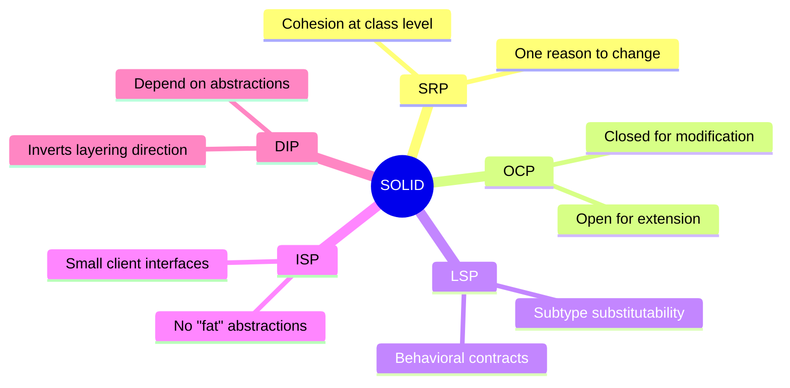
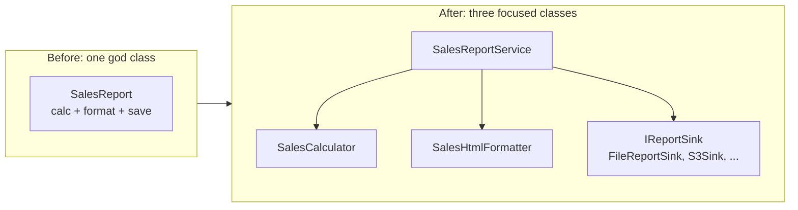
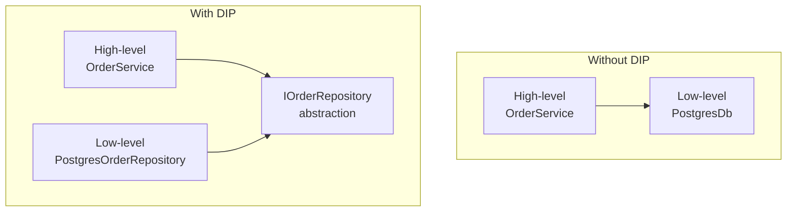
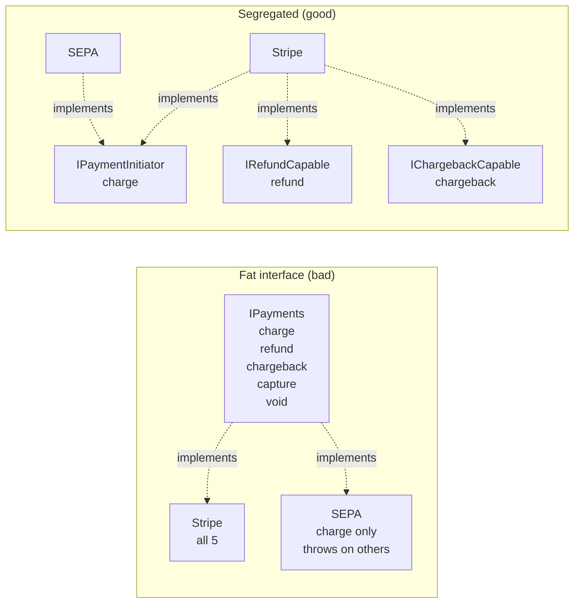
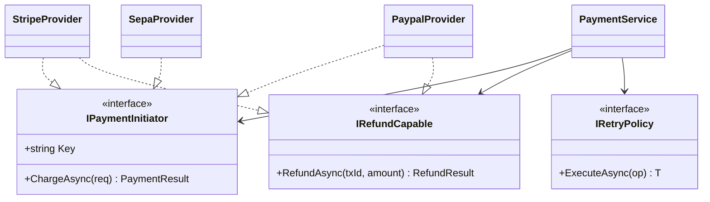

# Diagrams - SOLID

## The five principles at a glance

## SRP refactor — before / after

## Dependency direction (DIP)

The arrow points to **what depends on what**. Without DIP, high-level policy depends on low-level detail. With DIP, both depend on a stable abstraction owned by the high level.

The abstraction lives in the **same package as the consumer**, not with the implementation. That's what "inversion" means — the dependency direction at compile time is opposite to the runtime call direction.

## ISP — fat interface vs. segregated interfaces

In the fat version, SEPA is forced to implement methods it doesn't support — leading to runtime exceptions. In the segregated version, the type system makes the capability gap explicit and impossible to misuse.

## Class diagram of the payment example

See [Example_Real](./Example_Real.md) for the code.

Notice: `PaymentService` knows nothing about Stripe, PayPal, or SEPA. New provider = new class implementing the interface(s) it actually supports. That's OCP, ISP, and DIP working together.

## Visual Notes

- The mind map is a memory aid. Use it once, internalize it, then forget the map.
- The DIP diagram is the most important one — getting the dependency direction right is the foundation everything else builds on.
- The ISP diagram captures *why* "I'll just throw NotImplementedException" is an anti-pattern: the type system was already trying to tell you the abstraction was wrong.
