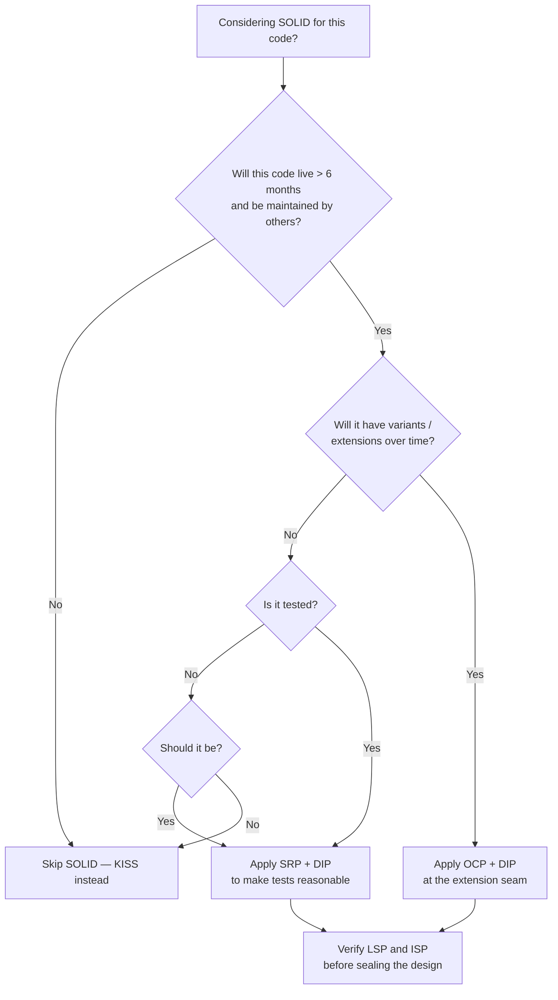

# When to Use - SOLID

## Use Cases

- **Long-lived business code.** Domain logic that will be maintained by multiple people over years.
- **Code under unit test.** SOLID and testability are deeply linked — DIP and SRP make tests easy; the lack of them makes tests painful.
- **Plugin/extension points.** OCP shines when you'll add new variants over time (payment providers, export formats, notification channels).
- **Multi-team or multi-module systems.** Clear contracts (ISP, DIP) let teams work in parallel without stepping on each other.
- **Legacy refactors.** SOLID is most useful as a *direction* during refactoring, not as a green-field upfront design.

## When to Use

Signals that suggest reaching for SOLID:

- A class file is over a few hundred lines or has more than ~7 methods.
- You're afraid to change a class because three other modules depend on it.
- A change request requires editing five existing classes instead of adding one new one.
- Tests for one class need to mock five collaborators or set up a database.
- You're about to write the second `if (type == "X")` branch in a switch — abstraction is calling.
- You're inheriting from a base class but overriding most of its methods.

## When NOT to Use

Signals that SOLID is overkill or actively harmful here:

- **Throwaway scripts.** Build scripts, data migrations, one-off ETL — KISS first.
- **Prototypes and spikes.** When the goal is to learn, not to ship, friction from indirection slows discovery.
- **Trivial CRUD with no business logic.** A controller that maps HTTP to a single SQL call doesn't need three layers of abstraction.
- **Performance hot paths.** Virtual dispatch and indirection have real cost in tight loops; sometimes a switch on a sealed enum is the right answer.
- **Data classes / DTOs.** A record with five fields and no behavior doesn't need SRP; it has zero responsibilities.
- **Code with a single concrete implementation that will never change.** Premature DIP creates ceremony without value (see [Topic_AntiPatterns](./Topic_AntiPatterns.md)).

## Decision Tree

## Real Scenarios

- **Adding a new payment provider.** Existing `StripeService` works. You're asked to add PayPal. Without SOLID you copy-paste and modify; with OCP+DIP you extract `IPaymentProvider`, both providers implement it, and `PaymentService` is unchanged.
- **Splitting a god service.** `OrderService` has grown to handle pricing, inventory, notifications, and persistence. SRP says split. The refactor extracts four focused services, each unit-testable, each with one stakeholder driving its changes.
- **Replacing the database.** Business code calls `DbContext` directly throughout. Hard to test, hard to swap. DIP says introduce `IOrderRepository`; concrete EF implementation lives at the edge. Tests use an in-memory implementation.
- **Mocking pain.** Tests for `EmailNotifier` need to mock SMTP, file system, time, and a logger. ISP suggests its dependencies are too broad: split `IClock`, `ITemplateLoader`, `IMailTransport` so each test sets up only what it needs.
- **Accidental inheritance violation.** A `BankAccount` base class assumes positive balances. `OverdraftAccount` inherits but allows negative balances, breaking calling code that relied on the invariant. LSP flags the violation; composition (with a balance policy) fixes it.
