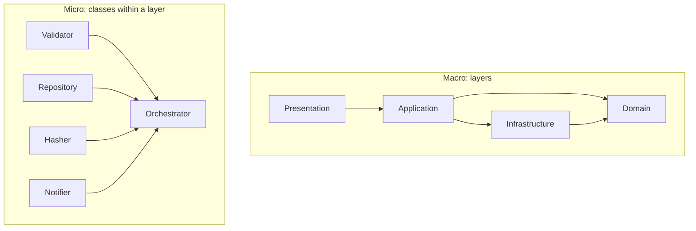
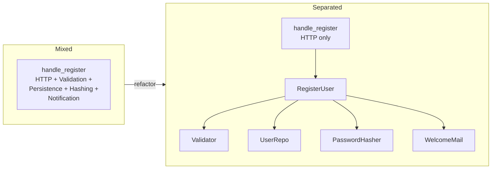

# Separation of Concerns

## Overview

A *concern* is anything you can describe with a noun phrase that captures one aspect of what the system does: "input validation," "currency formatting," "user authentication," "audit logging." **Separation of Concerns (SoC)** is the design discipline of giving each concern its own module, layer, or unit, and keeping them out of each other's internals.

Coined by Edsger Dijkstra in 1974 ("On the role of scientific thought"), the idea predates and underpins most modern modularity principles — SOLID's SRP, Clean Architecture's layers, web-MVC, microservices, and even CSS's separation from HTML are all instances of SoC at different scales.

## Problem

When concerns are tangled, every change is expensive:

- A single function does HTTP parsing, authorization checks, business calculation, database access, and email sending. Changing the email template means re-running tests that exercise authorization logic. Changing the auth rule means risking breakage in unrelated cases.
- The HTML template references the database schema directly. A column rename forces a designer to edit a template file. A template tweak forces a deploy.
- A "User" model carries methods for password hashing, email sending, profile editing, and analytics tracking. The class is over a thousand lines, owned by no one team specifically, and any feature touch risks merge conflicts.

These aren't aesthetic complaints. Each tangle adds friction proportional to the number of concerns mixed in.

## Key Concepts

- **A concern** is a *coherent area of behavior* — something you'd describe in one phrase. "Input validation," "billing," "logging," "rendering."
- **Concerns vary at different rates.** UI changes weekly; the underlying database schema changes once a quarter. Mixing them couples slow-changing things to fast-changing things and vice versa.
- **Concerns have different stakeholders.** Designers care about presentation, finance about pricing rules, security about authentication. SoC lets each stakeholder operate in their own area without stepping on the others.
- **Layers are SoC at the macro scale.** Presentation, application logic, domain, infrastructure — each layer is a concern.
- **Modules / classes / functions are SoC at the micro scale.** Inside a layer, each unit should embody a single concern.

SoC is the **why** behind cohesion (see `Coupling_Cohesion`). Cohesion is the *measure* — does this module embody one concern? SoC is the *goal* — concerns should not be mixed.

## When to Use

SoC is a baseline discipline, not a context-sensitive trick. Apply it any time more than one concern is present:

- **New feature touches input validation, business rule, and storage.** Three concerns — three places.
- **A class is being asked to "also" do something it didn't before.** That "also" is a sign a new concern is invading; consider extracting.
- **A test for a small behavior requires setting up a database, a mock email server, a fake clock, and three other things.** The unit under test mixes too many concerns.
- **You're about to change presentation and the change requires touching domain code.** They aren't separated.

## When NOT to Use

SoC has limits — over-applying it is its own problem:

- **Trivially small programs** — a 100-line script doesn't need three layers and ten modules.
- **Performance hot paths** — sometimes the right move is to fuse concerns for cache locality or to avoid abstraction overhead. Numerical kernels, game engines, and database internals legitimately fold concerns together for speed.
- **Premature decomposition** — splitting concerns that aren't yet clear leads to wrong boundaries. Wait until the concerns are obvious before drawing lines.
- **Cross-cutting concerns are inherently messy.** Logging, metrics, and security touch every module. Trying to "perfectly separate" them produces fragile aspect-oriented setups; better to acknowledge they cross-cut and place them at the edges.

## Trade-offs

### Benefits

- **Localized change.** A concern's code lives in one place; changes don't ripple.
- **Independent reasoning.** You can read and reason about one concern without holding the others in your head.
- **Parallel work.** Different teams can work on different concerns without merge contention.
- **Easier testing.** Each concern can be tested without standing up the others.
- **Stakeholder alignment.** Each concern has a clear owner who drives its evolution.

### Drawbacks

- **More files / modules / boundaries.** Navigation overhead increases.
- **Cross-concern interactions become explicit.** Things that "just worked" because everything was in one place now need a contract.
- **Premature separation produces wrong boundaries.** Wrong boundaries are harder to fix than no boundaries — you may end up needing to merge and re-split.

### Performance Characteristics

Largely **performance-neutral**. Layer crossings have small costs (function calls, sometimes serialization at module/service boundaries). In hot paths these matter; in business code they don't.

### Alternatives

- **`Coupling_Cohesion`** — the metric/measure underneath SoC.
- **`SOLID/SRP`** — SoC at the class level.
- **`Encapsulation`** — companion principle. SoC says *separate*, encapsulation says *hide internals across the seam*.
- **Aspect-oriented programming** — for cross-cutting concerns (logging, metrics) that resist normal SoC.

## Simple Example

A single function that mixes three concerns: HTTP I/O, business logic, and persistence.

### Before — concerns tangled

```python
def handle_register_request(request):
    # HTTP concern
    body = request.json
    email = body.get("email", "").strip().lower()
    password = body.get("password", "")

    # Validation concern
    if "@" not in email:
        return jsonify({"error": "invalid email"}), 400
    if len(password) < 8:
        return jsonify({"error": "password too short"}), 400

    # Persistence concern
    conn = sqlite3.connect("app.db")
    cur = conn.cursor()
    cur.execute("SELECT id FROM users WHERE email = ?", (email,))
    if cur.fetchone():
        return jsonify({"error": "email already registered"}), 409

    # Hashing concern
    salt = os.urandom(16)
    hashed = hashlib.pbkdf2_hmac("sha256", password.encode(), salt, 200_000)

    # Persistence concern (again)
    cur.execute("INSERT INTO users (email, password, salt) VALUES (?, ?, ?)",
                (email, hashed, salt))
    conn.commit()
    user_id = cur.lastrowid

    # Notification concern
    smtplib.SMTP("smtp.example.com").sendmail(
        "noreply@example.com", email, f"Subject: Welcome\n\nHi, your id is {user_id}.")

    # HTTP concern (again)
    return jsonify({"id": user_id}), 201
```

The function is short but does five jobs. Testing the validation rule needs a database. Changing the SMTP server forces touching code that knows about HTTP responses. None of the concerns can move independently.

### After — concerns separated

```python
# Domain — pure business rules, no I/O
class RegisterRequest:
    def __init__(self, email: str, password: str):
        if "@" not in email: raise InvalidEmail()
        if len(password) < 8: raise PasswordTooShort()
        self.email = email.strip().lower()
        self.password = password

# Persistence — only talks to the database
class UserRepo:
    def __init__(self, conn): self.conn = conn
    def find_by_email(self, email): ...
    def create(self, email, hashed, salt): ...

# Crypto — only does hashing
class PasswordHasher:
    def hash(self, password): ...

# Notifications — only sends mail
class WelcomeMail:
    def send(self, email, user_id): ...

# Application — orchestrates the use case
class RegisterUser:
    def __init__(self, repo, hasher, mail):
        self.repo, self.hasher, self.mail = repo, hasher, mail
    def execute(self, req: RegisterRequest) -> int:
        if self.repo.find_by_email(req.email):
            raise EmailAlreadyRegistered()
        hashed, salt = self.hasher.hash(req.password)
        user_id = self.repo.create(req.email, hashed, salt)
        self.mail.send(req.email, user_id)
        return user_id

# Presentation — only handles HTTP
def handle_register_request(request):
    try:
        req = RegisterRequest(**request.json)
        user_id = registrar.execute(req)  # registrar wired at composition root
        return jsonify({"id": user_id}), 201
    except InvalidEmail | PasswordTooShort as e:
        return jsonify({"error": str(e)}), 400
    except EmailAlreadyRegistered:
        return jsonify({"error": "email already registered"}), 409
```

Each unit now has one concern:

- `RegisterRequest` — input validation.
- `UserRepo` — persistence.
- `PasswordHasher` — crypto.
- `WelcomeMail` — notifications.
- `RegisterUser` — orchestration of the use case (no HTTP, no SQL).
- `handle_register_request` — HTTP shape only.

You can change SMTP transport, swap the database, or add a "registration source" field without each change rippling across all the others.

### Key takeaways

- The original was *short* but tangled. SoC isn't about line count — it's about *whose-concern-is-this* per line.
- The refactored version has more files but each is independently testable and ownable.
- The orchestrator (`RegisterUser`) has zero I/O code — it's pure logic. That's where the business rules live, untouched by transport or storage decisions.
- Errors propagate as exceptions through the seams; the HTTP layer is the only place that maps them to status codes. Each layer knows only its own concern's vocabulary.

## Diagrams

### Concerns at different scales



SoC applies recursively. Layers separate concerns at the system scale. Inside a layer, classes separate concerns at the module scale. Inside a class, methods separate concerns at the function scale.

### Mixed vs. separated



## Checklist

### Implementation Checklist

- [ ] Can I describe each module with a noun phrase that captures one concern, no "and"?
- [ ] If two concerns must collaborate, do they do so through a clear seam (function call, message, interface), not by touching each other's internals?
- [ ] Can I unit-test concern X without involving concern Y?
- [ ] Does each concern have an owner (a stakeholder, team, or person)?

### Review Checklist

- [ ] **A method does HTTP parsing AND business logic AND persistence.** Three concerns mixed; flag for refactor.
- [ ] **Domain code imports an HTTP framework.** Layers leaking — domain shouldn't know about transport.
- [ ] **A template references DB columns directly.** Presentation reaching into persistence — concerns mixed.
- [ ] **Validation logic appears in three different layers** with slight variations. Concern duplicated, not separated.
- [ ] **Test setup mocks 5+ collaborators to test 1 small behavior.** The behavior under test is mixed with other concerns.

### Production Readiness

- [ ] Failures localize to the responsible concern (a SMTP outage doesn't take down validation).
- [ ] On-call docs are organized by concern (auth issues → here; payment issues → there).
- [ ] Each concern has its own observability slice — logs and metrics tagged by concern.

## Topic Anti-Patterns

> Anti-patterns *specific to SoC*. For generic anti-patterns (God Object, etc.), see [16_AntiPatterns](../16_AntiPatterns/).

### The fat controller / fat handler

**Description.** Web frameworks make it tempting to put everything inside the request handler — validation, business logic, persistence, response shaping. The handler grows to hundreds of lines, tangling concerns that should live in their own units.

**Why it's bad.** Same as the simple example above: testing one concern requires standing up the rest, and changes to one ripple through the others.

**Better approach.** Keep the handler thin: parse input, delegate to an application service / use case, format the response. Everything else lives elsewhere.

### Anemic separation — concerns by name only

**Description.** Code is split into "Service," "Repository," and "Controller" classes, but each class still does multiple concerns inside. The folder layout suggests separation; the code doesn't deliver it.

**Why it's bad.** Cosmetic structure misleads readers. They expect to find one concern per class and instead navigate the same tangle, just spread thinner.

**Better approach.** Make sure each unit *actually* has one concern, not just a layer-suggestive name. Naming is a hint, not a substitute.

### Layer leakage

**Description.** A "domain" object that references an ORM type, takes a `Request` parameter, or knows about HTTP status codes. Layers exist on paper but the abstractions cross them in practice.

**Why it's bad.** The domain layer is supposed to be the most stable — language-agnostic, transport-agnostic. Once it depends on the framework, switching frameworks (or even running domain logic in a worker / script context) breaks.

**Better approach.** Keep domain code dependency-free. Use plain language types (`str`, `datetime`, value objects). Put the framework-coupled code in adapters at the edges.

### Cross-cutting code copy-pasted across modules

**Description.** Logging, metrics, retry, and authorization checks repeat in every controller / service / handler. Each module re-implements the same cross-cut behavior, slightly differently.

**Why it's bad.** Cross-cutting concerns *do* need separation, but the answer isn't "copy them into every module." That defeats the purpose.

**Better approach.** Centralize cross-cutting logic in middleware / decorators / aspects. The business code stays free of the cross-cut; the cross-cut lives in one place.

### Premature layering

**Description.** A 500-line CRUD app with a Presentation layer, Application layer, Domain layer, Infrastructure layer, with `IRepository`, `IService`, `IUnitOfWork` everywhere — for a single SQL table.

**Why it's bad.** Layers are *useful* when concerns genuinely separate. For a thin CRUD app, the "concerns" all collapse to "moving JSON to/from a SQL table" — separating them adds ceremony with no benefit.

**Better approach.** Match decomposition to actual concern complexity. A small CRUD endpoint can be a single function; introduce layers when concerns earn their separate existence.

### Related smells

- **God class** — usually low SoC visible at one location.
- **Shotgun surgery** — a single change requires edits in many places. Often signals a missed separation (the concern is actually scattered).
- **Divergent change** — a single class changes for several different reasons. Concerns mixed inside one unit.
- **Feature envy** — a method depends on another class's data more than its own. Often the method is in the wrong concern.

## Notes

### Insights

- SoC is **the why**; cohesion is **the measure**; SOLID's SRP is **the tactic**. The three are different angles on the same goal.
- The hardest skill is recognizing **what counts as a concern**. Beginners under-separate (everything in one big function). Mid-career often over-separates (every line is a class). Senior judgment is knowing where the natural seams are.
- Most architecture patterns are SoC variants — Clean Architecture (concerns by stability), Hexagonal (concerns by direction of dependency), CQRS (read concern vs. write concern), Event Sourcing (state vs. history).
- Cross-cutting concerns are real and don't fit cleanly. Frameworks evolved (middleware, decorators, AOP) specifically to handle them without forcing them into every module.
- Dijkstra's 1974 framing is still the clearest: "It is what I sometimes have called the separation of concerns, which... is the only available technique for effective ordering of one's thoughts."

### Edge cases

- **Performance code** — sometimes you fuse concerns for a hot path. Document the trade-off; don't pretend it's good design, but accept the pragmatic choice.
- **Configuration** — straddles concerns by nature. A "config" concern usually means the *defaults* live with the code that consumes them; the *overrides* live at the composition root.
- **Cross-cutting in the strict sense** — observability, security, transactions. Use aspects/middleware/decorators rather than embedding them.

### Gotchas

- "Folder by feature" vs "folder by layer" — both are SoC, just at different axes. Use feature-based folders inside layered projects, or layered folders inside feature-based monorepos.
- **A concern is not the same as a noun.** "User" is a noun, but a `User` class can violate SoC by mixing authentication, profile, billing. The concerns are auth, profile, billing — each can have its own type tied to the user.
- **Don't invent concerns to feel separated.** "EmailService" that wraps a one-line SMTP call adds ceremony with no separation gain.

### Open questions

- *Is SoC overkill for solo / small projects?* — yes, for small projects. The cost is real; the benefit scales with team and codebase size.
- *What's the right granularity for concerns?* — judgment. As a rule of thumb, a concern that takes longer to *describe* than to *implement* is probably too small.
- *How do you separate cross-cutting concerns cleanly?* — there's no clean answer. Middleware/aspects work but introduce their own cognitive cost. Some code just is cross-cutting.

## Related Topics

- `Coupling_Cohesion` — the metric pair underneath SoC.
- `SOLID` — SRP is SoC at the class level. The other principles support it.
- `Encapsulation` — protects the seams once you've drawn them.
- `Composition_over_Inheritance` — composition naturally separates concerns; inheritance often blurs them.

## References

- Edsger Dijkstra, ["On the role of scientific thought"](https://www.cs.utexas.edu/users/EWD/transcriptions/EWD04xx/EWD447.html) (EWD447, 1974) — origin of the term.
- Robert Martin, *Clean Architecture* — SoC at the architecture scale.
- Eric Evans, *Domain-Driven Design* — SoC by bounded context at the domain scale.
- Wikipedia: [Separation of concerns](https://en.wikipedia.org/wiki/Separation_of_concerns).
