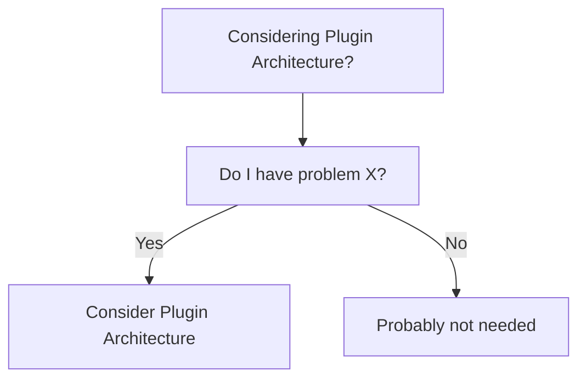

# When to Use - Plugin Architecture

## Use Cases
Concrete use cases with a bit of context.
-
-

## When to Use
Signals that suggest this is the right choice.
-
-

## When NOT to Use
Signals that suggest this is the wrong choice.
-
-

## Decision Tree

## Real Scenarios
- Scenario 1: context, constraints, why Plugin Architecture is the right call.
-

