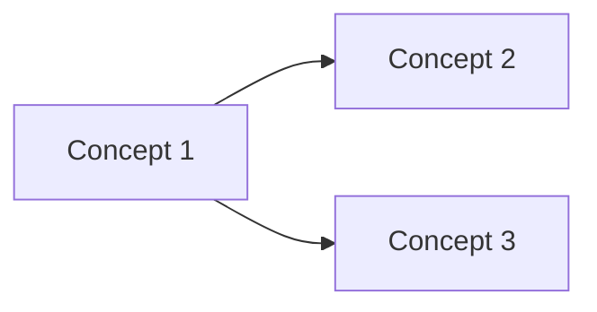
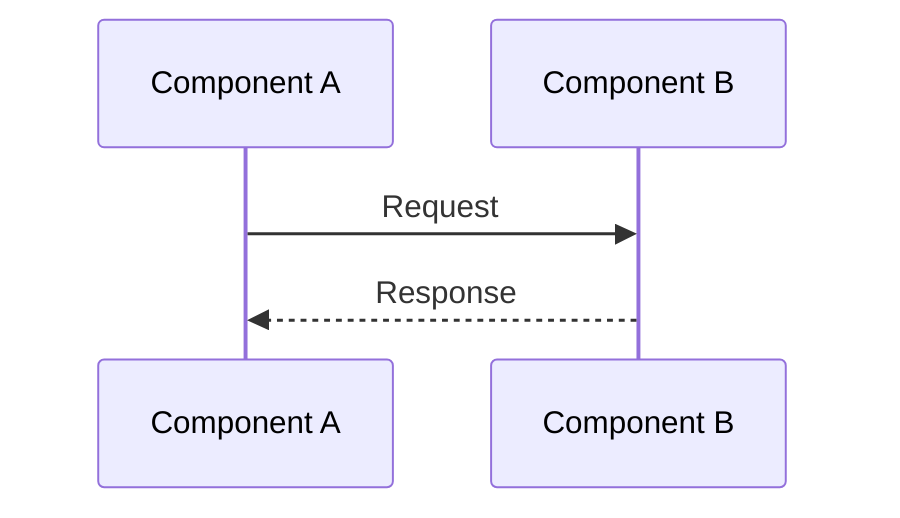
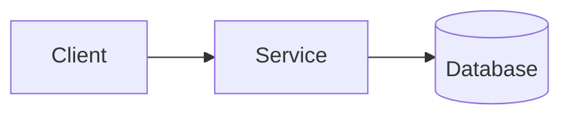

# Diagrams - Visitor

## Concept Map

```mermaid
graph LR
  A[Concept 1] --> B[Concept 2]
  A --> C[Concept 3]
```

## Sequence

```mermaid
sequenceDiagram
  participant A as Component A
  participant B as Component B
  A->>B: Request
  B-->>A: Response
```

## Architecture (C4 / blocks)
> Add a C4 diagram (Context/Container/Component) or architectural blocks if relevant.

```mermaid
flowchart LR
  Client --> Service
  Service --> DB[(Database)]
```

## Visual Notes
-

