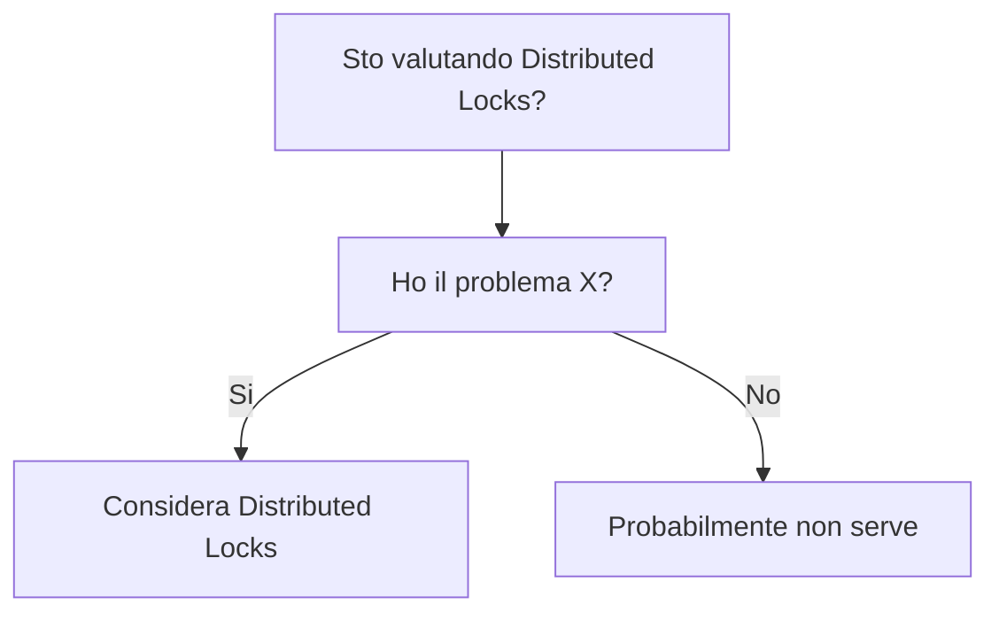

# When to Use - Distributed Locks

## Use Cases
Casi d'uso concreti con un minimo di contesto.
-
-

## When to Use
Segnali che indicano che è la scelta giusta.
-
-

## When NOT to Use
Segnali che indicano che è la scelta sbagliata.
-
-

## Decision Tree

## Real Scenarios
- Scenario 1: contesto, vincoli, perchè Distributed Locks è la scelta giusta.
-

