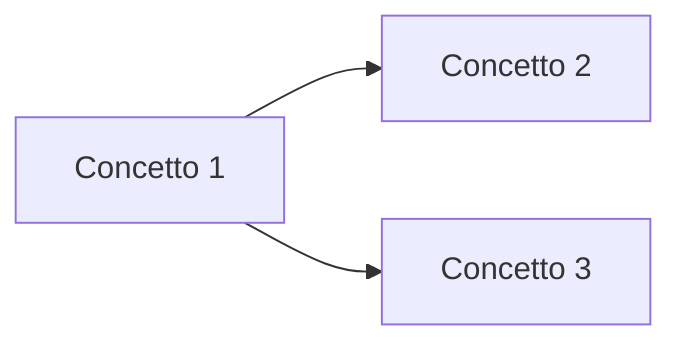
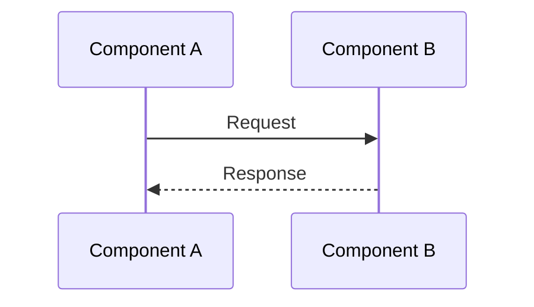
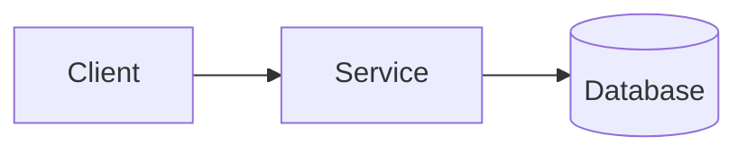

# Diagrams - Rate Limiting

## Concept Map

## Sequence

## Architecture (C4 / blocchi)
> Inserisci diagramma C4 (Context/Container/Component) o blocchi architetturali se rilevante.

## Note grafiche
-

